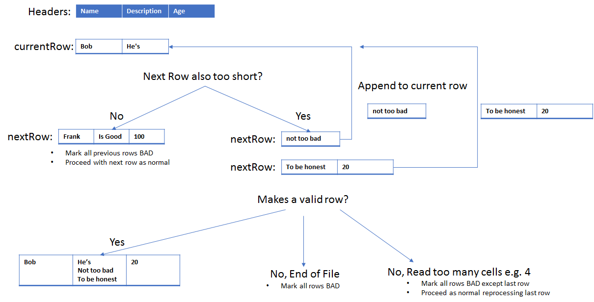
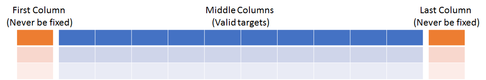

# Delimited File Handling (e.g. CSV)
## Table of contents
1. [Background](#background)
1. [Scalability](#scalability)
1. [Type Determination](#type-determination)
1. [Corrupt Files](#corrupt-files)
1. [Resolved Automatically](#resolved-automatically)
	* [Blank Lines](#blank-lines)
	* [Null Values](#null-values)
	* [Trailing Nulls](#trailing-nulls)
	* [Empty Columns](#empty-columns)
1. [Resolved According To Strategy](#resolved-according-to-strategy)
	* [Empty Files](#empty-files)
	* [Too Many Cells](#too-many-cells)
	* [Too Few Cells](#too-few-cells)
	* [Dodgy Column Names](#dodgy-column-names)
1. [Unresolveable](#unresolveable)
	* [Unclosed quotes](#unclosed-quotes)
	
## Background
CSV stands for 'Comma Separated Values'.  A CSV file is created by writing a text document in which the cells of the table are separated by a comma.  Here is an example CSV file:

```
CHI,StudyID,Date
0101010101,5,2001-01-05
0101010102,6,2001-01-05
```

CSV files usually end in the extension `.csv`.  Sometimes an alternate separator will be used e.g. pipe `|` or tab `\t`.  There is an [official ruleset](https://tools.ietf.org/html/rfc4180) for writing CSV files, this covers escaping, newlines etc.  However this ruleset is often not correctly implemented by data suppliers.  RDMP therefore supports the loading of corrupt/invalid CSV files.

The class that handles processing delimited files (CSV, TSV etc) is `DelimitedFlatFileDataFlowSource`.  This class is responsible for turning the CSV file into a series of `System.DataTable` chunks for upload to the database.

## Scalability
CSV processing is done iteratively and streamed into the database in chunks.  This has been tested with datasets of 800 million records without issue.  Chunk size is determined by `MaxBatchSize`, optionally the initial batch can be larger `StronglyTypeInputBatchSize` to streamline [Type decisions](https://github.com/HicServices/FAnsiSql/blob/master/Documentation/TypeTranslation.md) e.g. when sending data to a `DataTableUploadDestination`. 

## Type Determination
Type decisions [are handled separately](https://github.com/HicServices/FAnsiSql/blob/master/Documentation/TypeTranslation.md) after the `System.DataTable` has been produced in memory from the CSV file.

## Corrupt Files
RDMP is able to detect and cope with some common problems with delimited (e.g. CSV) files.  These situations can be classified as 'Resolved Automatically', 'Resolved Accordly' and 'Unresolveable'

## Resolved Automatically
The following potential problems are automatically resolved by RDMP when processing delimited files (e.g. CSV).

### Blank Lines
In a CSV file blank lines are ignored unless they appear within an escaped string.

```
Name,Dob
Frank,2001-01-01

Herbert,2002-01-01
```
*NewLineInFile_Ignored*

```
Name,Dob,Description
Frank,2001-01-01,"Frank is

the best ever"
Herbert,2002-01-01,Hey
```
*NewLineInFile_RespectedWhenQuoted*

### Null Values
There are many ways that a database null can be represented in a CSV file.  The most common are to skip the value (e.g. `Bob,,32`) or use the value null (e.g. `Bob,null,32`).  

Any cell value that is blank, whitespace or 'null' (ignoring capitalisation / trim) will be treated as `DBNull.Value` and enter the database as a null

The unit test for this behaviour is _NullCellValues_ToDbNull_

### Trailing nulls
Sometimes one or more rows of a CSV will have trailing commas (or null values).  This usually happens when making a change in Microsoft Excel and saving as CSV.  An example is shown below.  In such a case the trailing null values are ignored.

```
CHI ,StudyID,Date
0101010101,5,2001-01-05
0101010101,5,2001-01-05,,  ,null,
0101010101,5,2001-01-05
0101010101,5,2001-01-05
```
_TrailingNulls_InRows_


This also applies to trailing nulls in the header of the file
```
CHI ,StudyID,Date,,
0101010101,5,2001-01-05
0101010101,5,2001-01-05
0101010101,5,2001-01-05
0101010101,5,2001-01-05
```
_TrailingNulls_InHeader_

### Empty Columns
Sometimes a CSV file will have an entirely null column in the middle.  This can occur if you open a CSV in excel and insert a row or you have two 'tables' side by side in the CSV with a blank line separator.  In this situation RDMP will expect the unnamed column to be null/empty for all cells and it will ignore it.

```
CHI ,,StudyID,Date
0101010101,,5,2001-01-05
0101010101,,5,2001-01-05
0101010101,,5,2001-01-05
0101010101,,5,2001-01-05
```
_NullHeader_InMiddleOfColumns_

## Resolved According To Strategy

### Empty Files
The `ThrowOnEmptyFiles` setting determines behaviour if a file empty.  True will throw an Exception (error), False will skip the file.

A file is considered empty if it:

* Has no text at all (_EmptyFile_TotallyEmpty_)
* Has only whitespace (i.e. space, tab, return) in it (_EmptyFile_AllWhitespace_)
* Has a header record but is otherwise only whitespace _EmptyFile_HeaderOnly_

### Too Many Cells
This can occur if a free text field is not escaped properly and contains the separator e.g. comma.  Depending on the `BadDataHandlingStrategy` you can ignore the row, throw exception or divert it to an _Errors file.

```
Name,Description,Age
Frank,Is the greatest,100
Bob,He's also dynamite, seen him do a lot of good work,30
Dennis,Hes ok,35
```
_BadCSV_TooManyCellsInRow_

### Too Few Cells
There are many reasons why there might be too few cells on a given row.  It could have a header in the middle:

```````
Name,Description,Age
Frank,Is the greatest,100
Other People To Investigate
Dennis,Hes ok,35
```````
_BadCSV_TooFewCellsInRow_

Or it could have a free text field is not escaped properly and contains new lines:
```
Name,Description,Age
Frank,Is the greatest,100
Bob,He's
not too bad
to be honest,20
Dennis,Hes ok,35
```
_BadCSV_FreeTextMiddleColumn_

You can attempt to solve the problem of too few cells on a row by setting `AttemptToResolveNewLinesInRecords`.  This will trigger when the current row has too few cells.  It will investigate appending the subsequent rows to form a valid length of row (one where the number of cells match the number of headers).

 

This is a conservative approach in which the process is abandoned as soon as:
* A valid length row is read during the process (all work is discarded and processing resumes from this record)
* Too many cells are read (all work is discarded and processing resumes from the last record read)

 

Since the process only triggers when too few cells are read, newlines in the last column do not trigger the process:
```
Name,Age,Description
Frank,100,Is the greatest
Bob,20,He's
not too bad
to be honest
Dennis,35,Hes ok
```
_BadCSV_FreeTextLastColumn_

Since the process stops as soon as a valid length row is encountered, newlines in the first column will never trigger the process:
```
Description,Name,Age
Is the greatest,Frank,100
He's
not too bad
to be honest,Bob,20
Hes ok,Dennis,35
```
_BadCSV_FreeTextFirstColumn_

Bad rows are treated according to the `BadDataHandlingStrategy`.

### Dodgy Column Names
Sometimes a CSV file will have an odd choice of column names or one that does not match your database.  It can even be invalid data due to commas etc.  In this case you can use `ForceHeaders` and `ForceHeadersReplacesFirstLineInFile` to substitute in more sensible columns.

```
Patient's first name, Patients blood glucose, measured in mg
Thomas,100
Frank,300
```
_BadCSV_ForceHeaders_

If your data table doesn't have any headers at all then you can apply a `ForceHeaders` and set `ForceHeadersReplacesFirstLineInFile` to false.
```
Thomas,100
Frank,300
```
_BadCSV_ForceHeaders_NoReplace_

## Unresolveable

### Unclosed Quotes
The CSV standard allows you to escape the separator character, newlines etc by using quotes.  If your file contains an unclosed quote then the entire rest of the file will be in error:

```
Name,Description,Age
Frank,\"Is the, greatest\",100
Frank,Is the greatest,100"
Frank,\"Is the greatest,100
Frank,Is the greatest,100
Frank,Is the greatest,100
Frank,Is the greatest,100
```
_BadCSV_UnclosedQuote_