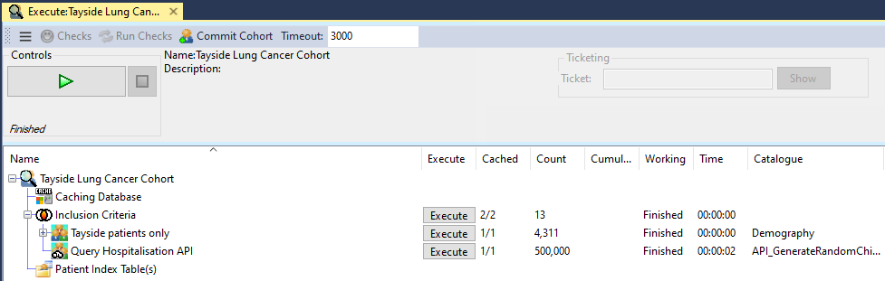

# Cohort Building Api Plugins

## Background

In the RDMP Cohort Builder, cohorts are built by [INTERSECT]ing / [UNION]ing and [EXCEPT]ing [lists of patient identifiers](./FAQ.md#cohort-builder-overview).

In order to support large queries across multiple datasets in an efficient and persistent manner a [query cache](./../../Rdmp.Core/CohortCreation#query-caching) can be set up.

This query cache can also be used to store the results of API calls to arbitrary services (e.g. REST)

## Writing an API call plugin

API call plugins should be [created in the same way as regular plugins](./PluginWriting.md).  After ensuring that your binary works and is loaded by RDMP you should implement `PluginCohortCompiler`.

An example implementation is included:

- [ExamplePluginCohortCompiler](../../Rdmp.Core/CohortCreation/Execution/ExamplePluginCohortCompiler.cs)

The implementation should be in the `main` section of your plugin and so be usable from both command line and UI client.  The implementation should not require user interaction when running.

## Writing a User Interface

You can provide a user interface for configuring uses of your plugin by implementing `PluginUserInterface`.  An example

An example implementation is included:

- [ExamplePluginCohortCompilerUI](../../Rdmp.Core/Providers/ExamplePluginCohortCompilerUI.cs)

The implementation should be in the `windows` section of your plugin since it will only be called from the Windows Gui Client

If you want to be able to configure uses of your API from the command line you can create a new command by implementing `BasicCommandExecution` (which can be in the `main` section of your plugin)

[UNION]: ./Glossary.md#UNION
[EXCEPT]: ./Glossary.md#EXCEPT
[INTERSECT]: ./Glossary.md#INTERSECT