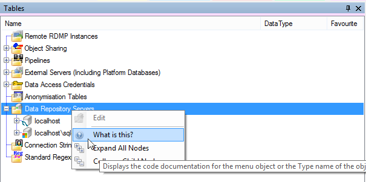
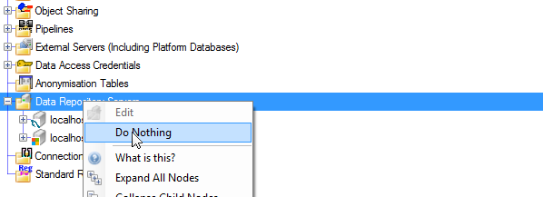
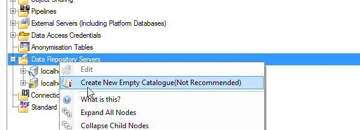
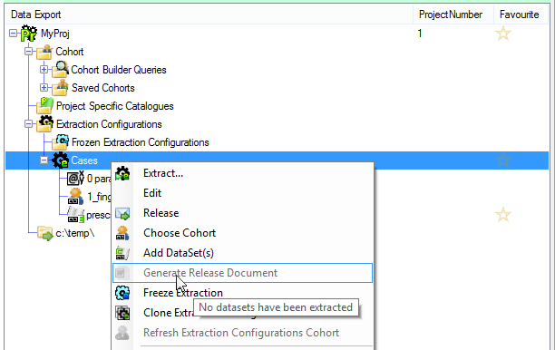

# Table of contents
1. [Background](#background)
2. [Masquerading](#masquerading)
3. [Menu Constructor Overloading](#menu-constructor-overloading)
4. [Reasoning](#reasoning)
5. [Example](#example)
6. [Commands](#commands)
7. [Creating a new Command](#creating-a-new-command)
<a name="background"></a>
# Background
RDMP uses tree collections to represent all objects the user is required to interact with (filters, datasets, projects, extraction configurations etc).  Every item can be right clicked resulting in a context menu appropriate to the object.  At a minimum it should have Expand/Collapse and 'What is this?'.

 

This menu is built by `RDMPCollectionCommonFunctionality` using reflection.  The rule is:

1. If an object called `MyObject` has a menu it must be called `MyObjectMenu` and must inherit from `RDMPContextMenuStrip`
2. It must have a constructor signature `public MyObjectMenu(RDMPContextMenuStripArgs args, MyObject instance)`
3. It must be in namespace Menus e.g. `CatalogueManager.Menus` / `DataExportManager.Menus` etc

If no corresponding menu exists for the object then the default menu will be shown.

# Masquerading
Sometimes we want 2 objects to have the same menu without having to create two menu classes.  This is valid if they represent the same object e.g. `ColumnInfo` and  `LinkedColumnInfoNode` (this represents a specific `ColumnInfo` to `CatalogueItem` binding).  The following options are available to make this happen.

1. Making the wrapper class `IMasqueradeAs` will allow you to specify at the class level that it behaves like the wrapped object with the following exceptions
1. If you implement `IDeletable` then your method will be called (not the object you are masquerading as)
2. If a menu directly compatible with your wrapper class does exists then it will be used (i.e. the masqueraded object menu is only used if there isn't one for the wrapper)
	
# Menu Constructor Overloading
The decision on which menu to use is actually done based on the menu constructor arguments (See `GetMenuWithCompatibleConstructorIfExists`).  This means that you can avoid code duplication by providing an overloaded constructor for multiple classes that have a similar menu.  For example `CatalogueMenu` contains constructors for both `CatalogueFolder` and `Catalogue`.

1. The menu class name must still match one constructor e.g. `CatalogueMenu`. This is a convention but is checked by unit tests (See `UserInterfaceStandardisationChecker`)
2. You should NOT use this as an opportunity to shove all the menus into the same class e.g. `AllObjectImportsNodeMenu`

# Reasoning
The conventions presented above allow you to rapidly create new menus by creating one new class and not modifying any existing code.  It also lets you rapidly find an objects menu by using `What is this?` to get the object `Type` name and searching for `<TypeName>Menu`.

# Example
Right click the "Data Repository Servers" folder and click "What is this?" (See [picture in Background](#background)).  A MessageBox should pop up saying `AllServersNode`

Create a new class in `CatalogueManager.Menus` called `AllServersNodeMenu` 

```csharp
using System.Windows.Forms;
using CatalogueLibrary.Nodes;

namespace CatalogueManager.Menus
{
    class AllServersNodeMenu : RDMPContextMenuStrip
    {
        public AllServersNodeMenu(RDMPContextMenuStripArgs args, AllServersNode o) : base(args, o)
        {
            Items.Add(new ToolStripMenuItem("Do Nothing"));
        }
    }
}

```

Run RDMP and right click the `AllServersNode` again, you should see your new menu item.



# Commands
The preferred way of adding menu items is to use abstract base class `RDMPContextMenuStrip` method `Add(IAtomicCommand cmd)`.  For example 

```csharp
using CatalogueLibrary.Nodes;
using CatalogueManager.CommandExecution.AtomicCommands;

namespace CatalogueManager.Menus
{
    class AllServersNodeMenu : RDMPContextMenuStrip
    {
        public AllServersNodeMenu(RDMPContextMenuStripArgs args, AllServersNode o) : base(args, o)
        {
            Add(new ExecuteCommandCreateNewEmptyCatalogue(args.ItemActivator));
        }
    }
}
```
This delegates all display/execution logic to `IAtomicCommand` and lets reuse the command elsewhere (e.g. in other menus).  



# Creating a new Command

All commands must be declared in an appropriate namespace e.g. `CommandExecution` (the unit test `UserInterfaceStandardisationChecker` will tell you if you put it in the wrong place).

If you want to create a new command then you should 
1. Create a new class called `ExecuteCommand<Something>` inherit from `BasicUICommandExecution` and implement `IAtomicCommand`
2. Declare a constructor taking whatever arguments are required to do the command and an `IActivateItems` (for calling the base constructor)
3. Implement `GetImage` returning null for no image or using the `IIconProvider` to provide a suitable `RDMPConcept` / `OverlayKind`
4. Override `Execute` to perform the command logic (make sure to still call `base.Execute` so that `IsImpossible` is respected)

In your constructor you can decide that the arguments are not compatible with the command.  In this case you should call `SetImpossible` to indicate that the command cannot be run with it's current arguments / environment state.  This will result in the command being greyed out in menus (and the user will be able to hover over to see why).  This is the preferred approach rather than not adding the command in the first place.



Useful methods you can invoke in `Execute` include

1. `Publish` which will entire user interface to respect a new object (or a change to an existing one).  Do not call this in a loop!
2. `Emphasise` Navigates the user interface to the collection containing the object and selects it (brings the object to the attention of the user)
4. `Activate` performs the double click action for the object usually resulting in a new tab opening for editing/executing the object
3. `SelectOne<T>` gets the user to pick a `DatabaseEntity` from a selection (or all the ones of a given type in the database).