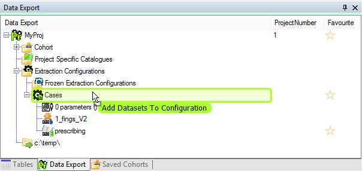
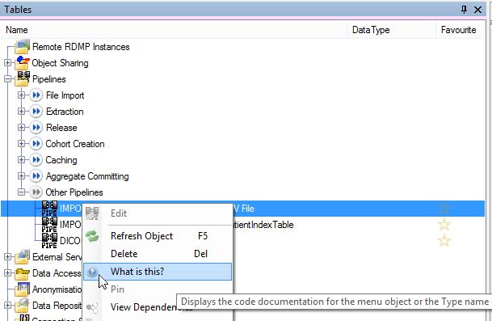
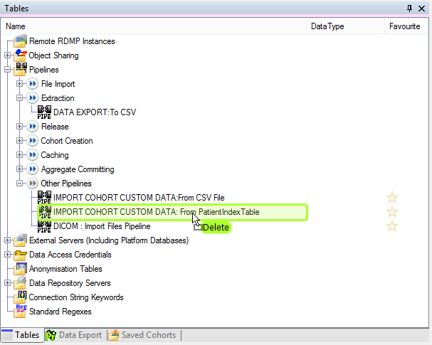
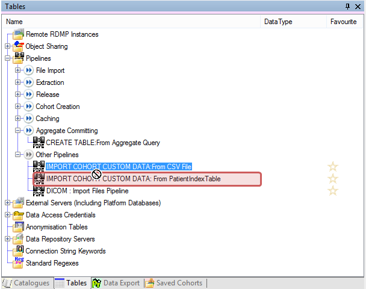

# Table of contents
1. [Background](#background)
2. [Activation](#activation)
3. [Tab Documents](#tab-documents)
4. [Drop](#drop)
4. [Drag](#drag)

<a name="background"></a>
# Background
Both 'drag and drop' and 'double click' tie directly to the 'Command' pattern RDMP uses for [Context Menus](./CreatingANewRightClickMenu.md) and [Command Line](./RdmpCommandLine.md).

Drag and drop and double clicking (called activation) is a core part of the RDMP API and is handled through the class `RDMPCommandExecutionProposal<T>` on a `Type` basis.  Each object that supports activation and/or drop must have an associated instance of `RDMPCommandExecutionProposal<T>` called `ProposeExecutionWhenTargetIs<SomeClass>`.  

This derived class will decide what tab/window/custom action to show when `Activate` happens either as part of double click or as part of `ExecuteCommandActivate` (e.g. from a right click menu) or a call to `BasicUICommandExecution.Activate` and decide what `ICommandExecution` is executed when a given object/collection is dropped on it.

 
_Example of dragging a [Catalogue] onto an ExtractionConfiguration_

This pattern allows all tree views system wide to have consistent behaviour for a given object type (via `RDMPCollectionCommonFunctionality`).  

For the developer it allows easy troubleshooting, if there is a problem with a tree object right click it and select 'What is this?' then search for the class `ProposeExecutionWhenTargetIs<ClassName>`.  Since the return type of the drop method `ProposeExecution` is `ICommandExecution` you simply have to decide what the appropriate command is for the drop operation.

See [ProposeExecutionWhenTargetIsExtractionConfiguration](./../../Rdmp.UI/CommandExecution/Proposals/ProposeExecutionWhenTargetIsExtractionConfiguration.cs) for an example of how consise the code is.

# Activation
To add support for activating (double clicking) an object we must first know its `Type`.  Right click it in the tree view and select 'What is this?' to determine its `Type`.



Create a new class called `ProposeExecutionWhenTargetIs<TypeName>` in namespace `CatalogueManager.CommandExecution.Proposals` and inherit from `RDMPCommandExecutionProposal<T>`.  Return true for `CanActivate` and put a test message in `Activate`.

<!--- cae13dde1de14f5cac984330a222c311 --->
```csharp
private class ProposeExecutionWhenTargetIsPipeline : RDMPCommandExecutionProposal<Pipeline>
{
    public ProposeExecutionWhenTargetIsPipeline(IActivateItems itemActivator) : base(itemActivator)
    {
    }

    public override bool CanActivate(Pipeline target) => true;

    public override void Activate(Pipeline target)
    {
        MessageBox.Show("Double clicked");
    }

    public override ICommandExecution ProposeExecution(ICombineToMakeCommand cmd, Pipeline target, InsertOption insertOption = InsertOption.Default) => null;
}
```

Check this works in the application by double clicking a tree node of the appropriate `Type` or right clicking and selecting `Edit`.


# Tab Documents
Most tabs in RDMP are designed for editing/executing a single `Type` of object held in one of the RDMP platform database tables (e.g. Catalogue, CatalogueItem, [Project] etc).  By convention these controls should be named `<MyClass>UI` unless there is a good reason not to.  These user interfaces all inherit from abstract base class `RDMPSingleDatabaseObjectControl<T>`.  There can be multiple tabs for a given `Type` e.g. [CacheProgress] has both `CacheProgressUI` (for changing cache dates etc) and `ExecuteCacheProgressUI` (for executing the cache).

To show a new tab control for editing your object you should create a normal WinForms control as you normally would but inherit from `RDMPSingleDatabaseObjectControl<T>` instead of `UserControl`.

To trigger the user interface on `Activate` of an `RDMPCommandExecutionProposal<T>` call `ItemActivator.Activate` 

<!--- d5ff7bebc57942df8c6c57a316bf72c6 --->
```csharp
public override void Activate(AggregateConfiguration target)
{
    ItemActivator.Activate<AggregateEditorUI, AggregateConfiguration>(target);
}
```

If you find you cannot use Visual Studio Designer to edit your control because of the abstract/generic base class `RDMPSingleDatabaseObjectControl` [you can create an AbstractControlDescriptionProvider with an intermediate class](https://stackoverflow.com/questions/1620847/how-can-i-get-visual-studio-2008-windows-forms-designer-to-render-a-form-that-im).

<!--- 56df0867990f4b0397e51a6a49f7bdd0 --->
```csharp
[TypeDescriptionProvider(typeof(AbstractControlDescriptionProvider<ANOTableUI_Design, UserControl>))]
public abstract class ANOTableUI_Design : RDMPSingleDatabaseObjectControl<ANOTable>
{
}
```

# Drop
To add support for item dropping you should add an implementation to the body of the `ProposeExecution` method.  The method provides the following parameters.

| Parameter | Purpose |
| ------------- | ------------- |
| ICombineToMakeCommand cmd| Self contained class describing both the object being dragged and salient facts about it e.g. if  it is a `CatalogueCombineable` then it will know whether the dragged [Catalogue] has at least one patient identifier column.|
| T target | The object the cursor is currently hovering over |
| InsertOption insertOption | Whether the cursor is above or below or on top of your object (if the collection the object is in supports it) |

The reason we have an `ICombineToMakeCommand` is so we can front load discovery and encapsulate facts into a single class which can then be waved around the place to look for valid combinations.  If an object doesn't have an associated `ICommand` then it won't be draggable in the first place.

To add support for dropping an object with an existing `ICombineToMakeCommand` you should cast `cmd` and return an appropriate `ICommandExecution`.

<!--- 59f55fa3ef50404291c7ae3996772635 --->
```csharp
public override ICommandExecution ProposeExecution(ICombineToMakeCommand cmd, Pipeline target, InsertOption insertOption = InsertOption.Default) => cmd is CatalogueCombineable sourceCatalogueCombineable ? new ExecuteCommandDelete(ItemActivator, sourceCatalogueCombineable.Catalogue) : (ICommandExecution)null;
```

While not terribly useful, you can now drop a [Catalogue] on `Pipeline` to delete the [Catalogue]



You can create your own `ICommandExecution` implementations by [following this tutorial](./CreatingANewRightClickMenu.md#creating-a-new-command)

# Drag

`RDMPCombineableFactory` is responsible for creating `ICombineToMakeCommand` objects at the start of a drag operation (including files etc from the OS).  Most objects will have a 1 to 1 mapping with an `ICombineToMakeCommand` e.g `CatalogueCombineable` is a wrapper for a [Catalogue].  The `ICombineToMakeCommand` is responsible for doing expensive fact gathering at the start of a drag operation.

If you need to provide drag support for a new object `Type` (e.g. [Pipeline]) first create an appropriate `ICombineToMakeCommand` e.g. `PipelineCombineable` and then in `RDMPCombineableFactory` modify the method `ICommand Create(object modelObject)` to return it given the appropriate modelObject:

```csharp
public ICombineToMakeCommand Create(object modelObject)
{
	//Other stuff
	
	var pipeline = modelObject as Pipeline;
	if (pipeline != null)
		return new PipelineCombineable(pipeline);
	
	//Other stuff
}
```

The `ICombineToMakeCommand` could look like this.

<!--- bbee6cb18ebd4e35a19f5fa521063648 --->
```csharp
public class PipelineCombineable : ICombineToMakeCommand
{
    public Pipeline Pipeline { get; private set; }
    public bool IsEmpty { get; private set; }

    public PipelineCombineable(Pipeline pipeline)
    {
        Pipeline = pipeline;
        IsEmpty = Pipeline.PipelineComponents.Count == 0;
    }

    public string GetSqlString() => "";
}
```

Doing this will allow you to drag the object (when previously you couldn't).  This helps avoid the user dragging something he will never be able to drop on anything.



To provide drop targets for the new `ICombineToMakeCommand` go to the `RDMPCommandExecutionProposal<T>` of the object `Type` you want to be able to drop on and [provide an implementation of ProposeExecution](#drop)

[Catalogue]: ./Glossary.md#Catalogue

[Project]: ./Glossary.md#Project

[CatalogueItem]: ./Glossary.md#CatalogueItem

[Pipeline]: ./Glossary.md#Pipeline
[CacheProgress]: ./Glossary.md#CacheProgress