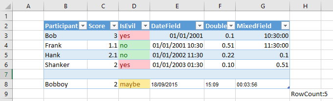

# Excel File Handling
## Table of contents
1. [Background](#background)
1. [Implementation](#implementation)
1. [Date Formatting](#date-formatting)
1. [Tests](#tests)

## Background
Microsoft Excel Workbooks (xls and xlsx) are file formats in which one or more WorkSheets are stored.  There are a number of difficulties in reading data from Excel spreadsheets and populating relational database tables.  These include:

- Cells in worksheets are formatted according to the [Microsoft Formatting Language](https://support.office.com/en-gb/article/number-format-codes-5026bbd6-04bc-48cd-bf33-80f18b4eae68?ui=en-US&rs=en-GB&ad=GB)
- Cells do not have to appear as a contiguous block.
- Rows / Columns can be hidden.  
- Cells can contain formulas

## Implementation
Excel files are read using the [NPOI](https://github.com/tonyqus/npoi) library.  Support for number formats is added by the [ExcelNumberFormat](#https://github.com/andersnm/ExcelNumberFormat) library.

Data read from the file is converted to a string (textual) representation and then treated exactly like other untyped inputs (See [Type Determination](https://github.com/HicServices/FAnsiSql/blob/master/Documentation/TypeTranslation.md))

The following behaviours should be expected when reading from the above example Excel Spreadsheet.

| Rule  | Behaviour | Example Range|
| ------------- | ------------- | ------------- |
| Column Headers  | Headers are determined by the cells in the first row which has any data on it. | B2-G2|
| Blank Rows | If a row has no data in it for any header it will be ignored. |Rows 7 and 9|
| Blank Columns | If a column has no header it is skipped and not added to the data table.|Column A|
| Hanging Values | If a value does not appear under a valid header then the cell is ignored and a warning will be issued. | H9|

## Date Formatting

In Excel all Date/Time fields are stored only as a number.  You can see this number yourself by changing the [Cell Formatting](https://support.office.com/en-gb/article/number-format-codes-5026bbd6-04bc-48cd-bf33-80f18b4eae68?ui=en-US&rs=en-GB&ad=GB) to "General".  This means that loading dates/times correctly involves parsing the Cell Formatting.  This is done by applying the following rules:

| Rule  | Behaviour | Example Range|
| ------------- | ------------- | ------------- |
| Date And Time Format | If the Cell Formatting includes both a date component (y) and a time component (h) it will be translated in an unambiguous format e.g. "2001-01-01 10:30:00" | E4 |
| Date Only Format | If the Cell Formatting includes a date component (y) but no time component (h) it will be translated into a date only format e.g. "2015-09-18" |E8|
| Time Only Format | If the Cell Formatting includes a time component (h) but no date component (y) it will be translated into a time only format e.g. "15:09:00" |F8|

## Tests

Tests confirming the above behaviour are included in the following tests:

- [ExcelTests.cs](./../../Rdmp.Core.Tests/DataLoad/Engine/Unit/ExcelTests.cs)
- [ExcelConversionTest](./../../Rdmp.Core.Tests/DataLoad/Engine/Integration/ExcelConversionTest.cs)

