# Frequently Asked Questions
## Table of contents
1. Compatibility
   1. [What System Requirements does RDMP have?](#reqs)
   1. [Does RDMP have a Command Line Interface?](#cli)
   1. [Does RDMP run under Linux?](#linux)
   1. [Does RDMP have an API?](#api)
   1. [Does RDMP Support Plugins?](#plugins)
   4. [How is RDMP versioned?](#how-is-rdmp-versioned)
   7. [Updating the CLI](#updating-the-cli)
1. Database Compatibility
   1. [What databases does RDMP support?](#databases)
   1. [What database permissions does RDMP need?](#database-permissions)
   1. [How does RDMP RSA encryption work?](#encryption)
   1. [How do I set a custom port / SSL certificate / connection string option?](#connectionStringKeywords)
   1. [When I connect to MySql it says 'The host localhost does not support SSL connections'](#disableSSL)
   1. [Does RDMP Support Schemas?](#schemas)
   1. [Does RDMP Support Views?](#views)
   1. [Does RDMP Support Table Valued Functions?](#tvf)
1. Cohort Creation
   1. [How does the RDMP Cohort Builder work?](#cohort-builder-overview)
   2. [Does the Cohort Builder support Excel, CSV files etc?](#cohort-build-with-file)
   3. [Cohort Builder isn't working or is slow](#cicslow)
   4. [Does RDMP support ontologies e.g. SNOMED CT?](#ontologies)
   5. [Does RDMP support multiple identifier formats?](#identifiers)
   6. [Does the cohort builder support querying other services e.g. REST APIs?](#apis)
1. Data Load Engine
   1. [How does RDMP differ from classic tools e.g. SSIS?](#vsssis)
   1. [Can RDMP Load UnTyped Data?](#untyped)
   1. [What is the purpose of the the data load folders? (ForLoading, ForArchiving etc)](#dle-folders)
   1. [What is hic_dataLoadRunID?](#hic_dataLoadRunID)
   1. [How does RDMP deal with Csv/text files?](#csv)
   1. [Can RDMP read Excel files?](#excel)
   1. [How does RDMP handle / translate untyped, C# and Database Types?](#typetranslation)
   1. [When loading data can I skip some columns?](#skipColumns)
   1. [Can I run SQL Scripts during a load?](#sqlScripts)
   1. [RDMP is not listing my table as importable](#notlistingtable)
1. User Interface
   1. [I cannot resize a column in a listbox/tree view](#resize)
   1. [Where does RDMP store user settings](#user-settings)
1. Anonymisation
   1. [Does RDMP support data anonymisation?](#does-rdmp-support-data-anonymisation)
1. Curation
   1. [What is a Catalogue?](#whatisacatalogue)
   1. [Can I share/export/import my dataset metadata?](#sharing)
   4. [How do I create a Catalogue from 2+ tables?](#2tablecatalogues)
   1. [Tell me about Graphs](#tell-me-about-graphs)
   1. [Tell me about logging](#tell-me-about-logging)
1. User Interface Programming
   1. [How are user interfaces implemented in RDMP?](#uioverview)
   1. [What's with the _Design user interface classes?](#abstractDesignerPattern)
   1. [How do I stop some nodes being reordered in RDMPCollectionUIs?](#reorder)
   1. [How do I add new nodes to RDMPCollectionUIs?](#addNewNodes)
   1. [My metadata databases are being hammered by thousands of requests](#databaseDdos)
1. Other Programming
   1. [Are there Unit/Integration Tests?](#tests)

## Compatibility

<a name="reqs"></a>
### What System Requirements does RDMP have?

RDMP comes in three parts:
  1. [RDMP Client](#reqclient)
  2. [RDMP Platform Databases](#reqdb)
  3. [RDMP Command Line](#reqcli)

<a name="reqclient"></a>
The RDMP Client is a graphical user interface that allows data analysts to create cohorts, perform linkage operations and data extractions etc.  The following system requirements exist for the RDMP Client

| Area | Requirement | Logic |
|------|-----|-----|
| Operating System | Windows 7 or later | Application uses Windows Forms with DotNet 4.6.1 (included in redistributable)|
| Hardware | 4 cores, 16GB of RAM, 50MB disk space | RDMP memory needs come from the size of datasets/batches being processed at the same time. Install is per user |
| Tooling | SQL Server Management Studio and any Office suite | SSMS is not required but recommended to validate generated SQL scripts. Office is useful to work with the documents generated by RDMP |

<a name="reqdb"></a>
RDMP stores all configuration data in 'platform databases'.  These must be created on an Sql Server Instance accessible to RDMP Client users.  The server can be the same server you host clinical data or a separate server.

| Area | Requirement | Logic |
|------|-----|-----|
| Sql Server Version | 2014 or later | |
| OS | Windows Server 2012R2 or higher | This requirement is dictated by the needs of the SQL Server version installed |
| Hardware | >100GB disk space | RAM and CPU are dictated by the SQL Server version installed. Disk space is based on the amount of datasets and projects managed. In a real world situation like in HIC, the existing set of RDMP DBs occupy about 60GB |

<a name="reqcli"></a>
The RDMP command line client can be used to run unattended jobs (such as overnight extractions or automated loads)

| Area | Requirement | Logic |
|------|-----|-----|
| Hardware | 2 cores, 8GB RAM, 100MB disk space plus space for logs | Logs are configurable and can be disabled or streamed to a UDP receiver. By default the CLI logs everything to disk and to console | 
| Operating System | Windows 7 or later or Linux on x86-64 | Application uses the cross platform .Net 6 API, self-contained |

   
<a name="cli"></a>
### Does RDMP have a Command Line Interface? (CLI)
Yes, read all about it in [CommandLine](./RdmpCommandLine.md)

<a name="linux"></a>
### Does RDMP run under Linux?

The [RDMP CLI](./RdmpCommandLine.md) runs natively under linux.

Download the [RDMP CLI release binary for linux-x64](https://github.com/HicServices/RDMP/releases)

For example to create test databases run:

```
./rdmp install localhost TEST_ -u sa -p YourStrong\!Passw0rd
```

The rdmp command `--help` describes how to pass connection strings directly to the executable but it is often easier to enter these in Databases.yaml e.g.

```
CatalogueConnectionString: Server=localhost;Database=TEST_Catalogue;User Id=sa;Password=YourStrong!Passw0rd
DataExportConnectionString: Server=localhost;Database=TEST_DataExport;User Id=sa;Password=YourStrong!Passw0rd
```

Each rdmp engine (e.g. dle) has its own verb e.g.

```
./rdmp dle --help
```

In addition core and plugin commands can be accessed through the cmd verb e.g.

```
./rdmp cmd ListSupportedCommands
```

<a name="api"></a>
### Does RDMP have an API?
Yes, RDMP can be controlled programmatically through its API which is available as 3 NuGet packages 
- [HIC.RDMP.Plugin](https://www.nuget.org/packages/HIC.RDMP.Plugin): All core objects, engines etc
- [HIC.RDMP.Plugin.UI](https://www.nuget.org/packages/HIC.RDMP.Plugin.UI): All definitions for writing user interface plugins that run in the main RDMP client application.
- [HIC.RDMP.Plugin.Test](https://www.nuget.org/packages/HIC.RDMP.Plugin.Test/): Classes to simplify writing Unit/Integration Tests for RDMP plugins

<a name="plugins"></a>
### Does RDMP Support Plugins?
Yes, RDMP supports both functional plugins (e.g. new anonymisation components, new load plugins etc) as well as UI plugins (e.g. new operations when you right click a [Catalogue]).

See [PluginWriting](./PluginWriting.md)

### How is RDMP versioned?

RDMP software has a build Major, Minor and Patch number (Semantic Versioning).  When an API update is issued that requires a change in the platform databases, accompanying sql scripts will be included to perform the update (which will run during startup).

Platform databases are divided into three tiers:

|Tier| Description|
|------|-----|
|   1  | The [Catalogue] and Data Export databases, stores all metadata (projects, datasets etc) as well as the locations of other databases|
|   2  | Ancillary databases managed by RDMP e.g. Logging, DQE Results, Query Caches.  You can have multiple or none of each of these configured.|
|   3  | This tier is reserved for [Plugins](#plugins) which wish to persist objects/meta data in a database using the same versioning model (update scripts, data model) as the core RDMP databases.|

During application startup (following installing an update) you will be prompted to apply patches on any platform databases that are not up to date.

### Updating the CLI

Download the [latest release binary](https://github.com/HicServices/RDMP/releases) (e.g. rdmp-cli-win-x64.zip) and unzip into a new empty folder (e.g. c:\temp\latest).  Locate your current CLI deployment folder (e.g. c:\rdmpcli\).

Copy all files from the new release into your current CLI directory __EXCEPT__:

- Databases.yaml (contains connection strings for your RDMP database)
- NLog.config (contains logging settings)

Ensure the new version matches expectations:

```bash
./rdmp.exe --help
```

Ensure all your plugins are up-to-date, you can check compatibility with:

```
./rdmp.exe cmd ListSupportedCommands --logstartup
```

## Database Compatibility

<a name="databases"></a>
### What databases does RDMP support?
RDMP uses [FAnsiSql](https://github.com/HicServices/FAnsiSql) to discover, query and connect to databases.  Currently this includes support for Sql Server, MySql, PostgreSQL and Oracle.

<a name="database-permissions"></a>
### What database permissions does RDMP need?

#### Installation/Patching user permissions
Installing RDMP will create a number of 'platform' databases e.g.:

- RDMP_Catalogue
- RDMP_DataExport
- RDMP_Logging
- RDMP_DQE

Installation requires 'CREATE DATABASE' permissions.  The user that installs RDMP will be the `db_owner` of the platform databases.  This can be changed to the following if desired:

- db_datareader
- db_datawriter
- db_ddladmin
- [db_executor]

For an indepth discussion of the implications of this change see [DDL_admin vs db_owner permissions](https://dba.stackexchange.com/a/121235).

This account should be used for patching when a new version of RDMP is released that includes a database patch (Any database patches are always clearly marked in bold in the [change log](../../CHANGELOG.md)).

The same user permissions and processes should be followed when creating [cohort databases]/[query cache] etc.

#### Regular user permissions

After installation RDMP users require `db_datareader` and `db_datawriter` permissions on the core platform databases:

- RDMP_Catalogue
- RDMP_DataExport
- RDMP_Logging
- RDMP_DQE

Committing cohort lists requires `db_datareader` and `db_datawriter` to the target [cohort database].  If you are using a plugin for cohort identifier allocation then additional permissions may be required (e.g. [db_executor]).

The [query cache] database requires `db_ddladmin` in addition to  `db_datareader` and `db_datawriter` because caching involves creating and dropping new tables.

RDMP can be configured to use separate credentials for each [cohort databases]/[query cache] databases.  These credentials can be encrypted with an [RSA private key](#encryption).
 
#### Data Load Permissions

The [Data Load Engine] includes support for pluggable modules (CSV Reader, FTP Downloader etc) and so may require any number of permissions.  Each module should clearly articulate what permissions are required (e.g. file read access for `DelimitedFlatFileAttacher`).  But common to all RDMP data loads are the following.

Running the DLE requires the following permissions for the database being loaded (your data repository):

- db_datareader
- db_datawriter
- [db_executor] (required for archiving)

Creating new data loads and changing the schema of live tables (e.g. adding a new column / changing primary key) requires `db_ddladmin`.

In addition the DLE requires 2 databases the [RAW and DLE_STAGING databases](#vsssis).

The RAW database is created at the beginning of a load and is the first place where unconstrained data is loaded.  The DLE runner requires `CREATE DATABASE` and `DROP DATABASE` permissions on this server.  For this reason it is recommended to use a separate RAW server (or separate [named instance](https://cloud.google.com/looker/docs/best-practices/connecting-a-ms-sql-named-instance)) from your live data repository.

The final stage of DLE execution requires a database called `DLE_STAGING`.  This database should be created by a user with `CREATE DATABASE` permissions but after it is created once it will remain and not be dropped (like RAW is).  When running the DLE requires the following permissions on `DLE_STAGING`

- db_ddladmin
- db_datareader
- db_datawriter

The [Data Load Engine] supports loading other DBMS than sql server (e.g. MySql, Postgresql, Oracle).  When loading an alternate DBMS you will need to translate the above roles (e.g. `db_datawriter`) into the appropriate permissions for the DBMS you are targeting.

<a name="encryption"></a>
### How does RDMP RSA encryption work?

The recommended approach to managing permissions is to use domain authentication (integrated security) where possible.  However sometimes credentials need to be stored (e.g. for a remote web service) or sql authentication is desired.  In these cases RDMP supports storing encrypted credentials.

Encryption uses 4096 bit RSA encryption.  Encrypted strings are decrypted prior to sending use (e.g. to send to a web service) so runtime protections such as HTTPS should still be used.  To generate an encryption certificate go to 'Tables (Advanced)' and open the 'Decryption Certificate' node (under 'Data Access Credentials').

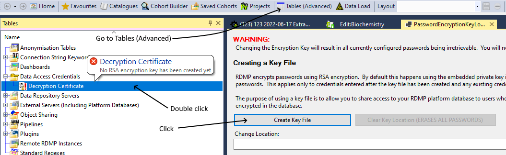

This will generate a file on disk that contains the private key.  Access to the key file allows decrypting passwords and so only RDMP users with file read access to the certificate can use them.  The private key file must be stored securely and access granted only to users who require to use the encrypted passwords.  

If you lose the private key file then encrypted passwords will be irretrievable (lost forever).

<a name="connectionStringKeywords"></a>
### How do I set a custom port / SSL certificate / connection string option?
RDMP manages connection strings internally.  If you want a keyword applied on your connection strings you can add it in the 'Connection String Keywords' node.  Each keyword is associated with a single database provider (MySql, Oracle etc).  In order for the changes to take effect you will need to restart RDMP.

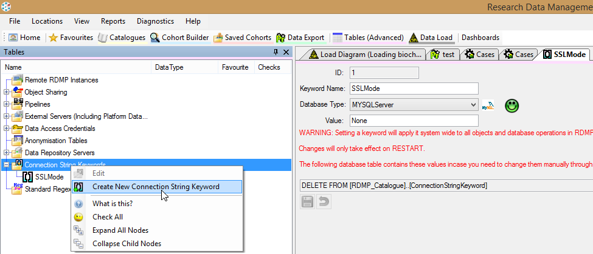

<a name="disableSSL"></a>
### When I connect to MySql it says 'The host localhost does not support SSL connections'
If your MySql server does not support SSL connections then you can specify a [Connection String Keyword](#connectionStringKeywords) 'SSLMode' with the Value 'None' (Make sure you select DatabaseType:MySQLServer)

<a name="schemas"></a>
### Does RDMP Support Schemas?

Yes.  In Microsoft Sql Server, Schema is a scope between Database and Table.  By default all tables get created in the 'dbo' schema but it is possible to create tables in other schemas.  For example

```sql
--Table gets created in the default schema 'dbo'
create table test..MyTable1(MyCol int not null)

--Table gets created in the schema 'omg' within the database 'test'
create schema omg
create table test.omg.MyTable1(MyCol int not null)
```

When importing a table RDMP will record the schema it came from and fully qualify calls to the table.  When running the data load engine RAW and STAGING tables will always be created in dbo (to avoid issuing schema creation commands).

<a name="views"></a>
### Does RDMP Support Views?

Yes, when importing a table from a database to create a [Catalogue] any views in the database will also be shown.  These are interacted with in exactly the same manner as regular tables.

You cannot load a view with data using the [Data Load Engine].

<a name="tvf"></a>
### Does RDMP Support Table Valued Functions?

When importing a table from a Microsoft Sql Server database to create a [Catalogue] any table valued functions in the database will also be shown.  When you import these you will get a [TableInfo] which contains default values to supply to the function when querying it.  You can override these parameters e.g. for a project extraction, cohort identification configuration etc.

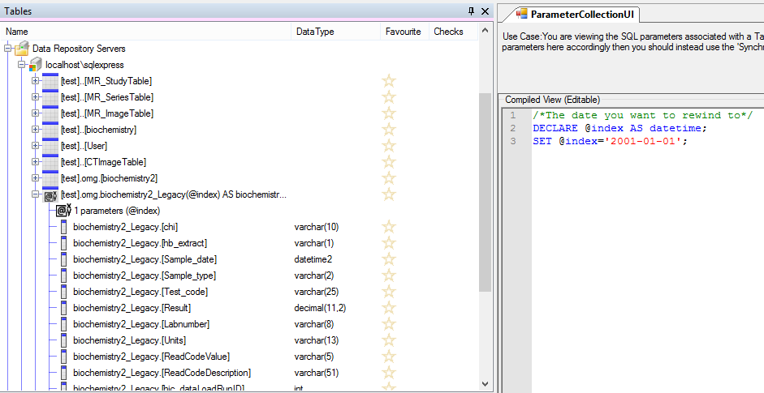

## How does the RDMP Cohort Builder work?

<a name="cohort-builder-overview"/>

So you've decided to do a research study using Electronic Health Records and/or imaging and you've written a document outlining the requirements.  How do we turn this list of inclusion / exclusion criteria into runnable code?  With RDMP's Cohort Compiler of course!

The first task is to split up the criteria into bite sized chunks, each run on a single dataset:

- 3+ prescriptions for Drug A
- Biochemistry result for TestCode B > 500
- Alive at the time of study
- Has had a head MR in the past 5 years

How does RDMP compile this into SQL? To answer that question let's look at the end goal.  Since the datasets share a common identifier we can JOIN the tables.  But that can get complex fast and gives us a single gigantic query that's likely to bring the server to its knees.  Instead, since we are dealing with lists of patients, we can use SET operations (UNION, INTERSECT, EXCEPT).  This means we only need to pull a single column (e.g. patientId) from each dataset and we can then smash all the resulting lists together using the super fast operations that Relational Database Engines excel at.  As an added bonus, if the datasets are on separate database servers or engines (MySql, Sql Server, Oracle and PostgreSQL) we can run the queries separately and store the results in a temporary common server and apply the SET operations there.

```sql
SELECT patientId From Prescribing WHERE Drug = 'Drug A' Group by CHI HAVING COUNT(*) > 3

UNION

SELECT patientId From Biochemistry WHERE TestCode = 'TestCode B' AND Result > 500

EXCEPT

Select patientId from Demography WHERE DateOfDeath is not null

INTERSECT

SELECT patientId from Imaging WHERE Modality = 'MR' and StudyDescription like '%head%'
```

Since each section is runnable independently it is trivially easy for RDMP to produce totals for each separate set.  The set results can even be cached to prevent having to re-run the entire query if you are only making a small change to one bit.

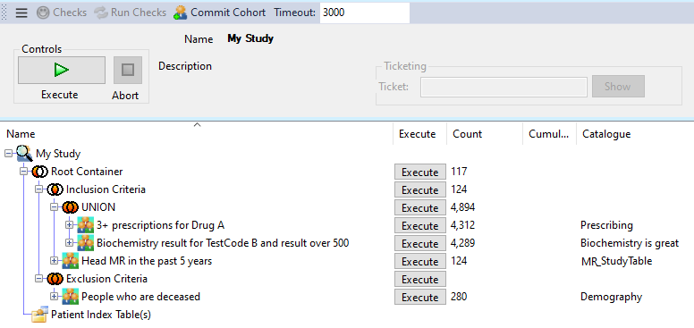

For full details on technical implementation see [Cohort Creation](../../Rdmp.Core/CohortCreation/CohortCreation.md).

## Does the Cohort Builder support Excel, CSV files etc?
<a name="cohort-build-with-file"/>

Yes.  If a cohort is solely defined by the contents of such a file it can be [committed directly to the cohort store](../../Rdmp.Core/CohortCommitting/CohortCommitting.md).

If you need to combine data in the file (or multiple files) with data in your database then the first step is to create a new Catalogue by uploading the data into your database.  This has a number of advantages:

- It provides a permanent record in RDMP of the data used to generate the cohort
- Querying is faster and more flexible
- The data in the file can be anonymised and released by the RDMP extraction engine if required for project extractions.

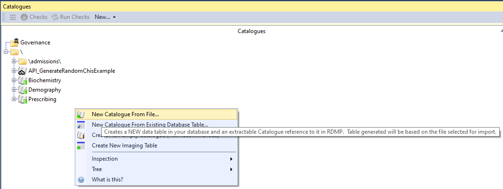

## Cohort Builder isn't working or is slow

<a name="cicslow"></a>
   
Cohorts are built by combining datasets (with filters) using SET operations [UNION]/[EXCEPT]/[INTERSECT].  These queries can become very big and run slowly.  In some [DBMS] certain operations aren't even supported (e.g. [INTERSECT]/[EXCEPT] in MySql).  Therefore it is recommended to create a [query cache].

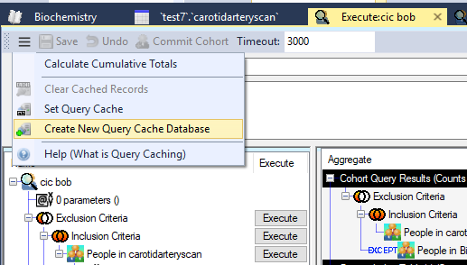

The [query cache] will be used to store the results of each subquery in indexed temporary tables (of patient identifiers).  The cache also records the SQL executed in order to invalidate the cache if the configuration is changed.

### Does RDMP support ontologies e.g. SNOMED CT?

<a name="ontologies"></a>

Not directly.  RDMP supports multiple [DBMS] and does not enforce any specific table schemas on your data.  There are many clinical ontologies (e.g. BNF, ICD9/ICD10, SNOMED CT) and these evolve over time.  Cohort creation in RDMP is done with filters which are defined by the data analyst and are closely tied to their own data model.  For this reason it would be difficult to create an ontology system which worked with all datasets without requiring table schema changes.

Ontology creation / management can still occur behind the scenes in your database e.g. with scalar functions or table valued functions.  This approach allows maximum flexibility of the tool and reduces overhead when deploying RDMP against an existing mature data hosting environment (with established systems for handling ontologies).

RDMP supports lookup tables which can form part of an ontology mapping solution.  The DLE can be helpful in ensuring lookup tables / ontology mappings remain current and avoid duplication.

### Does RDMP support multiple identifier formats?
<a name="identifiers"></a>

Yes, RDMP supports both multiple identifier formats (text, numerical, guids etc) and [multiple identifiers per dataset](./MultipleExtractionIdentifiers.md)

### Does the cohort builder support querying other services e.g. REST APIs?
<a name="apis"></a>

Yes, RDMP supports querying any data provider service through the [Cohort Building API Plugin](./CohortBuildingApiPlugins.md) system.

## Data Load Engine

<a name="vsssis"></a>

### How does RDMP differ from classic tools e.g. SSIS?

RDMP is primarily a data management tool and does not seek to replace existing ETL tools (e.g. SSIS) that you might use for complex data transforms / data migrations etc.  The RDMP DLE is designed to facilitate routine loading of clinical/research datasets, this differs from traditional ETL jobs the following ways:

- Data sources are error prone 
  - Duplication
  - Badly formatted files (e.g. unescaped CSV)
  - Schema changes (e.g. columns changing periodically)
- Scale in dimensions other than row count
  - By number of dataset
  - By number of columns (e.g. researcher adds some new columns to his dataset)
- Require specific narrow set of transformations (e.g. [anonymisation](#does-rdmp-support-data-anonymisation))
- Benefits from traceability
  - When each row appeared
  - When row values change (when and what old values were)
  - Which job/batch loaded a given row (allows tracing rows back to original source files)
 
The Data Load Engine is designed to rapidly build simple data loads with a robust framework for error detection, traceability and duplication avoidance.  Core to the data load process implemented in RMDP is the automatic migration of the data you are trying to load through increasingly structured states (RAW=>STAGING=>LIVE).  This allows for rapid error detection and ensures that bad data remains in an isolated area for inspection by data analysts.
  
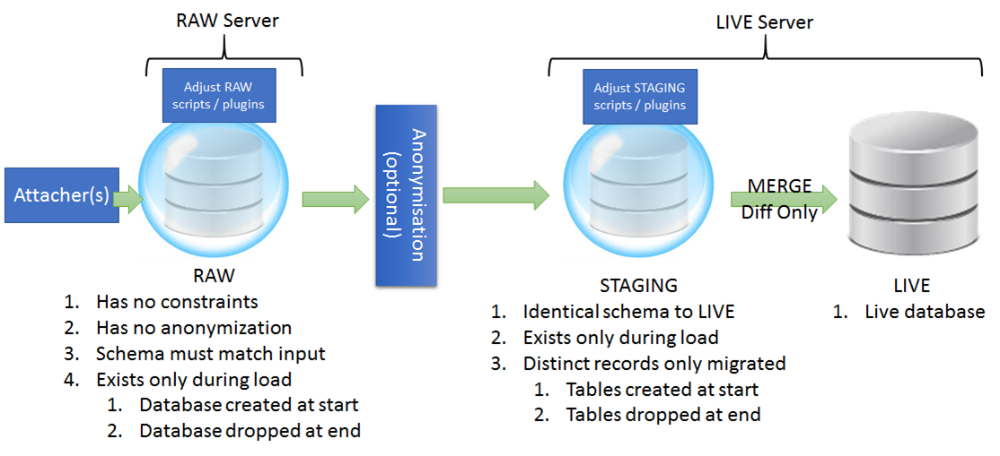

A full description of the mechanics and design of the DLE can be found in the [UserManual](./UserManual.md)

<a name="untyped"></a>
### Can RDMP Load UnTyped Data?
Yes, [determining database types from untyped data (e.g. CSV)](./DataTableUpload.md) is a core feature.

<a name="dle-folders"></a>
### What is the purpose of the the data load folders (ForLoading, ForArchiving etc)?
RDMP data load jobs are configured by creating a [LoadMetadata].  When you create a new [LoadMetadata] you will be prompted to choose/create a set of load folders.  The default directories created have the following layout:

```
someFolder
 |_ Data
 |  |_ Cache
 |  |_ ForArchiving
 |  |_ ForLoading
 |_ Executables
```

These folders are accessible to DLE load components.  Some components put data into a folder (e.g. [WebFileDownloader]) while
others load files in a folder (e.g. [DelimitedFlatFileAttacher]). Some components ignore these folders completely (e.g. [RemoteTableAttacher]).
When a load starts it is assumed that anything in `ForLoading` will be loaded.  If `ForLoading` is empty then it is assumed that the components
in the load do not require files (e.g. [RemoteTableAttacher]) or a component will be populate `ForLoading` at runtime (e.g. [ImportFilesDataProvider]).

At the end of a successful load all files in `ForLoading` (if any) are moved into `ForArchiving` and compressed into a zip archive.  The name of the archive
will be the [hic_dataLoadRunID] of the run (e.g. 132.zip).  If the load fails then files are left in `ForLoading` for future runs.

The `Executables` directory is provided for storing executable files and/or sql scripts that you might want to run during the load.

The `Cache` folder is used for the RDMP caching engine (long running fetching tasks e.g. pulling images from a PACS server or reports from a webservice).

<a name="hic_dataLoadRunID"></a>
### What is hic_dataLoadRunID?

When a [LoadMetadata] is executed in RDMP it is assigned a unique number.  This number provides an end to end audit of:

- Files stored on disk that were loaded
- Logging audit of messages, errors, insert/update counts etc
- Records in live table (INSERTed / UPDATEd by the run)

The number is allocated by the logging database and is unique to the RUN (i.e. it is not the ID of the [LoadMetadata] but reflects one execution of that config).

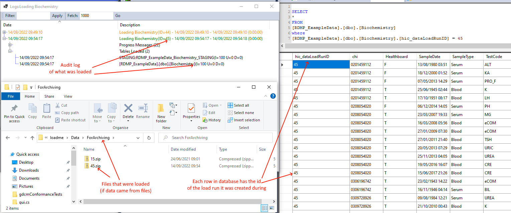

If the `hic_dataLoadRunID` of a record in the database is null then it was not loaded by the RDMP DLE.  It may have been loaded by bulk importing a CSV or created by
other means.

If a load issues an UPDATE then the archive trigger will move the old record state to an `_Archive` table.  Therefore it is important to also loook at the `_Archive`
table when tracing where records ended up from a given run (`hic_dataLoadRunID`).  This trigger can be disabled for volatile loads where large numbers of records are updated
frequently and the feature would impact performance.

<a name="csv"></a>
### How does RDMP deal with Csv/text files?
RDMP supports files delimited by any character (tab separated, pipe separated, comma separated etc).  Since [invalid formatting is a common problem with ETL of CSV files RDMP has several fault tolerance features](./CSVHandling.md).

<a name="excel"></a>
### Can RDMP read Excel files?]
Yes, Support for Excel is described in the [Excel Handling page](./ExcelHandling.md)

<a name="typetranslation"></a>
### How does RDMP handle / translate untyped, C# and Database Types?
[TypeTranslation is handled by FAnsiSql](https://github.com/HicServices/FAnsiSql/blob/master/Documentation/TypeTranslation.md).

<a name="skipColumns"></a>
### When loading data can I skip some columns?
The data load engine first loads all data to the [temporary unconstrained RAW database](#data-load-engine) then migrates it to STAGING and finally merges it with LIVE (See [UserManual](./UserManual.md) for more info).  It is designed to make it easy to identify common issues such as data providers renaming columns, adding new columns etc.

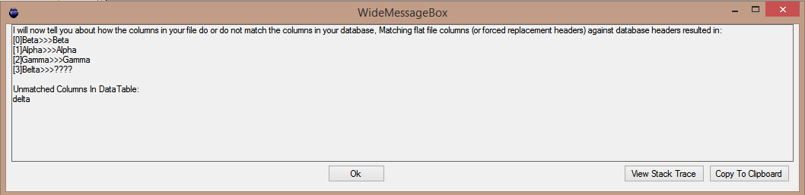

The above message shows the case where there is a new column appearing for the first time in input files for the data load (Agenda) and an unmatched column in your RAW database (Schedule).  This could be a renamed column or it could be a new column with a new meaning.  Once you have identified the nature of the new column (new or renamed) then there are many ways to respond.  You could handle the name change in the DLE (e.g. using ForceHeaders or a Find and Replace script).  Or you could send an email to data provider rejecting the input file.

In order for this to work the DLE RAW Attachers enforce the following rules:

1. Unmatched columns in RAW are ALLOWED.  For example you could have a column 'IsSensitiveRecord' which is in your live table but doesn't appear in input files.
2. Unmatched columns in files are NOT ALLOWED.  If a flat file has a column 'Dangerous' you must have a corresponding column in your dataset

If you have columns in your file that you straight up don't want to load (see 2 above) then you can list them explicitly using the IgnoreColumns setting of your Attacher.


If you need to process data in the columns but don't want them in your final LIVE database table (e.g. to merge two fields or populate an aggregate column) then you can create a virtual RAW only column (called a PreLoadDiscardedColumn).  PreLoadDiscardedColumns are columns which are supplied by data providers but which you do not want in your LIVE database.  Each PreLoadDiscardedColumn can either:

1. Be created in RAW and then thrown away (`Oblivion`).  This is useful if there are columns you don't care about or combo columns you want to use only to populate other columns (e.g. FullPatientName=> Forename + Surname) 
2. Be dumped into an identifier dump (`StoreInIdentifiersDump`).  This is useful if you are supplied with lots of identifiable columns that you want to keep track of but separated from the rest of the data
3. Be promoted to LIVE in a diluted form (`Dilute`).  For example you might want to promote PatientName as a 1 or a 0 indicating whether or not it was provided and store the full name in the identifier dump as above.

Creating a `PreLoadDiscardedColumn` can be done by right clicking the [TableInfo]	.  You will need to specify both the name of the virtual column and the datatype as it should be created in RAW (it won't appear in your LIVE table).

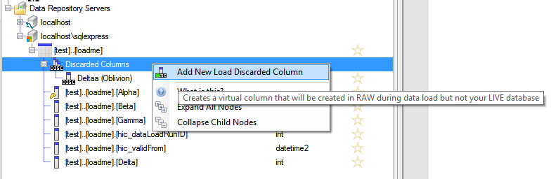

If you want to dump / dilute the column you must configure a dump server.  And in the case of dilution, you will also have to add a `Dilution` mutilator to `AdjustStaging` and a column to your live schema for storing the diluted value.

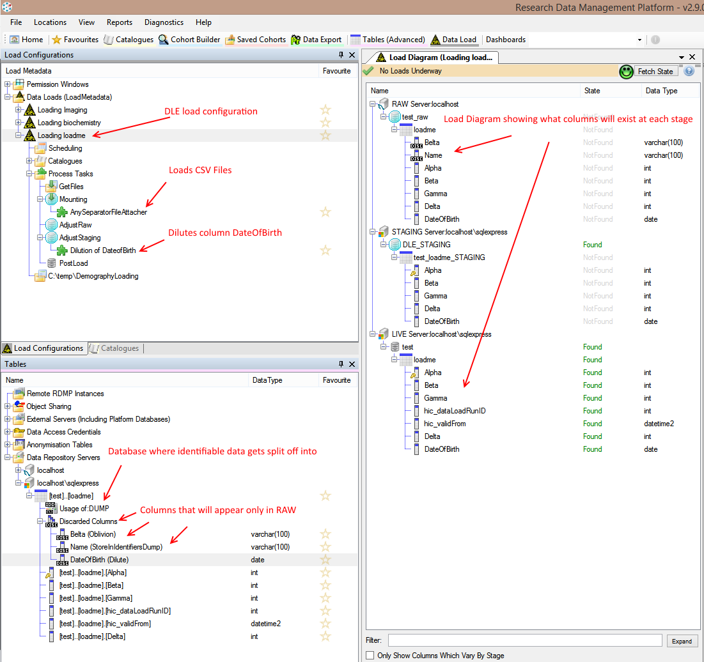

This approach gives a single workflow for acknowledging new columns and making conscious decisions about how to treat that data.  And since it is ALLOWED for columns in the database to appear that are not in input files you can still run the new load configuration on old files without it breaking.

<a name="sqlScripts"></a>
### Can I run SQL Scripts during a load?
Yes once you have a load set up you can add SQL scripts to adjust the data in RAW / STAGING during the load.  You can also run scripts in PostLoad (which happens after data is migrated into the LIVE tables) but this is not recommended since it breaks the paradigm load isolation.

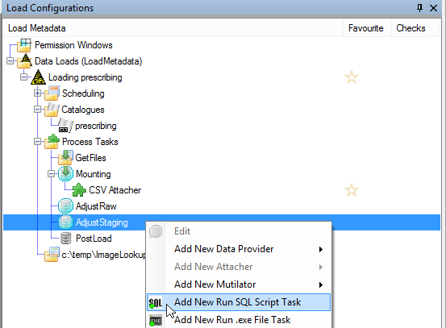


The Load Diagram shows the tables that will exist in RAW/STAGING.  Notice that the names for the tables/databases change depending on the stage.  This is handled by autocomplete when writing scripts (see below).

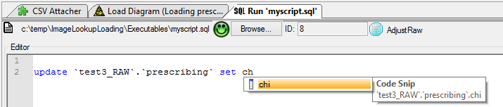

If you want to make a script agnostic of the LoadStage or if you are writing your own `INameDatabasesAndTablesDuringLoads` then you can reference columns/tables by ID using the following Syntax

```
{T:100}
```

Where T is for [TableInfo] and 100 is the `ID` of the [TableInfo] you want the name of.  You can find the ID by viewing the ID column of the Tables collection:

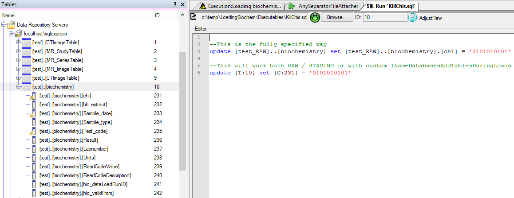

If you want to share one script between lots of different loads you can drag the .sql file from Windows Explorer onto the bubble node (e.g. AdjustStaging)

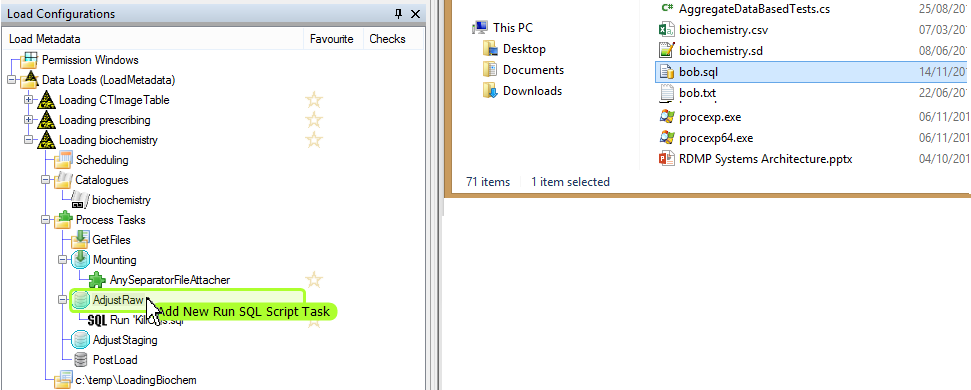

In order to allow other people to run the data load it is advised to store all SQL Script files on a shared network drive.

<a name="notlistingtable"></a>
### RDMP is not listing my table as importable

RDMP can create references to tables and views from any database to which you have sufficient privileges.  If you can see other tables in the database listed check the following:

- The table does not have brackets in its name e.g. `[MyDb]..[MyTbl (fff)]`
- The table does not have dots in its name e.g. `[MyDb]..[MyTbl.lol]`
- The table is visible through other tools e.g. sql management studio

If you cannot see any tables listed in the database

- Check that the servername/database name are correct
- If you need a connection string keyword (e.g. specific port) [create a ConnectionStringKeyword](#connectionStringKeywords)

## User Interface

<a name="resize"></a>

## I cannot resize a column in a listbox/tree view

Some columns in RDMP are set to fill the available space (in the dialog).  For example the Name column in the object selection dialog.  You can still resize other columns (e.g. CatalogueName) by using dragging the far side of the column to the right.

[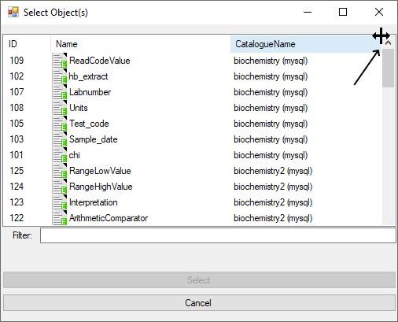](https://youtu.be/OcbG-FDEq30)

<a name="user-settings"></a>
## Where does RDMP store user settings?

RDMP stores user settings in IsolatedStorage.  In Windows you can reach this by entering the following in Windows Explorer:

```
%LocalAppData%\IsolatedStorage
```

## Anonymisation

### Does RDMP Support Data Anonymisation?

Yes, data can be annonymised in the following ways

1. When loading data 
   1. [Columns can be can be ignored by the DLE](#skipColumns) (do not load an identifiable column)
   2. Columns can be split off and stored in a separate table (e.g. split identifiers like name/address from data like prescribed drug)
   2. Column values can be allocated an anonymous substitution mapping (mapping tables are persisted in an ano database)
   3. Column values can be diluted (e.g. store only the left 4 digits of a postcode)
2. When extracting data
   1. Columns can be marked as 'not extractable'
   2. Columns can be marked as requiring 'Special Approval' to be extracted
   3. Columns can be marked for hashing on extraction
   4. The linkage identifier (e.g. CHI) is substituted for an anonymous mapping (e.g. a guid)
   5. Sql transforms can be applied to the column being extracted
3. Pipelines / ProcessTasks
   1. The [plugin API](#plugins) makes writing plugins to perform arbitrary anonymisations easy.

## Curation

<a name="whatisacatalogue"></a>
### What is a Catalogue?
A [Catalogue] is RDMP's representation of one of your datasets e.g. 'Hospital Admissions'.  A [Catalogue] consists of:

* Human readable names/descriptions of what is in the dataset it is
* A collection of items mapped to underlying columns in your database.  Each of these:
	* Can be extractable or not, or extractable only with SpecialApproval
	* Can involve a transform on the underlying column (E.g. hash on extraction, UPPER etc)
	* Have a human readable name/description of the column/transform
	* Can have curated WHERE filters defined on them which can be reused for project extraction/cohort generation etc
* Validation rules for each of the extractable items in the dataset
* Graph definitions for viewing the contents of the dataset (and testing filters / cohorts built)
* Attachments which help understand the dataset (e.g. a pdf file)

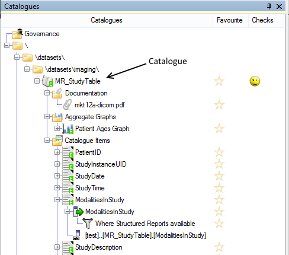

A [Catalogue] can be a part of project extraction configurations, used in cohort identification configurations.  They can be marked as Deprecated, Internal etc.

The separation of dataset and underlying table allows you to have multiple datasets both of which draw data from the same table.  It also makes it easier to handle moving a table/database (e.g. to a new server or database) / renaming etc.

Internally Catalogues are stored in the [Catalogue] table of the RDMP platform database (e.g. RDMP_Catalogue).  The ID field of this table is used by other objects to reference it (e.g. CatalogueItem.Catalogue_ID).  

<a name="sharing"></a>
### Can I share/export/import my dataset metadata?

There are 4 ways to export/import dataset descriptions from RDMP

* [Metadata Report](#metadata-report)
* [Share Definition](#share-definition)
* [Dublin Core](#dublin-core)
* [DITA](#dita)
* [Custom Metadata Report](#custom-metadata-report)


#### Metadata Report

This report is accessed through the 'Reports' menu.  It uses [DocX](https://github.com/xceedsoftware/DocX) to write a Microsoft Word file containing the dataset description, row count, unique patient count as well as any graphs that are marked extractable.

This report can be generated for a specific dataset only or all datasets.  A variant of this report is produced when performing a project extraction which shows only the subset of data extracted for the given project/cohort.

#### Example Metadata Report

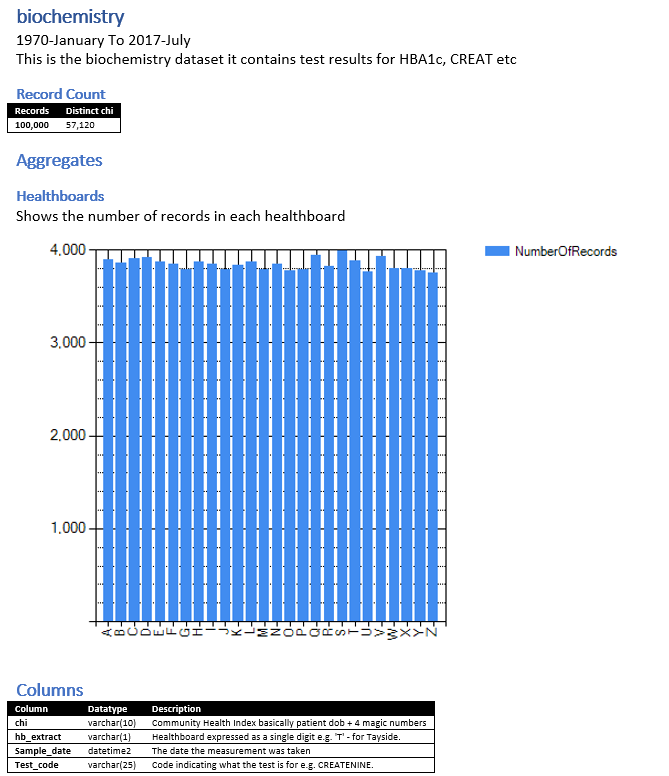

#### Share Definition

If you want to share dataset description, column descriptions etc with another RDMP user (in another organisation) you can export your [Catalogue] as a .sd file.  This contains JSON definitions for the [Catalogue] and all [CatalogueItem] objects.  This includes Validation XML and all the additional fields e.g. Granularity Coverage, Background Summary etc.  The share does not include the mapping between descriptions and underlying columns or the extraction SQL since this is likely to vary by site.

You can import a Share Definition (.sd) file previously generated by yourself or another RMDP user to load the stored descriptions.  This is useful if two or more organisations have semantically similar copies of the same dataset (e.g. SMR01).  When importing a Share Definition file you will import all column descriptions ([CatalogueItem]) even if you do not have them in your database (they simply won't be mapped to an underlying database column).

Share Definition files include JSON serialization of values and are not designed to be human readable.

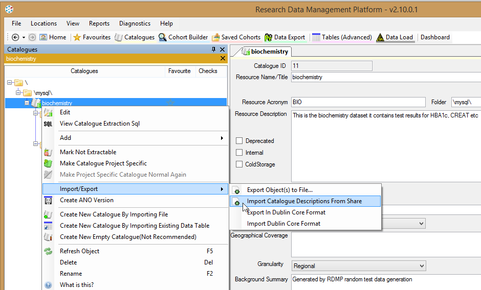

#### Dublin Core

[Catalogue] descriptive metadata can be serialized into an xml file which follows the [Dublin Core guidelines]( http://dublincore.org/documents/dc-xml-guidelines/).  RDMP can load dataset descriptions from `<metadata>` `XElements` which follow this xmlns.

An example can be seen below:

```xml
<metadata xmlns:xsi="http://www.w3.org/2001/XMLSchema-instance" xmlns:dc="http://purl.org/dc/elements/1.1/" xmlns:dcterms="http://purl.org/dc/terms/">
  <dc:title>biochemistry</dc:title>
  <dcterms:alternative>BIO</dcterms:alternative>
  <dc:subject>biochemistry, blood, urine, Tayside</dc:subject>
  <dc:description>This is the biochemistry dataset it contains test results for HBA1c, CREAT etc</dc:description>
  <dc:publisher />
  <dcterms:isPartOf xsi:type="dcterms:URI" />
  <dcterms:identifier xsi:type="dcterms:URI" />
  <dc:format xsi:type="dcterms:IMT" />
</metadata>
```

#### DITA

You can export all dataset descriptions as [.dita files](http://docs.oasis-open.org/dita/dita/v1.3/dita-v1.3-part3-all-inclusive.html) and a single .ditamap using the Reports menu.

An example .dita file is shown below:

```xml
<?xml version="1.0" encoding="UTF-8"?>
<!DOCTYPE concept PUBLIC "-//OASIS//DTD DITA Concept//EN"
"concept.dtd"><concept id="bio">
<title>biochemistry</title>
<conbody>
<simpletable keycol="1">
<strow>
<stentry>Acronym</stentry>
<stentry>BIO</stentry>
</strow>
<strow>
<stentry>Name</stentry>
<stentry>biochemistry</stentry>
</strow>
<strow>
<stentry>Description</stentry>
<stentry>This is the biochemistry dataset it contains test results for HBA1c, CREAT etc</stentry>
</strow>
<strow>
<stentry>Type</stentry>
<stentry>EHRExtract</stentry>
</strow>
<strow>
<stentry>Periodicity</stentry>
<stentry>Daily</stentry>
</strow>
...
```
#### Custom Metadata Report

RDMP supports exporting in arbitrary file formats (xml, markdown etc) through its 'custom metadata' engine.  To do this you will need to use
the [RDMP CLI](./RdmpCommandLine.md). 

First create a simple template (e.g. a markdown file).

```md
# Datasets

These are the datasets we hold:

- Biochemistry
- Hameatology
- Prescribing
```

Then surround the actual values with a `$foreach Catalogue` and `$end`


```md
# Datasets

These are the datasets we hold:

$foreach Catalogue
- Biochemistry
- Hameatology
- Prescribing
$end
```

Then replace the Name with `$Name`

```md
# Datasets

These are the datasets we hold:

$foreach Catalogue
- $Name
$end
```

Save this in a file (e.g. `C:\temp\myTemplate.md`).  Next run an metadata extraction using the CLI:

```
./rdmp ExtractMetadata Catalogue:* c:\temp\ C:\temp\myTemplate.md "out.md" true null null
```

Open `out.md` and you should have something like:

```md
# Datasets

These are the datasets we hold:

- AutomateExtraction
- AutomateExtractionSchedule
- Biochemistry
- Demography
- HospitalAdmissions
- Prescribing
- QueuedExtraction
- ReleaseIdentifiersSeen
- SuccessfullyExtractedResults
- vConditions
- vOperations
- z_someting
```

For a full list of substitutions available see [CustomMetadataSubstitutions.md](./CustomMetadataSubstitutions.md)

<a name="2tablecatalogues"></a>
## How do I create a [Catalogue] from 2+ tables?

Start by importing the Tables as normal (but do not create a Catalogue).  Double click the topmost table and check 'Is Primary Extraction Table'.

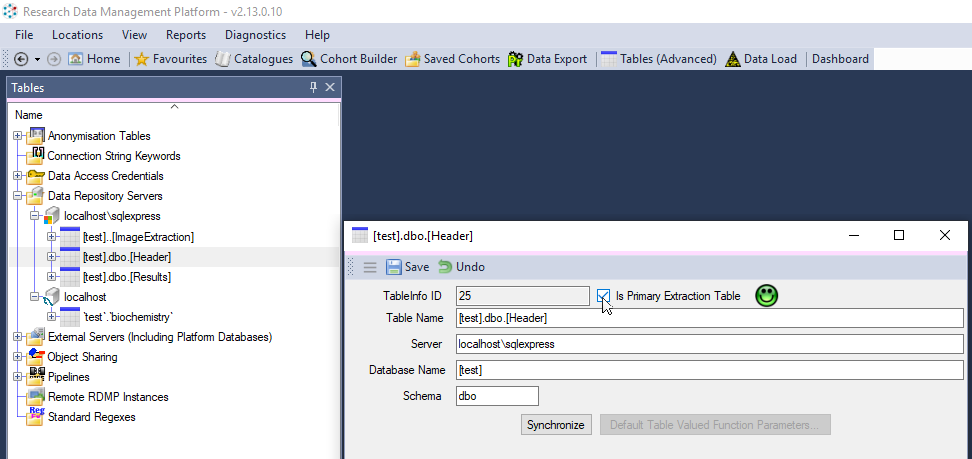 

Next right click the topmost table and select 'Configure [JoinInfo] Where...'.  In this window add the child table to join to and drag the column(s) that should be used to join. 

You can configure a `collation` (if required) and join direction (LEFT / RIGHT / INNER)

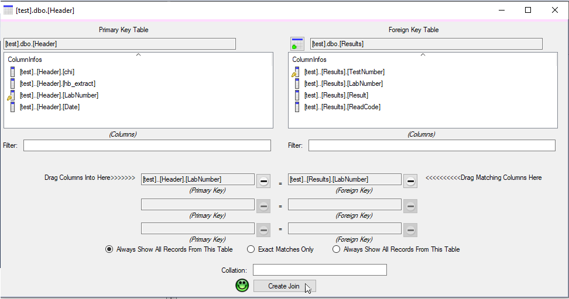 

Now we have configured the technical layer we can create our [Catalogue].  Create a new [Catalogue] by right clicking in the Catalogues collection

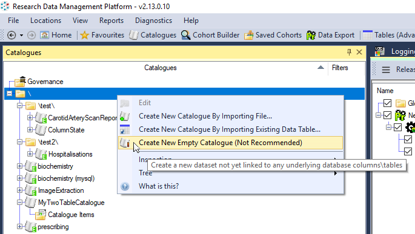 

Then right click each Table in turn and select `Create New Catalogue...` but instead of closing the dialog with 'Ok' instead click 'Add To Existing Catalogue' (After configuring column extractability).

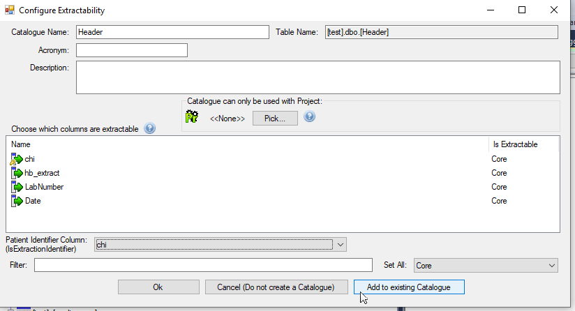 

You can check that you have configured the join correctly by right clicking the [Catalogue] and selecting `View [Catalogue] Extraction Sql`

<a name ="#tell-me-about-graphs"></a>
### Tell me about graphs

Being able to visualize your data is incredibly important for data confidence, cohort building and correct filtering.  RDMP has 2
graph systems:

- [Data Quality Engine graphs](./Validation.md)
- [Aggregate Graphs](./Graphs.md)


<a name ="tell-me-about-logging"></a>
### Tell me about logging

There are 2 primary sources of 'logging' in RDMP:

- Audit
- System Logs

### Audit

Audit logs are generated by running RDMP engines (extractions, cohort creation, ETL etc).  Audit
logs are written to the 'Logging' RDMP platform database and are designed to be consumed by data
analysts.  Audit logs are stored in a hierarchical format:


| Table      | Description |
| ----------- | ----------- |
| DataTask      | Title       |
| Paragraph   | Text        |

Audit logs can be accessed by right clicking on the 'Logging' server in the RDMP Gui under (`Tables(Advanced)` tree or `Other` in TUI).  

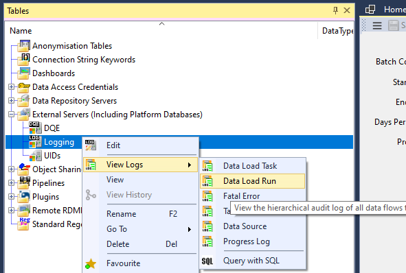 

Audit logs for specific objects can be accessed directly from the object itself e.g. right clicking on an [ExtractionConfiguration]

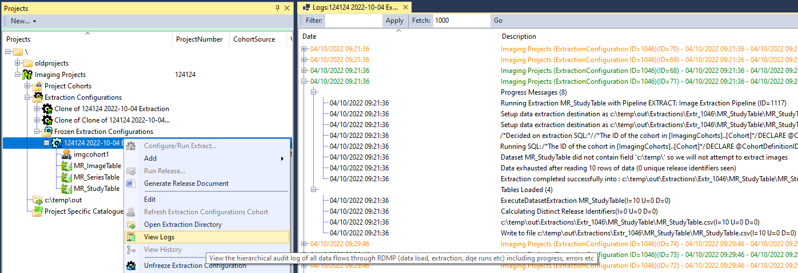 

The audit server is automatically set up during the installation of RDMP and defaults to using 'integrated security' (windows authentication).
However you can create a new logging server manually which can use (encrypted) username/password credentials (e.g. sql authentication). 
RDMP also supports creating the audit logging database in other [DBMS] types (e.g. MySql) but again this must be manually configured.

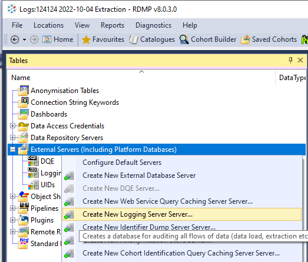

### System Logs

System logs can be enabled for RDMP.  These are low level logs designed to be read by a software developer or IT specialist.  To enable
this feature, download [NLog.config](https://raw.githubusercontent.com/HicServices/RDMP/main/Tools/rdmp/NLog.config) to your RDMP install.
This template generates file logs to a `./logs/` sub-directory.  You can adjust it to log anywhere including to databases/central server etc
by [following the NLog targets guide](https://nlog-project.org/config/).  **Logs may contain identifiable or sensitive information so should
be secured appropriately if enabled**. 

The RDMP CLI (command line) is supplied pre-configured for file and colour console logging.

## User Interface Programming


<a name="uioverview"></a>
### How are user interfaces implemented in RDMP?
RDMP uses Windows Forms with the [Dock Panel Suite](https://github.com/dockpanelsuite/dockpanelsuite) framework for docking.  It uses [Scintilla.Net](https://github.com/jacobslusser/ScintillaNET) for text editors (e.g. viewing SQL) and [ObjectListView](http://objectlistview.sourceforge.net/cs/index.html) for the advanced navigation tree/list views.

User interfaces in RDMP follow a standard testable design which is described in the [user interface overview](./UserInterfaceOverview.md).

<a name="abstractDesignerPattern"></a>
### What's with the _Design user interface classes?
Any user interface class which includes an abstract base class in its hierarchy (e.g. `CatalogueUI`) has an accompanying class `CatalogueUI_Design`.  This class exists solely facilitate using the visual studio forms designer (which [doesn't support abstract base classes](https://stackoverflow.com/a/6817281/4824531)).  Even with this workaround visual studio will sometimes fail to show the designer for these controls, restarting visual studio usually solves this problem.

<a name="reorder"></a>
### How do I stop some nodes being reordered in RDMPCollectionUIs?
Sometimes you want to limit which nodes in an `RDMPCollectionUI` are reordered when the user clicks on the column header.  In the below picture we want to allow the user to sort data loads by name but we don't want to reorder the ProcessTask nodes or the steps in them since that would confuse the user as to the execution order.

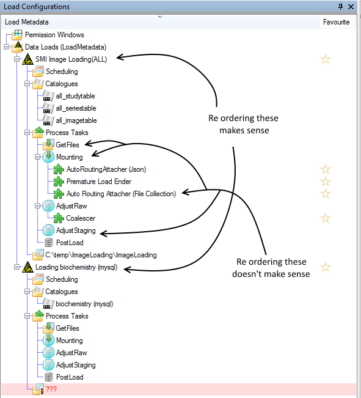 

You can prevent all nodes of a given Type from being reordered (relative to their branch siblings) by inheriting `IOrderable` and returning an appropriate value:

```csharp
public class ExampleNode : IOrderable
{
	public int Order { get { return 2; } set {} }
}
```

If you are unsure what Type a given node is you can right click it and select 'What Is This?'.

<a name="addNewNodes"></a>
### How do I add new nodes to RDMPCollectionUIs?
This requires a tutorial all of its own 

[CreatingANewCollectionTreeNode](./CreatingANewCollectionTreeNode.md)


<a name="databaseDdos"></a>
### My metadata databases are being hammered by thousands of requests?
The entire RDMP meta data model is stored in platform databases (Catalogue / Data Export etc).  Classes e.g. [Catalogue] are fetched either all at once or by `ID`.  The class Properties can be used to fetch other related objects e.g. `Catalogue.CatalogueItems`.  This usually does not result in a bottleneck but under some conditions deeply nested use of these properties can result in your platform database being hammered with requests.  You can determine whether this is the case by using the PerformanceCounter.  This tool will show every database request issued while it is running including the number of distinct Stack Frames responsible for the query being issued.  Hundreds or even thousands of requests isn't a problem but if you start getting into the tens of thousands for trivial operations you might want to refactor your code.

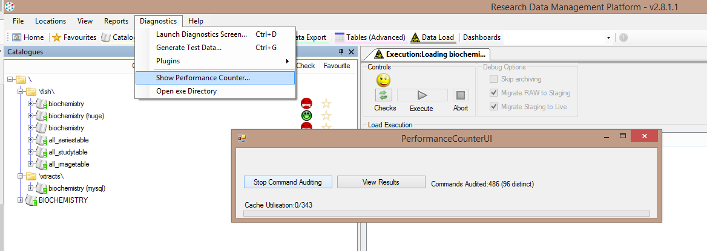 

Typically you can solve these problems by fetching all the required objects up front e.g.

```csharp
var catalogues = repository.GetAllObjects<Catalogue>();
var catalogueItems = repository.GetAllObjects<CatalogueItem>();
```

If you think the problem is more widespread then you can also use the [`IInjectKnown<T>`](./../../Rdmp.Core/MapsDirectlyToDatabaseTable/Injection/Injection.md) system to perform `Lazy` loads which prevents repeated calls to the same property going back to the database every time.


## Other Programming

<a name="tests"></a>
### Are there Unit/Integration Tests?
Yes there are over 1,000 unit and integration tests, this is covered in [Tests](Tests.md)

[hic_dataLoadRunID]: #hic_dataLoadRunID
[Data Load Engine]: #data-load-engine
[db_executor]: https://www.sqlmatters.com/Articles/Adding%20a%20db_executor%20role.aspx
[cohort databases]: ../../Rdmp.Core/CohortCommitting/CohortCommitting.md
[cohort database]: ../../Rdmp.Core/CohortCommitting/CohortCommitting.md
[query cache]: ../../Rdmp.Core/CohortCreation/CohortCreation.md
[UNION]: ./Glossary.md#UNION
[EXCEPT]: ./Glossary.md#EXCEPT
[INTERSECT]: ./Glossary.md#INTERSECT
[DBMS]: ./Glossary.md#DBMS

[Catalogue]: ./Glossary.md#Catalogue
[TableInfo]: ./Glossary.md#TableInfo

[Project]: ./Glossary.md#Project
[LoadMetadata]: ./Glossary.md#LoadMetadata
[CatalogueItem]: ./Glossary.md#CatalogueItem

[JoinInfo]: ./Glossary.md#JoinInfo
[WebFileDownloader]: ../../Rdmp.Core/DataLoad/Modules/Web/WebFileDownloader.cs
[DelimitedFlatFileAttacher]: ../../Rdmp.Core/DataLoad/Modules/Attachers/DelimitedFlatFileAttacher.cs
[RemoteTableAttacher]: ../../Rdmp.Core/DataLoad/Modules/Attachers/RemoteTableAttacher.cs
[ImportFilesDataProvider]: ../../Rdmp.Core/DataLoad/Modules/DataProvider/ImportFilesDataProvider.cs
[ProcessTask]: ./Glossary.md#ProcessTask

[Pipeline]: ./Glossary.md#Pipeline
