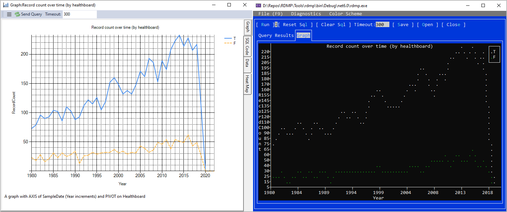
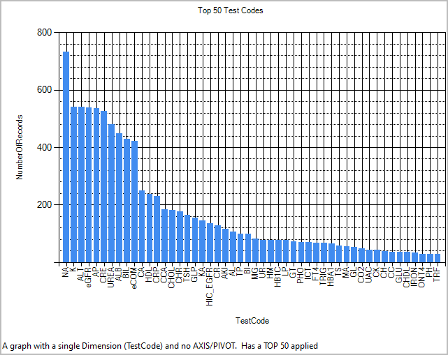
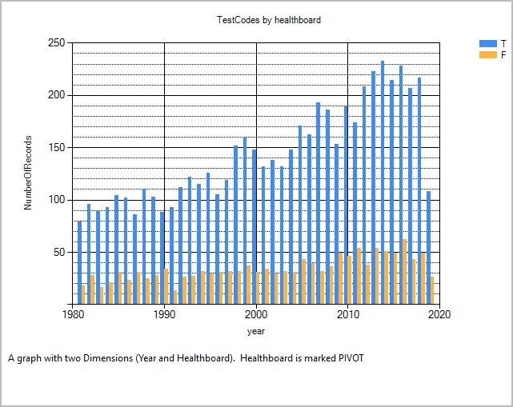
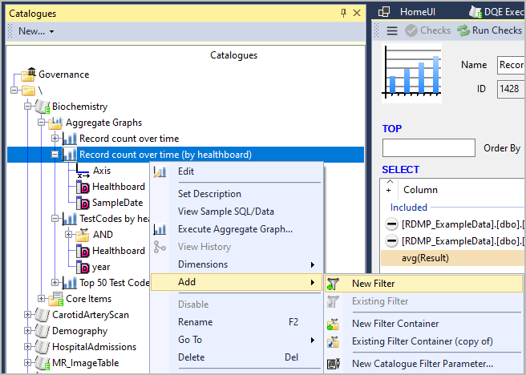
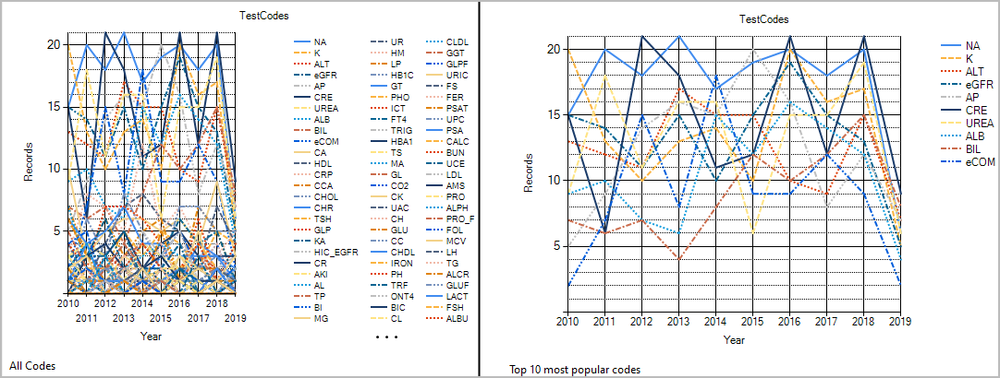
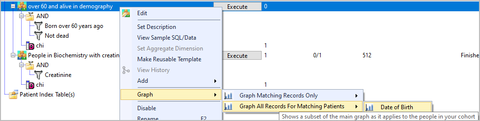
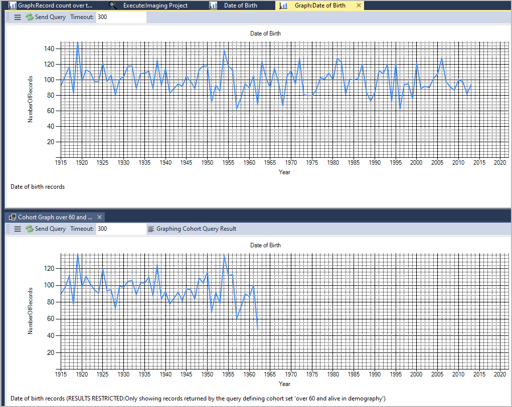

# Aggregate Graphs

## Table of contents
1. [Introduction](#introduction)
1. [Adding a Graph](#adding-a-graph)
1. [Graph Types](#graph-types)
   1. [Bar 1 Dimension](#bar-1-dimension)
   1. [Bar 2 Dimensions](#bar-2-dimensions)
   1. [Plot 1 Dimension](#plot-1-dimension)
   1. [Bar 2 Dimension](#plot-2-dimensions)
1. [Other Features](#other-features)
   1. [COUNT Y](#count-y)
   1. [WHERE](#where)
   1. [HAVING](#having)
   1. [TOP X](#top-x)
1. [Graphing Cohorts](#graphing-cohorts)
1. [Performance](#performance)
1. [Exporting graph data from CLI](#exporting-graph-data-from-cli)
1. [Limitations](#limitations)

## Introduction

RDMP has a basic graphing system called 'Aggregate Graphs'.  These generate queries that produce Bar or Plot data that
can then either:

- Be visualized in the RDMP Windows GUI Client
- Be visualized in the RDMP Cross Platform Console TUI
- Be [exported as CSV](#exporting-graph-data-from-cli) for graphing in other tools (e.g. Excel)



## Adding a Graph

Graphs can be added to any [Catalogue] through the right click context menu:


This will take you to the 'Edit' page where you can specify which dimensions to use, Axis, Pivot etc.

## Graph Types
The RDMP graphing engine supports Bar and Plot graphs.  Not all [DBMS] implement all graph types.  The following
table shows what is implemented:

|  Graph Type  | [Sql Server](https://github.com/HicServices/FAnsiSql/blob/main/FAnsiSql/Implementations/MicrosoftSQL/README.md) | [MySql](https://github.com/HicServices/FAnsiSql/blob/main/FAnsiSql/Implementations/MySql/README.md) | [Postgres](https://github.com/HicServices/FAnsiSql/blob/main/FAnsiSql/Implementations/PostgreSql/README.md) | [Oracle](https://github.com/HicServices/FAnsiSql/blob/main/FAnsiSql/Implementations/Oracle/README.md) |
|----|---|----|---|---|
| [Bar 1 Dimension](#bar-1-dimension) | yes | yes | yes | yes  |
| [Bar 2 Dimensions](#bar-2-dimensions) | yes | yes | no | yes  |
| [Plot 1 Dimension](#plot-1-dimension) | yes | yes | yes | no |
| [Plot 2 Dimensions](#plot-2-dimensions) | yes | yes | no| no  |

Graph query generation is handled in the [FAnsiSql](https://github.com/HicServices/FAnsiSql) library.

### Bar 1 Dimension 
The simplest graph you can create has only a single Dimension (column).  The following is an example created from the
Biochemistry test dataset that is optionally provided with the RDMP installation.



### Bar 2 Dimensions

You can create a 'Side-By-Side' bar chart by adding two Dimensions and marking one as PIVOT.  The following example
shows a Dimension of `Year(SampleDate)` and a PIVOT on healthboard.  A filter has also been added to only show years
after 1980.



### Plot 1 Dimension

Plot graphs depict a time axis and a line for the data.  The axis is continuous and can be set to Year/Quarter/Month increments.
If no data exists for a date then the bar will drop to 0 (unlike in bar graphs where 0 counts are not shown).


### Plot 2 Dimensions

Plot graphs can have a PIVOT dimension.  The following example shows an AXIS of `SampleDate` and a PIVOT on healthboard:


## Other Features

Behind every graph RDMP generates is a `GROUP BY` statement (hence the word 'Aggregate').  The following SQL features are
supported for customizing what data is calculated.

### COUNT Y

All graphs come with a single 'count' column.  This column cannot be removed and defaults to `count(*)`.  You can change this to any valid SQL e.g. `count(distinct StudyInstanceUID)`.  You are not restricted to count and can use any other aggregation function e.g. `avg(Result)`.

### WHERE

Filters can be applied to the records returned.  These use the normal RDMP filter system and can be added via the right click context menu.



### HAVING

In SQL a `GROUP BY` query can contain a `HAVING` block.  This discards records after performing the aggregation (e.g. count).  `HAVING`
differs from `WHERE` because it is applied after counting all the data while `WHERE` is applied before.  `WHERE` cannot reference the count
(since it has not been calculated yet) while `HAVING` can.

You can add a `HAVING` block e.g. `count(*)>100` to show only bars / plot values where the count is over 100.

**Take care when combining `HAVING` with `PIVOT` as `HAVING` will discard plot points/bars.  This can lead to a graph which appears to show 0 records**


_Bars with values <100 are not shown due to the HAVING condition.  This results in several orange 'F' bars disappearing, even when there is a 'T' bar over 100_

### TOP X

You can apply a `TOP` (or `LIMIT` in the case of MySql/Oracle).  This will reduce the number of bars in a Bar chart or the number of series in a Plot.



_Applying a TOP to PIVOT graphs limits the number of series in the PIVOT_

## Graphing Cohorts

One of the core strengths of the RDMP graphing system is the ability to run graphs on Filters, Cohorts and/or [ExtractionConfiguration] datasets.  This lets you rapidly confirm that the cohort you are building does not have data holes or missing trends.

To graph a cohort right click it and go to Graph.  Make sure you have set up a [cohort caching database](../../Rdmp.Core/CohortCreation/CohortCreation.md).



There are 2 options for generating graphs:

|               |     Explanation           |
|---------------|---------------------------|
| Records       | Graph will show only rows returned by your cohort query (e.g. prescriptions for drug X) |
| Matching Patients  | Graph of all records held by people that appear in your cohort result set (e.g. all prescriptions that people on drug X are collecting)|

In the above example graphing the records would give a graph showing only drug X.  While graphing patients will show a graph with a heavy bias for drug X (those records contributed patients to the result set) but also any other drugs they are on.  Graphing patients can be done cross dataset e.g. you can view a Demography graph for a cohort built using Prescribing.


When running a cohort graph you may benefit from also running the normal graph so you can compare the two:



## Performance

RDMP generates a single SQL query which is sent to the server.  This puts the workload on the [DBMS] and not the local
computer.  The SQL query can be viewed through the RDMP client.  It is normal for graphs to take several hours to run if
your dataset contains billions of records.  One way to improve performance is to run the SQL generated by RDMP through the
Query Optimizer of your [DBMS].

Other things to consider include:

- Adding indexes to PIVOT and/or AXIS columns
- Changing AXIS to a larger increment (e.g. YEAR instead of MONTH)
- Avoiding using complicated transforms for Dimensions (which may invalidate index use)

## Exporting graph data from CLI

The [RDMP CLI](./RdmpCommandLine.md) supports automated running and extraction of CSV data for any graphs you have created in RDMP.
To do this use the ViewData command.  You will need to know the ID of the graph you want to run:

```
./rdmp viewdata AggregateConfiguration:1428 ALL ./out.csv
```

Alternatively you can provide the name of the graph:
```
./rdmp viewdata "AggregateConfiguration:Record count over time (by healthboard)" ALL ./out.csv
```

If you want to pipe the results to another process (e.g. grep) you can skip the file argument (e.g. `./out.csv`) and add the `-q` (quiet) option to surprsess extra logging:

```
./rdmp viewdata "AggregateConfiguration:1428" ALL -q | grep 1992
```

## Limitations

RDMP graphs are relatively simple
and should not be considered a substitute for dedicated data exploration tools such as Power BI or Tableau.  The
strengths of RDMP's graph system is the ability to rapidly visualize table data without leaving RDMP and the ability to [combine with the other RDMP systems](#graphing-cohorts) (e.g. cohort building).


[ExtractionConfiguration]: ./Glossary.md#ExtractionConfiguration
[Catalogue]: ./Glossary.md#Catalogue
[DBMS]: ./Glossary.md#DBMS
[CohortIdentificationConfiguration]: ./Glossary.md#CohortIdentificationConfiguration