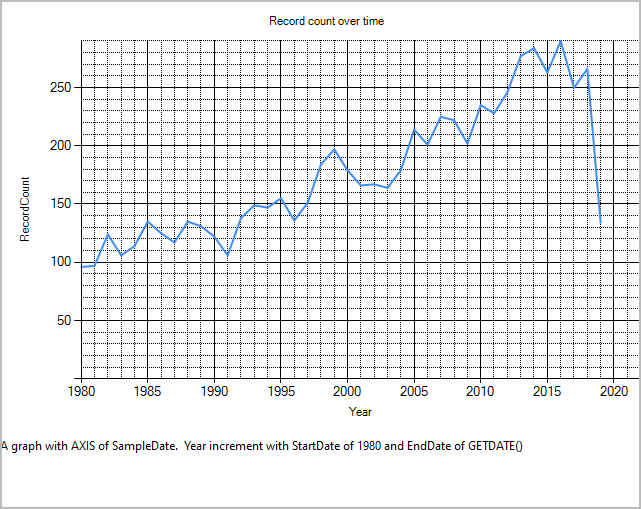

# Aggregate Graphs

## Table of contents
1. Introduction
1. [Adding a Graph](#adding)
1. [Graph Types](#graph-types)
   1. [Bar 1 Dimension](bar-1-dimension)
   1. [Bar 2 Dimensions](bar-2-dimensions)
   1. [Plot 1 Dimension](plot-1-dimension)
   1. [Bar 2 Dimension](plot-2-dimensions)
1. [Other Features]
   1. COUNT Y
   1. WHERE
   1. HAVING
   1. TOP
   
## Introduction

RDMP has a basic graphing system called 'Aggregate Graphs'.  These generate queries that produce Bar or Plot data that
can then either:

- Be visualized in the RDMP Windows GUI Client
- Be visualized in the RDMP Cross Platform Console TUI
- Be exported as CSV for graphing in other tools (e.g. Excel)

## Adding a Graph

Adding a Graph

## Graph Types
The RDMP graphing engine supports Bar and Plot graphs.  Not all [DBMS] implement all graph types.  The following
table shows what is implemented:

|  Graph Type  | [Sql Server](https://github.com/HicServices/FAnsiSql/blob/main/Implementations/FAnsi.Implementations.MicrosoftSQL/README.md) | [MySql](https://github.com/HicServices/FAnsiSql/blob/main/Implementations/FAnsi.Implementations.MySql/README.md) | [Postgres](https://github.com/HicServices/FAnsiSql/blob/main/Implementations/FAnsi.Implementations.PostgreSql/README.md) | [Oracle](https://github.com/HicServices/FAnsiSql/blob/main/Implementations/FAnsi.Implementations.Oracle/README.md) |
|----|---|----|---|---|
| [Bar 1 Dimension](bar-1-dimension) | yes | yes | yes | yes  |
| [Bar 2 Dimensions](bar-2-dimensions) | yes | yes | yes | yes  |
| [Plot 1 Dimension](plot-1-dimension) | yes | yes | yes | no |
| [Plot 2 Dimensions](plot-2-dimensions) | yes | yes | yes| no  |

Graph query generation is handled in the [FAnsiSql](https://github.com/HicServices/FAnsiSql) library.

### Bar 1 Dimension 
The simplest graph you can create has only a single Dimension (column).  The following is an example created from the
Biochemistry test dataset that is optionally provided with the RDMP installation.

### Bar 2 Dimensions

You can create a 'Side-By-Side' bar chart by adding two Dimensions and marking one as PIVOT.  The following example
shows a Dimension of `Year(SampleDate)` and a PIVOT on healthboard.  A filter has also been added to only show years
after 1980.

### Plot 1 Dimension

Plot graphs depict a time axis and a line for the data.  The axis is continuous and can be set to Year/Quarter/Month increments.
If no data exists for a date then the bar will drop to 0 (unlike in bar graphs where 0 counts are not shown).

### Plot 2 Dimensions

Plot graphs can have a PIVOT dimension.  The following example shows an AXIS of `SampleDate` and a PIVOT on healthboard:

These graphs support `TOP` and `HAVING`
logic.  You can customize the 

# TOP

# HAVING

[DBMS]: ./Glossary.md#DBMS