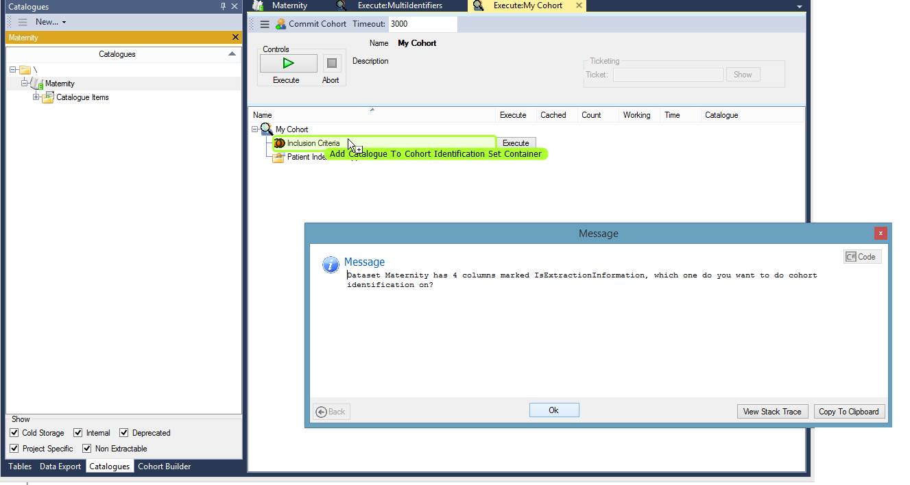
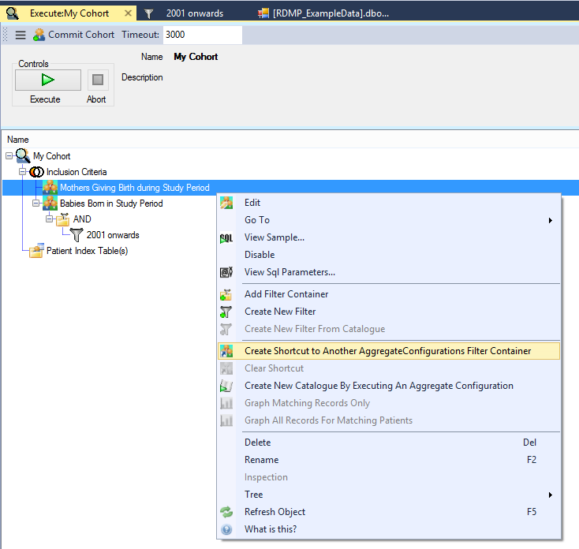

# Multiple Extraction Identifiers

## Background

In RDMP you indicate which column in your dataset contains the linkage identifier (e.g. CHI) that can be used to link the dataset with others that share the same identifier type.  

When a single column is marked [IsExtractionIdentifier] RDMP will use this column for building cohorts.  When two or more columns are marked [IsExtractionIdentifier] (e.g. Mother CHI, baby CHI for a Maternity dataset) then you must choose which column to use.

## When building a cohort

When adding a dataset with multiple [IsExtractionIdentifier] columns to a [CohortIdentificationConfiguration] you will be prompted to pick which column to pull identifiers from.  Since cohort building in RDMP is based on set operations ([UNION] , [INTERSECT] etc) it is not possible to select two columns at once for a given set.

After adding a dataset you can change the identifier column by right clicking and selecting Edit.

If you want your cohort to contain identifiers in multiple columns (e.g. Mothers and Children) you will have to import the dataset twice selecting a different column in each case.  If you have complicated filters that you do not want to replicate you can define them in one and create a link in the other:

## When extracting a dataset

When extracting a dataset in an [ExtractionConfiguration] RDMP performs a JOIN on a cohort table.  The cohort table stores the Release identifier for all Private identifiers in the cohort.  For example:

Example Cohort Table:

| PrivateIdentifier | ReleaseIdentifier |
|----------|---------|
| 101         |   anon1      |
| 202         |   anon2      |
| 303         |   anon3      |

When extracting a dataset with multiple [IsExtractionIdentifier] columns (e.g. see below) __all private identifiers will be removed__.  Where the private identifier exists in the cohort it will be substituted for the Release Identifier.  If it does not exist then it will be substituted for null.  This allows you to build a cohort based on Mothers or Children.

Maternity Dataset:

| MotherIdentifier | ChildIdentifier | Date |
|----------|---------|---------|
|   101       |  707       |     2001-01-01    |
|   202       |  909       |     2001-02-02    |
|   202       |  808       |     2002-01-01    |

_Extracting the above dataset with the above cohort (mothers only) would produce a table with nulls in the ChildIdentifier column_

[IsExtractionIdentifier]: ./Glossary.md#IsExtractionIdentifier
[ExtractionConfiguration]: ./Glossary.md#ExtractionConfiguration
[CohortIdentificationConfiguration]: ./Glossary.md#CohortIdentificationConfiguration
[UNION]: ./Glossary.md#UNION
[INTERSECT]: ./Glossary.md#INTERSECT
