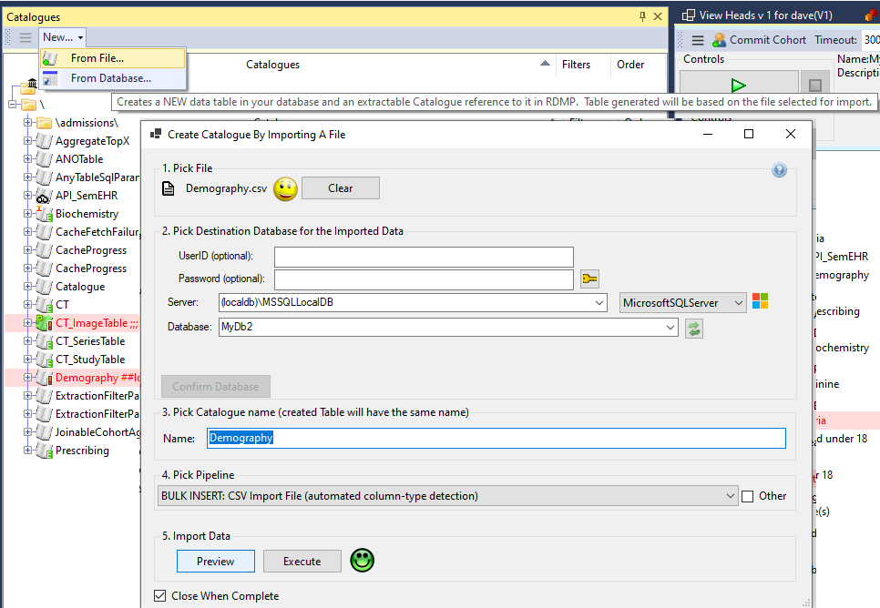
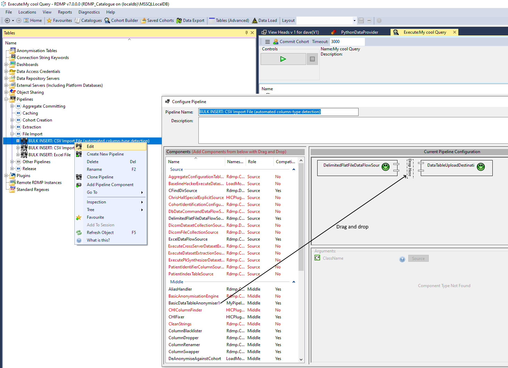

# Table of contents
1. [RDMP Binary and Documentation](#binary)
1. [Hello World Plugin](#helloWorldPlugin)
2. [Debugging](#debugging)
5. [A basic anonymisation plugin](#basicAnoPlugin)
  * [Version 1](#anoPluginVersion1)
  * [Version 2](#anoPluginVersion2)
  * [Version 3](#anoPluginVersion3)
6. [Tests](#tests)
  * [Unit Tests](#unitTests)
  * [Setting up Database Tests](#databaseTestsSetup)
  * [Writting a Database Test](#databaseTestsWritting)
7. [Checks](#checks)
  * [Version 4](#anoPluginVersion4)
7. [Progress Logging](#progress)
  * [Version 5](#anoPluginVersion5)
  * [What is wrong with NLog etc?](#NLog)
  * [What other funky things can I do with IDataLoadEventListener?](#funkyIDataLoadEventListener)
7. [Graphical User Interfaces In Plugins](#guis)


<a name="binary"></a>
# RDMP Binary and Documentation
The Research Data Management Platform Binaries are available on [Releases section of Github](https://github.com/HicServices/RDMP/releases).  In order to use RDMP you will also need access to a Microsoft Sql Server (or Sql Express).  After completing the setup process the main UI will launch.

From here you can access several resources that help understand RDMP classes / patterns etc.  


Firstly there is the `Help=>Show User Manual` (also available at https://github.com/HicServices/RDMP/blob/master/Documentation/UserManual.docx).

Secondly there is the `Help=>Generate Class/Table Summary` which describes the DatabaseEntity objects that appear in RDMPCollectionUIs and are core concepts for RDMP.


Thirdly `Help=>Show Help` will show a dialog telling you what User Interface control you are in (class name) and any comments the class has (works for content tabs only - not collection trees).

Fourthly there is the Tutorial system `Help=>Tutorials` which cover the basics for setting up RDMP test data, importing files etc.

Finally if you get stuck you can compare your codebase with the fully worked example (of this documentation):
https://github.com/HicServices/RDMPExamplePlugins


 <a name="helloWorldPlugin"></a>
 # Hello World Plugin

Rdmp plugins must be packaged as [NuGet packages](https://en.wikipedia.org/wiki/NuGet) (e.g. MyPlugin.0.0.1.nupkg).

Create a new project and add a reference to the nuget package [HIC.RDMP.Plugin](https://www.nuget.org/packages/HIC.RDMP.Plugin/)

```
dotnet new classlib -n MyPlugin -o ./MyPlugin
cd ./MyPlugin
dotnet add package HIC.RDMP.Plugin
```

Add the following classes:

```csharp
using Rdmp.Core;
using Rdmp.Core.CommandExecution;
using Rdmp.Core.CommandExecution.AtomicCommands;
using Rdmp.Core.Curation.Data;
using System.Collections.Generic;

namespace MyPlugin
{
    class MyPluginUI : PluginUserInterface
    {
        public MyPluginUI(IBasicActivateItems itemActivator) : base(itemActivator)
        {
        }

        public override IEnumerable<IAtomicCommand> GetAdditionalRightClickMenuItems(object o)
        {
            if(o is Catalogue)
            {
                yield return new ExecuteCommandHelloWorld(BasicActivator);
            }
        }
    }


    internal class ExecuteCommandHelloWorld : BasicCommandExecution
    {
        public ExecuteCommandHelloWorld(IBasicActivateItems activator) : base(activator)
        {

        }
        public override void Execute()
        {
            BasicActivator.Show("Hello World!");
        }
    }
}
```

Create a nuspec file called `MyPlugin.nuspec` that describes your plugin:

```xml
<?xml version="1.0" encoding="utf-8"?>
<package xmlns="http://schemas.microsoft.com/packaging/2013/05/nuspec.xsd">
    <metadata>
        <id>MyPlugin</id>
        <version>0.0.1</version>
        <authors>Me</authors>
        <description>My RDMP Plugin</description>
        <dependencies>
            <!-- Make sure this matches your running RDMP major/minor versions-->
            <dependency id="HIC.RDMP.Plugin" version="7.0" />
        </dependencies>
    </metadata>
    <files>
    <file src="bin\net5.0\*" target="lib\main" />	
    </files>
</package>
```

Build the solution and package it with the [nuget cli app](https://www.nuget.org/downloads):
```
dotnet build
nuget pack MyPlugin.nuspec
```

This should produce a file called `MyPlugin.0.0.1.nupkg`.  Open RDMP and click the `Tables(Advanced)` collection and right click `Plugins`.  Navigate to your plugin package.

 

Make sure that you have listed the correct RDMP Major/Minor version in the nuspec file (7.0 in the xml example above).  Otherwise when you add it you will get an error:

```
Plugin version 0.0.1 is incompatible with current running version of RDMP (7.0.0).
```

Restart RDMP and right click a Catalogue

 

If you have the RDMP command line you can also call your command from there:

```
./rdmp cmd HelloWorld
```

For example on windows running in powershell the following output would appear:
```
PS Z:\Repos\RDMP\Tools\rdmp\bin\Debug\net5.0> ./rdmp cmd HelloWorld
2021-10-19 10:42:00.7839 INFO Dotnet Version:5.0.10 .
2021-10-19 10:42:00.8063 INFO RDMP Version:7.0.0.0 .
2021-10-19 10:42:01.6559 INFO Setting yaml config value for CatalogueConnectionString .
2021-10-19 10:42:01.6568 INFO Setting yaml config value for DataExportConnectionString .
Hello World!
Command Completed
2021-10-19 10:42:05.9123 INFO Exiting with code 0 .
```

 <a name="debugging"></a>
 # Debugging
If you want to debug your plugin, first delete it in RDMP.  Then set the output build directory to the location of the RDMP binary e.g.:

```
dotnet build -o Z:\rdmp-client
```

Launch the RDMP binary and then attach the visual studio debugger (Debug=>Attach to Process)

<a name="basicAnoPlugin"></a>
# A (very) basic Anonymisation Plugin

We have seen how UI plugins work, now we will write a plugin which functions both through the UI and from the CLI running under the cross platform `net5.0` runtime.

Create a new solution with the following projects.

```
\MyPipelinePlugin\MyPipelinePlugin.csproj                     (TargetFramework net5.0)
\Plugin\net5.0\net5.0.csproj                                  (TargetFramework net5.0)
\Plugin\net5.0-windows\net5.0-windows.csproj                  (TargetFramework net5.0-windows)
\MyPipelinePlugin.nuspec
\MyPipelinePlugin.sln
```

In MyPipelinePlugin.nuspec add the following:

```xml
<?xml version="1.0" encoding="utf-8"?>
<package xmlns="http://schemas.microsoft.com/packaging/2013/05/nuspec.xsd">
    <metadata>
        <id>MyPipelinePlugin</id>
        <version>0.0.1</version>
		<authors>Health Informatics Service, University of Dundee</authors>
		<description>Example Pipeline Plugin Component </description>
		<dependencies>
            <dependency id="HIC.RDMP.Plugin" version="5.0" />
		</dependencies>
    </metadata>
  <files>
    <file src="Plugin\net5.0\bin\Debug\net5.0\publish\*" target="lib\main" />
	<file src="Plugin\net5.0-windows\bin\Debug\net5.0-windows\win-x64\publish\*" target="lib\windows" />
  </files>
</package>
```

Add a Project reference to `MyPipelinePlugin.csproj` from both net5.0.csproj and net5.0-windows.csproj:


To build the plugin run the following in the net5.0 project directory:

```
cd \ExamplePipelinePlugin\MyPipelinePlugin\Plugin\net5.0\
dotnet publish --self-contained false
cd \ExamplePipelinePlugin\MyPipelinePlugin\Plugin\net5.0-windows\
dotnet publish -r win-x64 --self-contained false
```

Next run the nuspec file:

```
nuget pack .\MyPipelinePlugin.nuspec
```

This should produce a file `MyPipelinePlugin.0.0.1.nupkg` containing the following directories:

```
lib\main\
lib\windows\
```

When uploaded into RDMP as a plugin, the appropriate platform/runtime will be selected.  

You can test that the plugin is loaded correctly by compiling and running the cli:

```
cd Tools\rdmp
dotnet publish -r win-x64

cd .\bin\Debug\net5.0\win-x64\publish\

.\rdmp.exe list -t Catalogue --servername localhost\sqlexpress --cataloguedatabasename RDMP_Catalogue --logstartup --command run
```

Now lets write some components for our plugin!

<a name="anoPluginVersion1"></a>
## Version 1

Most of the processes in RDMP use the [Pipeline] system.  This involves a series of components performing operations on a flow of objects of type T (often a `System.Data.DataTable`).  The pipeline is setup/tailored by RDMP users and then reused every time the task needs to be executed.  For example importing a csv file into the database and generating a [Catalogue] from the resulting table (the first thing you do when playing with the RDMP test data) happens through a pipeline called 'BULK INSERT:CSV Import File'.



We will write a reusable component which lets the user identify problem strings (names) in data they are importing.

Declare a new class `BasicDataTableAnonymiser1` in `MyPipelinePlugin.csproj` and implement IPluginDataFlowComponent<DataTable>:


```csharp
using Rdmp.Core.DataFlowPipeline;
using ReusableLibraryCode.Checks;
using ReusableLibraryCode.Progress;
using System;
using System.Data;
using System.Text.RegularExpressions;

namespace MyPipelinePlugin
{
    public class BasicDataTableAnonymiser1 : IPluginDataFlowComponent<DataTable>
    {
        public void Abort(IDataLoadEventListener listener)
        {
            
        }

        public void Check(ICheckNotifier notifier)
        {
            
        }

        public void Dispose(IDataLoadEventListener listener, Exception pipelineFailureExceptionIfAny)
        {
            
        }

        public DataTable ProcessPipelineData(DataTable toProcess, IDataLoadEventListener listener, GracefulCancellationToken cancellationToken)
        {
            //Go through each row in the table
		    foreach (DataRow row in toProcess.Rows)
		    {
			    //for each cell in current row
			    for (int i = 0; i < row.ItemArray.Length; i++)
			    {
				    //if it is a string
				    var stringValue = row[i] as string;

				    if(stringValue != null)
				    {
					    //replace any common names with REDACTED
					    foreach (var name in CommonNames)
						    stringValue =  Regex.Replace(stringValue, name, "REDACTED",RegexOptions.IgnoreCase);

					    row[i] = stringValue;
				    }
			    }
            }

		    return toProcess;
        }

        string[] CommonNames = new string[]
        { 
            "Dave","Frank","Bob","Pete","Daisy","Marley","Lucy","Tabitha","Thomas","Wallace"
        };

    }
}
```

Increase the plugin version number to 0.0.2 in `MyPipelinePlugin.nuspec` and compile the project (don't forget to also run the `dotnet publish` commands above).  Run `nuget pack MyPipelinePlugin.nuspec` and upload the new version of the plugin: `MyPipelinePlugin.0.0.2.nupkg`

Restart RDMP client and select `New Catalogue From File` from the home screen.

Select 'demography.csv' for import (See UserManual.docx for generating test data - Help=>Show User Manual).  Choose a database as the destination and select 'Advanced'.  Select the `BULK INSERT:CSV Import File` pipeline and click Edit.

Drag and drop BasicDataTableAnonymiser1 into the middle of the pipeline.

If your plugin doesn't appear you can select `Diagnostics->Plugins->List All Types` to view all the loaded Types.  You can also click the smiley face during startup to see messages about plugin loading.



Execute the import and do a select out of the final table to confirm that it has worked:

```sql
select * from test..demography where forename like '%REDACTED%'
```

<a name="anoPluginVersion2"></a>
## Version 2 - Adding arguments
You can add user configured properties by declaring public properties decorated with `[DemandsInitialization]`.  This attribute is supported on a wide range of common Types (see `Rdmp.Core.Curation.Data.DataLoad.Argument`.`PermissableTypes` for a complete list) and some RDMP object Types (e.g. [Catalogue]).  Let's add a file list of common names and a regular expression that lets you skip columns you know won't have any names in.

Add a new component BasicDataTableAnonymiser2 (or adjust your previous component).  Add two public properties as shown below.

```csharp
using Rdmp.Core.Curation.Data;
using Rdmp.Core.DataFlowPipeline;
using ReusableLibraryCode.Checks;
using ReusableLibraryCode.Progress;
using System;
using System.Data;
using System.IO;
using System.Text.RegularExpressions;

namespace MyPipelinePlugin
{
    public class BasicDataTableAnonymiser2: IPluginDataFlowComponent<DataTable>
    {
        [DemandsInitialization("List of names to redact from columns", mandatory:true)]
        public FileInfo NameList { get; set; }

        [DemandsInitialization("Columns matching this regex pattern will be skipped")]
        public Regex ColumnsNotToEvaluate { get; set; }

        private string[] _commonNames;
        
        public DataTable ProcessPipelineData(DataTable toProcess, IDataLoadEventListener listener,GracefulCancellationToken cancellationToken)
        {
            if (_commonNames == null)
                _commonNames = File.ReadAllLines(NameList.FullName);

            //Go through each row in the table
            foreach (DataRow row in toProcess.Rows)
            {
                //for each cell in current row
                foreach (DataColumn col in toProcess.Columns)
                {
                    //if it's not a column we are skipping
                    if(ColumnsNotToEvaluate != null && ColumnsNotToEvaluate.IsMatch(col.ColumnName))
                        continue;
                    
                    //if it is a string
                    var stringValue = row[col] as string;

                    if(stringValue != null)
                    {
                        //replace any common names with REDACTED
                        foreach (var name in _commonNames)
                            stringValue =  Regex.Replace(stringValue, name, "REDACTED",RegexOptions.IgnoreCase);

                        row[col] = stringValue;
                    }
                }
            }

            return toProcess;
        }

        public void Dispose(IDataLoadEventListener listener, Exception pipelineFailureExceptionIfAny)
        {
            
        }

        public void Abort(IDataLoadEventListener listener)
        {
            
        }

        public void Check(ICheckNotifier notifier)
        {
            
        }
    }
}

```

Recompile and upload the plugin (making sure to update the nuspec to 0.0.3).  If you want to skip this version change you can delete the Plugin from RDMP and from the plugin directory on disk (double click the Plugin folder to open this directory - it should be %appdata%/MEF).

Drop the demography table from your database (and delete any associated Catalogues / TableInfos in RDMP).  Import demography.csv again but edit the pipeline to include the new component BasicDataTableAnonymiser2.  Now when you select it you should be able to type in some values.

For NameList create a file with a few basic names (don't put any blank lines in the file or your likely to end up redacting spaces!)

```
Dave
Frank
Peter
Angela
Laura
Emma
```


<a name="anoPluginVersion3"></a>
## Version 3 - Referencing a database table
Having a text file isn't that great, it would be much better to power it with a database table.  

Create a new plugin component BasicDataTableAnonymiser3 (or modify your existing one).  Get rid of the property NameList and add a [TableInfo] one instead:

```csharp
 using Rdmp.Core.Curation.Data;
using Rdmp.Core.DataFlowPipeline;
using ReusableLibraryCode.Checks;
using ReusableLibraryCode.DataAccess;
using ReusableLibraryCode.Progress;
using System;
using System.Data;
using System.Text.RegularExpressions;
using System.Linq;

namespace MyPipelinePlugin
{
    public class BasicDataTableAnonymiser3: IPluginDataFlowComponent<DataTable>
    {
        [DemandsInitialization("Table containing a single column which must have a list of names to redact from columns", mandatory:true)]
        public TableInfo NamesTable { get; set; }

        [DemandsInitialization("Columns matching this regex pattern will be skipped")]
        public Regex ColumnsNotToEvaluate { get; set; }

        private string[] _commonNames;
        
        public DataTable ProcessPipelineData(DataTable toProcess, IDataLoadEventListener listener,GracefulCancellationToken cancellationToken)
        {
            if (_commonNames == null)
            {
                //discover the table
                var tableDiscovered = NamesTable.Discover(DataAccessContext.DataLoad);

                //make sure it exists
                if(!tableDiscovered.Exists())
                    throw new NotSupportedException("TableInfo '" + tableDiscovered + "' does not exist!");
                
                //Download all the data
                var dataTable = tableDiscovered.GetDataTable();

                //Make sure it has the correct expected schema (i.e. 1 column)
                if(dataTable.Columns.Count != 1)
                    throw new NotSupportedException("Expected a single column in DataTable '" + tableDiscovered +"'");

                //turn it into an array (throwing out any nulls)
                _commonNames = dataTable.Rows.Cast<DataRow>().Select(r => r[0] as string).Where(s=>!string.IsNullOrWhiteSpace(s)).ToArray();
            }

            //Go through each row in the table
            foreach (DataRow row in toProcess.Rows)
            {
                //for each cell in current row
                foreach (DataColumn col in toProcess.Columns)
                {
                    //if it's not a column we are skipping
                    if(ColumnsNotToEvaluate != null && ColumnsNotToEvaluate.IsMatch(col.ColumnName))
                        continue;
                    
                    //if it is a string
                    var stringValue = row[col] as string;

                    if(stringValue != null)
                    {
                        //replace any common names with REDACTED
                        foreach (var name in _commonNames)
                            stringValue =  Regex.Replace(stringValue, name, "REDACTED",RegexOptions.IgnoreCase);

                        row[col] = stringValue;
                    }
                }
            }

            return toProcess;
        }

        public void Dispose(IDataLoadEventListener listener, Exception pipelineFailureExceptionIfAny)
        {
            
        }

        public void Abort(IDataLoadEventListener listener)
        {
            
        }

        public void Check(ICheckNotifier notifier)
        {
            
        }
    }
}

```

You will need to create the names table:

```sql

use test

create table NamesListTable 
(
Name varchar(500) primary key,
)
go

insert into NamesListTable values ('Thomas')
insert into NamesListTable values ('Mitchell')
insert into NamesListTable values ('Davis')
insert into NamesListTable values ('Walker')
insert into NamesListTable values ('Saunders')

```

And import it into RDMP as a [TableInfo] (you don't need to create a Catalogue if you don't want to, just the [TableInfo] part)


Test the plugin by importing demography.csv again through the pipeline with the new component implmentation

<a name="tests"></a>
# Tests

<a name="unitTests"></a>
## Unit Tests 
We definetly want to write some unit/integration tests for this component.  Create a new project called MyPipelinePluginTests.  

Set the TargetFramework to `net5.0`

Add a reference MyPipelinePlugin.csproj and reference the following NuGet packages:

```
HIC.RDMP.Plugin.Test
Microsoft.NET.Test.Sdk
NUnit (version 3)
NUnit3TestAdapter
NunitXml.TestLogger (optional)
```

Add the following test:

```csharp
using MyPipelinePlugin;
using NUnit.Framework;
using Rdmp.Core.DataFlowPipeline;
using ReusableLibraryCode.Progress;
using System.Data;

namespace MyPipelinePluginTests
{
    public class TestAnonymisationPlugins
    {
        [Test]
        public void TestBasicDataTableAnonymiser1()
        {
            var dt = new DataTable();
            dt.Columns.Add("Story");
            dt.Rows.Add(new[] {"Thomas went to school regularly"});
            dt.Rows.Add(new[] {"It seems like Wallace went less regularly"});
            dt.Rows.Add(new[] {"Mr Smitty was the teacher"});

            var a = new BasicDataTableAnonymiser1();
            var resultTable = a.ProcessPipelineData(dt,new ThrowImmediatelyDataLoadEventListener(),new GracefulCancellationToken());

            Assert.AreEqual(resultTable.Rows.Count,3);
            Assert.AreEqual("REDACTED went to school regularly",resultTable.Rows[0][0]);
            Assert.AreEqual("It seems like REDACTED went less regularly",resultTable.Rows[1][0]);
            Assert.AreEqual("Mr Smitty was the teacher",resultTable.Rows[2][0]);
        }
    }
}

```

This is a very basic test.  We create a data table that would be flowing through our pipeline (e.g. as it was read from a csv file) and look for the REDACTED names appearing.  The only new bits we need to worry about are `ThrowImmediatelyDataLoadEventListener` and `GracefulCancellationToken`.  

`GracefulCancellationToken` is a wrapper for two `CancellationToken` (Abort and Cancel).  Since our component doesn't support aborting/cancelling anyway we don't need to worry about it.

`IDataLoadEventListener` is the interface that handles messages generated by data flow components, this includes progress messages (done 1000 of x records) and notifications (Information, Warning, Error).  There are many implementations of `IDataLoadEventListener` including user interface components (e.g. `ProgressUI`) but we will use `ThrowImmediatelyDataLoadEventListener` this is a data class that treats Error messages as Exceptions (hence the throw) but otherwise writes progress messages to the Console.

<a name="databaseTestsSetup"></a>

## Setting up Database Tests

Lets look at testing `BasicDataTableAnonymiser3`, this is harder since it involves having a user specified [TableInfo] that references a table of names.  We can do this though.

Start by making a new class `TestAnonymisationPluginsDatabaseTests` and inherit from `Tests.Common.DatabaseTests`:

```
using NUnit.Framework;
using Tests.Common;

namespace MyPipelinePluginTests
{
    class TestAnonymisationPluginsDatabaseTests: DatabaseTests
    {
        [Test]
        public void Test()
        {
            Assert.Pass();
        }
    }
}
```

Run the unit test again.  It should fail at test fixture setup with something like

```
Message: OneTimeSetUp: System.TypeInitializationException : The type initializer for 'Tests.Common.DatabaseTests' threw an exception.
  ----> System.IO.FileNotFoundException : Could not find file 'E:\RDMPExamplePlugins\ExamplePipelinePlugin\MyPipelinePlugin\MyPipelinePluginTests\bin\Debug\net5.0\TestDatabases.txt'

```

Add a new file to your project called TestDatabases.txt and set it to `Copy if newer`

```
ServerName: localhost\sqlexpress
Prefix: TEST_
```

```
Message: OneTimeSetUp:   Catalogue database does not exist, run 'rdmp.exe install' to create it (Ensure that servername and prefix in TestDatabases.txt match those you provide to 'rdmp.exe install' e.g. 'rdmp.exe install localhost\sqlexpress TEST_')
```

To create these databases you can use the main RDMP UI:


Or you can compile the RMDP CLI yourself and run it from the bin directory.

Or you can use rdmp.dll with the dotnet command from the packages directory (helpful for continuous integration builds) e.g.

```
cd C:\Users\tznind\.nuget\packages\hic.rdmp.plugin\3.0.13-rc\tools\net5.0\publish\
dotnet rdmp.dll install localhost\sqlexpress TEST_
```

If you had to change the location of your server or specified a custom prefix (i.e. not `TEST_`) then you will need to change `TestDatabases.txt` (this file should be in the root of your Tests project).  Also ensure that `TestDatabases.txt` is marked `Copy always` under `Copy to Output Directory` in the file Properties (F4).

Clean and Rebuild your project and run the unit test again. It should pass this time.

<a name="databaseTestsWritting"></a>
## Writting a Database Test
Add a new test 

```csharp
using FAnsi;
using FAnsi.Discovery;
using MyPipelinePlugin;
using NUnit.Framework;
using Rdmp.Core.Curation.Data;
using Rdmp.Core.DataFlowPipeline;
using ReusableLibraryCode.Progress;
using System.Data;
using Tests.Common;

namespace MyPipelinePluginTests
{
    class TestAnonymisationPluginsDatabaseTests: DatabaseTests
    {
        [Test]
        public void Test()
        {
            Assert.Pass();
        }

        [TestCase(DatabaseType.MicrosoftSQLServer)]
        public void TestBasicDataTableAnonymiser3(DatabaseType type)
        {
            DiscoveredDatabase database = GetCleanedServer(type);

            //Create a names table that will go into the database
            var dt = new DataTable();
            dt.Columns.Add("Name");
            dt.Rows.Add(new[] {"Thomas"});
            dt.Rows.Add(new[] {"Wallace"});
            dt.Rows.Add(new[] {"Frank"});

            DiscoveredTable table = database.CreateTable("ForbiddenNames",dt);
            
            TableInfo tableInfo;
            Import(table,out tableInfo,out _);

            //Create the test dataset chunk that will be anonymised
            var dtStories = new DataTable();
            dtStories.Columns.Add("Story");
            dtStories.Rows.Add(new[] { "Thomas went to school regularly" });
            dtStories.Rows.Add(new[] { "It seems like Wallace went less regularly" });
            dtStories.Rows.Add(new[] { "Mr Smitty was the teacher" });

            //Create the anonymiser
            var a = new BasicDataTableAnonymiser3();

            //Tell it about the database table
            a.NamesTable = tableInfo;

            //run the anonymisation
            var resultTable = a.ProcessPipelineData(dtStories, new ThrowImmediatelyDataLoadEventListener(),new GracefulCancellationToken());

            //check the results
            Assert.AreEqual(resultTable.Rows.Count, 3);
            Assert.AreEqual("REDACTED went to school regularly", resultTable.Rows[0][0]);
            Assert.AreEqual("It seems like REDACTED went less regularly", resultTable.Rows[1][0]);
            Assert.AreEqual("Mr Smitty was the teacher", resultTable.Rows[2][0]);

            //finally drop the database table
            table.Drop();
        }
    }
}
```

This has a few intersting lines in it.  Firstly we create a DataTable containing a Names column with some values then we use the base class property `GetCleanedServer` this is a database for creating test tables in.  The database is nuked before each test set is run.  `DiscoveredDatabase.CreateTable` will upload the `DataTable` to the destination and return a `DiscoveredTable`.

`Discovered[...]` is how we reference Servers / Databases / Tables / Columns as we find them at runtime.  These classes exist to provide simplified access to common tasks in a cross platform way.

Once we have a `DiscoveredTable` we can create a persistent reference to it in the TEST_Catalogue database ([TableInfo]) via base method `Import` (this is a helper method that wraps `TableInfoImporter`).  The [TableInfo] pointer is given to the `BasicDataTableAnonymiser3` and used to anonymise the 'pipeline chunk' `dtStories` (like in the first unit test).

If you have access to an oracle / mysql testing database you can add the other test cases by adding the connection strings to TestDatabases.txt:

```
ServerName: localhost\sqlexpress
Prefix: TEST_
MySql: Server=localhost;Uid=root;Pwd=zombie;SSLMode=None
Oracle: Data Source=localhost:1521/orclpdb.dundee.uni;User Id=ora;Password=zombie;
``` 

Add the following 2 test cases to the test
```
[TestCase(DatabaseType.Oracle)]
[TestCase(DatabaseType.MySql)]
```

This will result in the names table being created/read on the other DMBS provider databases.

<a name="checks"></a>
# Checks
RDMP tries to make sure all components are configured correctly before executing, this is done through the `ICheckNotifier` / `ICheckable` system.

<a name="anoPluginVersion4"></a>
## Version 4
Create an exact copy of `BasicDataTableAnonymiser3` called `BasicDataTableAnonymiser4`.  Move the initialization code for `_commonNames` into a method GetCommonNamesTable.

Next go into the empty `Check` method in your class (`BasicDataTableAnonymiser4`) and call the new method `GetCommonNamesTable`

```csharp
using Rdmp.Core.Curation.Data;
using Rdmp.Core.DataFlowPipeline;
using ReusableLibraryCode.Checks;
using ReusableLibraryCode.DataAccess;
using ReusableLibraryCode.Progress;
using System;
using System.Data;
using System.Text.RegularExpressions;
using System.Linq;

namespace MyPipelinePlugin
{
    public class BasicDataTableAnonymiser4: IPluginDataFlowComponent<DataTable>
    {
        [DemandsInitialization("Table containing a single column which must have a list of names to redact from columns", mandatory:true)]
        public TableInfo NamesTable { get; set; }

        [DemandsInitialization("Columns matching this regex pattern will be skipped")]
        public Regex ColumnsNotToEvaluate { get; set; }

        private string[] _commonNames;
        
        public DataTable ProcessPipelineData(DataTable toProcess, IDataLoadEventListener listener,GracefulCancellationToken cancellationToken)
        {
            GetCommonNamesTable();

            //Go through each row in the table
            foreach (DataRow row in toProcess.Rows)
            {
                //for each cell in current row
                foreach (DataColumn col in toProcess.Columns)
                {
                    //if it's not a column we are skipping
                    if(ColumnsNotToEvaluate != null && ColumnsNotToEvaluate.IsMatch(col.ColumnName))
                        continue;
                    
                    //if it is a string
                    var stringValue = row[col] as string;

                    if(stringValue != null)
                    {
                        //replace any common names with REDACTED
                        foreach (var name in _commonNames)
                            stringValue =  Regex.Replace(stringValue, name, "REDACTED",RegexOptions.IgnoreCase);

                        row[col] = stringValue;
                    }
                }
            }

            return toProcess;
        }
        private void GetCommonNamesTable()
        {
            if (_commonNames == null)
            {
                //get access to the database under DataLoad context
                var databaseDiscovered = DataAccessPortal.GetInstance().ExpectDatabase(NamesTable, DataAccessContext.DataLoad);

                //expect a table matching the TableInfo
                var tableDiscovered = databaseDiscovered.ExpectTable(NamesTable.GetRuntimeName());

                //make sure it exists
                if (!tableDiscovered.Exists())
                    throw new NotSupportedException("TableInfo '" + tableDiscovered + "' does not exist!");

                //Download all the data
                var dataTable = tableDiscovered.GetDataTable();

                //Make sure it has the correct expected schema (i.e. 1 column)
                if (dataTable.Columns.Count != 1)
                    throw new NotSupportedException("Expected a single column in DataTable '" + tableDiscovered + "'");

                //turn it into an array
                _commonNames = dataTable.Rows.Cast<DataRow>().Select(r => r[0] as string).Where(s=>!string.IsNullOrWhiteSpace(s)).ToArray();
            }
        }

        public void Dispose(IDataLoadEventListener listener, Exception pipelineFailureExceptionIfAny)
        {
            
        }

        public void Abort(IDataLoadEventListener listener)
        {
            
        }

        public void Check(ICheckNotifier notifier)
        {
            GetCommonNamesTable();
        }
    }
}
```

Go to your unit tests and write a test for it passing it a `ThrowImmediatelyCheckNotifier` (this is just like `ThrowImmediatelyDataLoadEventListener` in that it will treat all Fail messages - and optionally Warnings too as Exceptions and throw them).

```csharp
[Test]
public void TestBasicDataTableAnonymiser4_FailConditions()
{
	var a = new BasicDataTableAnonymiser4();
	a.Check(new ThrowImmediatelyCheckNotifier());
}
```

Running this test should give an error like 

```
Message: System.NullReferenceException : Object reference not set to an instance of an object.
```

This is not very helpful.  We can use the `ReusableLibraryCode.Checks.ICheckNotifier` argument of `Check` to record the checking process.  This will look something like:
```csharp
notifier.OnCheckPerformed(new CheckEventArgs("Ready to start checking", CheckResult.Success, null, null));
```

The two null arguments are for Exception (if any) and the 'proposed fix' which is a string that describes how you can immediately fix the problem in a way where you want to delegate the descision (i.e. you don't want to automatically always fix it').  The return value of OnCheckPerformed is `bool` this indicates whether the fix should be attempted.  Most `ICheckNotifier` implementations provide static answers to fixes e.g. `ReusableLibraryCode.Checks.AcceptAllCheckNotifier` will return true but throw an Exception any time there is a check that fails without a ProposedFix.  Some `ICheckNotifier` will consult the user about whether to apply a ProposedFix e.g. `ChecksUI`
  
For now we can ignore ProposedFix because nothing that goes wrong with our component can be easily fixed.

Start by passing the `notifier` argument into `GetCommonNamesTable` and use it to document the setup process (and any failures).  You can pass a `ThrowImmediatelyCheckNotifier` when calling it from `ProcessPipelineData`

```csharp
using Rdmp.Core.Curation.Data;
using Rdmp.Core.DataFlowPipeline;
using ReusableLibraryCode.Checks;
using ReusableLibraryCode.DataAccess;
using ReusableLibraryCode.Progress;
using System;
using System.Data;
using System.Text.RegularExpressions;
using System.Linq;

namespace MyPipelinePlugin
{
    public class BasicDataTableAnonymiser4: IPluginDataFlowComponent<DataTable>
    {
        [DemandsInitialization("Table containing a single column which must have a list of names to redact from columns", mandatory:true)]
        public TableInfo NamesTable { get; set; }

        [DemandsInitialization("Columns matching this regex pattern will be skipped")]
        public Regex ColumnsNotToEvaluate { get; set; }

        private string[] _commonNames;
        
        public DataTable ProcessPipelineData(DataTable toProcess, IDataLoadEventListener listener,GracefulCancellationToken cancellationToken)
        {
            GetCommonNamesTable(new ThrowImmediatelyCheckNotifier());

            //Go through each row in the table
            foreach (DataRow row in toProcess.Rows)
            {
                //for each cell in current row
                foreach (DataColumn col in toProcess.Columns)
                {
                    //if it's not a column we are skipping
                    if(ColumnsNotToEvaluate != null && ColumnsNotToEvaluate.IsMatch(col.ColumnName))
                        continue;
                    
                    //if it is a string
                    var stringValue = row[col] as string;

                    if(stringValue != null)
                    {
                        //replace any common names with REDACTED
                        foreach (var name in _commonNames)
                            stringValue =  Regex.Replace(stringValue, name, "REDACTED",RegexOptions.IgnoreCase);

                        row[col] = stringValue;
                    }
                }
            }

            return toProcess;
        }
        private void GetCommonNamesTable(ICheckNotifier notifier)
        {
            if (_commonNames == null)
            {
                if (NamesTable == null)
                {
                    notifier.OnCheckPerformed(
                        new CheckEventArgs(
                            "No NamesTable has been set, this must be a Table containing a list of names to REDACT from the pipeline data being processed",
                            CheckResult.Fail));

                    return;
                }

                //get access to the database under DataLoad context
                var databaseDiscovered = DataAccessPortal.GetInstance().ExpectDatabase(NamesTable, DataAccessContext.DataLoad);


                
                //expect a table matching the TableInfo
                var tableDiscovered = databaseDiscovered.ExpectTable(NamesTable.GetRuntimeName());

                //make sure it exists
                if (!tableDiscovered.Exists())
                    throw new NotSupportedException("TableInfo '" + tableDiscovered + "' does not exist!");

                //Download all the data
                var dataTable = tableDiscovered.GetDataTable();

                //Make sure it has the correct expected schema (i.e. 1 column)
                if (dataTable.Columns.Count != 1)
                    throw new NotSupportedException("Expected a single column in DataTable '" + tableDiscovered + "'");

                //turn it into an array
                _commonNames = dataTable.Rows.Cast<DataRow>().Select(r => r[0] as string).Where(s=>!string.IsNullOrWhiteSpace(s)).ToArray();
            }
        }

        public void Dispose(IDataLoadEventListener listener, Exception pipelineFailureExceptionIfAny)
        {
            
        }

        public void Abort(IDataLoadEventListener listener)
        {
            
        }

        public void Check(ICheckNotifier notifier)
        {
            notifier.OnCheckPerformed(new CheckEventArgs("Ready to start checking", CheckResult.Success, null, null));

            GetCommonNamesTable(notifier);
        }
    }
}
```

Now we can run our test and see an error that makes sense

```
[Test]
public void TestBasicDataTableAnonymiser4_FailConditions()
{
	var a = new BasicDataTableAnonymiser4();
	var ex = Assert.Throws<Exception>(()=>a.Check(new ThrowImmediatelyCheckNotifier()));
	Assert.IsTrue(ex.Message.Contains("No NamesTable has been set"));
}
```

Now when you run RDMP and add this component to the `BULK INSERT:CSV Import File` without specifying a [TableInfo] it should look something like:


Finally we can add in some other sensible checks

```csharp
private void GetCommonNamesTable(ICheckNotifier notifier)
{
    if (_commonNames == null)
    {
        if (NamesTable == null)
        {
            notifier.OnCheckPerformed(
                new CheckEventArgs(
                    "No NamesTable has been set, this must be a Table containing a list of names to REDACT from the pipeline data being processed",
                    CheckResult.Fail));

            return;
        }

        //get access to the database under DataLoad context
        var databaseDiscovered = DataAccessPortal.GetInstance().ExpectDatabase(NamesTable, DataAccessContext.DataLoad);

        if (databaseDiscovered.Exists())
            notifier.OnCheckPerformed(new CheckEventArgs("Found Database '" + databaseDiscovered + "' ",CheckResult.Success));
        else
            notifier.OnCheckPerformed(new CheckEventArgs("Database '" + databaseDiscovered + "' does not exist ", CheckResult.Fail));

        //expect a table matching the TableInfo
        var tableDiscovered = databaseDiscovered.ExpectTable(NamesTable.GetRuntimeName());

        if (tableDiscovered.Exists())
            notifier.OnCheckPerformed(new CheckEventArgs("Found table '" + tableDiscovered + "' ", CheckResult.Success));
        else
            notifier.OnCheckPerformed(new CheckEventArgs("Table '" + tableDiscovered + "' does not exist ", CheckResult.Fail));

        //make sure it exists
        if (!tableDiscovered.Exists())
            throw new NotSupportedException("TableInfo '" + tableDiscovered + "' does not exist!");

        //Download all the data
        var dataTable = tableDiscovered.GetDataTable();

        //Make sure it has the correct expected schema (i.e. 1 column)
        if (dataTable.Columns.Count != 1)
            throw new NotSupportedException("Expected a single column in DataTable '" + tableDiscovered + "'");

        //turn it into an array
        _commonNames = dataTable.Rows.Cast<DataRow>().Select(r => r[0] as string).Where(s=>!string.IsNullOrWhiteSpace(s)).ToArray();

        if (_commonNames.Length == 0)
        {
            notifier.OnCheckPerformed(new CheckEventArgs("Table '" + tableDiscovered + "' did not have any rows in it!", CheckResult.Fail));
                    
            //reset it just in case
            _commonNames = null;
        }
        else
            notifier.OnCheckPerformed(new CheckEventArgs("Read " + _commonNames.Length + " names from name table", CheckResult.Success));
    }
}
```

<a name="progress"></a>
# Progress Logging
Now that we are familiar with `ReusableLibraryCode.Checks.ICheckNotifier` it is time to get to grips with the other event system in RDMP `ReusableLibraryCode.Progress.IDataLoadEventListener`.  While `ICheckNotifier` is intended to run primarily at Design time (when the user is configuring his pipelines) and can propose fixes, `IDataLoadEventListener` is the opposite.  

`IDataLoadEventListener` is intended for use at execution time and supports both `ReusableLibraryCode.Progress.ProgressEventArgs` (incremental messages about how many records have been processed in what time period) as well as one off messages (`ReusableLibraryCode.Progress.NotifyEventArgs`).

<a name="anoPluginVersion5"></a>
## Version 5
Create a copy of `BasicDataTableAnonymiser4` called `BasicDataTableAnonymiser5`.  Add an Information message into `ProcessPipelineData` recording the fact that you are processing a new batch:

```csharp
listener.OnNotify(this, new NotifyEventArgs(ProgressEventType.Information, "Ready to process batch with row count " + toProcess.Rows.Count));
```

Declare a StopWatch and a counter variable at class level
```csharp
private int _redactionsMade = 0;
private Stopwatch _timeProcessing = new Stopwatch();
```

This will let us record how long is specifically spent on the anonymisation of the DataTable (bearing in mind we are only one component in a long pipeline which might be slow).  Start the StopWatch before the `foreach` statement and stop it afterwards.  Send a Progress message at the end of the `foreach` statement too.  The new code for `ProcessPipelineData` should look like:

```csharp
public DataTable ProcessPipelineData(DataTable toProcess, IDataLoadEventListener listener, GracefulCancellationToken cancellationToken)
{
	GetCommonNamesTable(new ThrowImmediatelyCheckNotifier());

	listener.OnNotify(this, new NotifyEventArgs(ProgressEventType.Information, "Ready to process batch with row count " + toProcess.Rows.Count));

	_timeProcessing.Start();

	//Go through each row in the table
	foreach (DataRow row in toProcess.Rows)
	{
		//for each cell in current row
		foreach (DataColumn col in toProcess.Columns)
		{
			//if it's not a column we are skipping
			if (ColumnsNotToEvaluate != null && ColumnsNotToEvaluate.IsMatch(col.ColumnName))
				continue;

			//if it is a string
			var stringValue = row[col] as string;

			if (stringValue != null)
			{
				//replace any common names with REDACTED
				foreach (var name in _commonNames)
					stringValue = Regex.Replace(stringValue, name, "REDACTED", RegexOptions.IgnoreCase);

				//if string value changed
				if (!row[col].Equals(stringValue))
				{
					//increment the counter of redactions made
					_redactionsMade++;

					//update the cell to the new value
					row[col] = stringValue;
				}
			}
		}
	}

	_timeProcessing.Stop();
	listener.OnProgress(this, new ProgressEventArgs("REDACTING Names",new ProgressMeasurement(_redactionsMade,ProgressType.Records),_timeProcessing.Elapsed));

	return toProcess;
}
```

Notice that we are only counting the number of redactions since that is the most interesting bit.  Now it is time to test it and see the power of the `IDataLoadEventListener` system.  We are going to write a test which explores three different `IDataLoadEventListener` implementations.

Add the following to `TestAnonymisationPluginsDatabaseTests`

```csharp
public enum LoggerTestCase
{
	ToConsole,
	ToMemory,
	ToDatabase
}

[Test]
[TestCase(LoggerTestCase.ToConsole)]
[TestCase(LoggerTestCase.ToMemory)]
[TestCase(LoggerTestCase.ToDatabase)]
public void TestBasicDataTableAnonymiser5(LoggerTestCase testCase)
{
	//Create a names table that will go into the database
	var dt = new DataTable();
	dt.Columns.Add("Name");
	dt.Rows.Add(new[] { "Thomas" });
	dt.Rows.Add(new[] { "Wallace" });
	dt.Rows.Add(new[] { "Frank" });

	//upload the DataTable from memory into the database
	var discoveredTable = GetCleanedServer(DatabaseType.MicrosoftSQLServer).CreateTable("ForbiddenNames", dt);
	try
	{
        TableInfo tableInfo;

		//import the persistent TableInfo reference
		var importer = Import(discoveredTable,out tableInfo ,out _);
                
		//Create the test dataset chunks that will be anonymised
		var dtStories1 = new DataTable();
		dtStories1.Columns.Add("Story");
		dtStories1.Rows.Add(new[] { "Thomas went to school regularly" }); //1st redact
		dtStories1.Rows.Add(new[] { "It seems like Wallace went less regularly" }); //2nd redact
		dtStories1.Rows.Add(new[] { "Mr Smitty was the teacher" });

		var dtStories2 = new DataTable();
		dtStories2.Columns.Add("Story");
		dtStories2.Rows.Add(new[] { "Things were going so well" });
		dtStories2.Rows.Add(new[] { "And then it all turned bad for Wallace" }); //3rd redact
	
		var dtStories3 = new DataTable();
		dtStories3.Columns.Add("Story");
		dtStories3.Rows.Add(new[] { "There were things creeping in the dark" });
		dtStories3.Rows.Add(new[] { "Surely Frank would know what to do.  Frank was a genius" }); //4th redact
		dtStories3.Rows.Add(new[] { "Mr Smitty was the teacher" });
	
		//Create the anonymiser
		var a = new BasicDataTableAnonymiser5();

		//Tell it about the database table
		a.NamesTable = tableInfo;

		//Create a listener according to the test case
		IDataLoadEventListener listener = null;

		switch (testCase)
		{
			case LoggerTestCase.ToConsole:
				listener = new ThrowImmediatelyDataLoadEventListener();
				break;
			case LoggerTestCase.ToMemory:
				listener = new ToMemoryDataLoadEventListener(true);
				break;
			case LoggerTestCase.ToDatabase:
			
				//get the default logging server
				var logManager = CatalogueRepository.GetDefaultLogManager();

				//create a new super task Anonymising Data Tables
				logManager.CreateNewLoggingTaskIfNotExists("Anonymising Data Tables");

				//setup a listener that goes to this logging database 
				listener = new ToLoggingDatabaseDataLoadEventListener(this,logManager ,"Anonymising Data Tables","Run on " + DateTime.Now);
				break;
			default:
				throw new ArgumentOutOfRangeException("testCase");
		}

		//run the anonymisation
		//process all 3 batches
		a.ProcessPipelineData(dtStories1, listener, new GracefulCancellationToken());
		a.ProcessPipelineData(dtStories2, listener, new GracefulCancellationToken());
		a.ProcessPipelineData(dtStories3, listener, new GracefulCancellationToken());

		//check the results
		switch (testCase)
		{
			case LoggerTestCase.ToMemory:
				Assert.AreEqual(4, ((ToMemoryDataLoadEventListener)listener).LastProgressRecieivedByTaskName["REDACTING Names"].Progress.Value);
				break;
			case LoggerTestCase.ToDatabase:
				((ToLoggingDatabaseDataLoadEventListener)listener).FinalizeTableLoadInfos();
				break;
		}
	}
	finally
	{
		//finally drop the database table
		discoveredTable.Drop();
	}
}
```

This test has the same setup of the ForbiddenNames table, this time we create 3 batches which will go through our pipeline component in sequence (as would happen in normal execution where you could be processing millions of records in sub batches).  It then creates one of three `IDataLoadEventListener` and passes the 3 batches in.

The first test case `LoggerTestCase.ToConsole` creates a `ThrowImmediatelyDataLoadEventListener`.  This ignores `OnProgress` messages, writes out `OnNotify` to the console and throws an Exception if there are any Error messages received.


The second test case `LoggerTestCase.ToMemory` creates a `ReusableLibraryCode.Progress.ToMemoryDataLoadEventListener`.  `ToMemoryDataLoadEventListener` records `OnProgress` and `OnNotify` messages in Dictionaries indexed by component (that sent the message).  We need a Dictionary because in practice there will usually be multiple components executing and all logging to the same `IDataLoadEventListener`.  This class is particularly useful for testing where you want to confirm that a certain message was sent or that a certain number of records was processed.  `ToMemoryDataLoadEventListener` can also be used when you want to run an entire Pipeline and make descisions based on the logging messages generated (`ProgressEventType GetWorst()` method can be helpful here).

We use the `ToMemoryDataLoadEventListener` to confirm that the final progress count of redactions as logged by the component are 4.

```csharp
Assert.AreEqual(4,
 ((ToMemoryDataLoadEventListener)listener).LastProgressRecieivedByTaskName["REDACTING Names"].Progress.Value);
```

Finally we have the test case `LoggerTestCase.ToDatabase` which creates a `ToLoggingDatabaseDataLoadEventListener`.  This is class writes to the RDMP relational logging database which RDMP uses to record all the ongoing activities executed by users.  A test instance of this database is automatically setup by `rdmp.exe install` and is therefore available any class inheriting from `DatabaseTests`.  If you look at your test server in Sql Management Studio you should see a database called `TEST_Logging`.  This database has a hierarchy 

TableName|Purpose
--------|---------
DataLoadTask | The overarching task which occurs regularly e.g. DataExtraction
DataLoadRun | An instance of the overarching task being attempted/executed e.g. `Extracting 'Cases' for 'Project 32'
ProgressLog | All the messages generated during a given `DataLoadRun`
FatalError | All Error messages generated during a given `DataLoadRun` with a flag for whether they have been resolved or not
TableLoadRun | A count of the number of records that ended up at a given destination (this might be a database table but could equally be a flat file etc)
DataSource | A description of all the contributors of data to the `TableLoadRun` (this could be flat files or a block of SQL run on a server or even just a class name!)

After running this test case you can open the TEST_Logging database in Sql Management Studio.  Unlike TEST_Catalogue, The TEST_Logging database is not automatically cleared cleared after each test so you might have some additional runs (if you ran the test multiple times or had some bugs implementing it) but it should look something like:


One final thing to note is the call to `FinalizeTableLoadInfos`.  Since we might pass the `ToLoggingDatabaseDataLoadEventListener` to multiple components and even possibly multiple pipeline executions (or pipelines within pipelines!) it is not easy to automatically define an end point after which the `DataLoadRun` / `TableLoadRun` should be closed off and marked complete.  Therefore `ToLoggingDatabaseDataLoadEventListener` requires you to call this at some point once you are sure all the things you wanted to log in the run are complete and all relevant components have Disposed etc.

<a name="NLog"></a>
## What is wrong with NLog etc?
Nothing is stopping you creating your own class logger (e.g. NLog, Log4Net etc).  If you want to send events reported by a `IDataLoadEventListener` to your existing log you can use `NLogIDataLoadEventListener` or `NLogICheckNotifier`.  If you are using Log4Net or another logging package you can follow the pattern and create your own implementation of `IDataLoadEventListener`.

<a name="funkyIDataLoadEventListener"></a>
## What other funky things can I do with IDataLoadEventListener?
Well you can route messages to two different locations at once:

```csharp
IDataLoadEventListener toUserInterface = new ProgressUI();
IDataLoadEventListener toDatabase = new ToLoggingDatabaseDataLoadEventListener(this, logManager, "Anonymising Data Tables", "Run on " + DateTime.Now);
IDataLoadEventListener forkListener = new ForkDataLoadEventListener(toUserInterface, toDatabase);
```

You can also convert between an `IDataLoadEventListener` and an `ICheckNotifier` 
```csharp
IDataLoadEventListener listener = new ThrowImmediatelyDataLoadEventListener();
ICheckNotifier checker = new FromDataLoadEventListenerToCheckNotifier(listener);
```		

And even back again
```csharp
IDataLoadEventListener listener = new ThrowImmediatelyDataLoadEventListener();
ICheckNotifier checker = new FromDataLoadEventListenerToCheckNotifier(listener);
IDataLoadEventListener listener2 = new FromCheckNotifierToDataLoadEventListener(checker);	
```

<a name="guis"></a>
# Graphical User Interfaces In Plugins
In RDMP commands are usually parcelled into [`IAtomicCommand`](./UserInterfaceOverview.md#commands) objects rather using `ToolStripMenuItem` directly.  You can implement this system as follows:

Create a new class `ExecuteCommandRenameCatalogueToBunnies` inherit from base class `BasicUICommandExecution` and implement `IAtomicCommand`.

Create a new Resources file called `Resources.resx` and add a 19x19 pixel image of a bunny e.g. this one: 

(You might need to add a reference to `System.Drawing.Common` nuget package)

```csharp
using Rdmp.Core.Curation.Data;
using Rdmp.UI.CommandExecution.AtomicCommands;
using Rdmp.UI.ItemActivation;
using ReusableLibraryCode.CommandExecution.AtomicCommands;
using ReusableLibraryCode.Icons.IconProvision;
using System.Drawing;

namespace MyPlugin
{
    public class ExecuteCommandRenameCatalogueToBunnies:BasicUICommandExecution, IAtomicCommand
    {
        private readonly Catalogue _catalogue;

        public ExecuteCommandRenameCatalogueToBunnies(IActivateItems activator,Catalogue catalogue) : base(activator)
        {
            _catalogue = catalogue;

            if(catalogue.Name == "Bunny")
                SetImpossible("Catalogue is already called Bunny");
        }

        public Image GetImage(IIconProvider iconProvider)
        {
		    //icon to use for the right click menu (return null if you don't want one)
            return Resources.Bunny;
        }

        public override void Execute()
        {
            base.Execute();

		    //change the name
            _catalogue.Name = "Bunny";
			
		    //save the change
            _catalogue.SaveToDatabase();

		    //Lets the rest of the application know that a change has happened
            Publish(_catalogue);
        }
    }
}
```

Adjust the plugin user interface class `GetAdditionalRightClickMenuItems` method to return an instance of this new command:

```csharp

public override ToolStripMenuItem[] GetAdditionalRightClickMenuItems(object o)
{
    if (o is Catalogue)
        return new[]
        {
            new ToolStripMenuItem("Hello World", null, (s, e) => MessageBox.Show("Hello World")),

            GetMenuItem(new ExecuteCommandRenameCatalogueToBunnies(ItemActivator,(Catalogue)o))
        };

    return null;
}
```

Increase the version number of your plugin to 0.1.2 in the nuspec file and commit the new nupkg to rdmp.

Now when you right click a [Catalogue] you should see your command offered to the user:


Your command will also be available under the `File=>Run...` dialog.


Keep in mind the differences though: 
Going from `IDataLoadEventListener` to `ICheckNotifier` will result in rejecting any ProposedFix automatically
Going from `ICheckNotifier` to `IDataLoadEventListener` will result in a listener which basically ignores OnProgress counts

[Catalogue]: ./Glossary.md#Catalogue
[TableInfo]: ./Glossary.md#TableInfo

[Project]: ./Glossary.md#Project

[Pipeline]: ./Glossary.md#Pipeline
