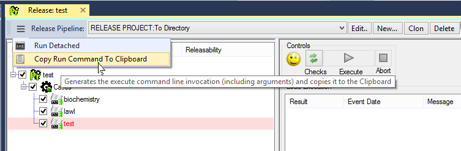

# RDMP Command Line

## Contents

1. [Installing](#installing)
2. [Commands](#commands)
    1. [Install](#install)
    2. [cmd](#cmd)
4. [Terminal Gui](#terminal-gui)
5. [Scripting](#scripting)

## Installing

Command line programs run in a terminal window (e.g. DOS).  In Windows these files usually have the extension `.exe` (e.g. `rdmp.exe`), in Linux these often have no extension (e.g. `rdmp`).

The binaries (runnable files) for the RDMP command line are included in the [Releases](https://github.com/HicServices/RDMP/releases) section of GitHub.  Download and unzip the file that matches your operating system e.g. `rdmp-cli-win-x64.zip` for Windows or `rdmp-cli-linux-x64.zip` for linux.

Unzip the package and edit `Databases.yaml` so that it points to your RDMP databases.  If you do not have any platform databases yet then you can run `./rdmp install "(localdb)\MSSQLLocalDB" TEST_ -e` (use your own server name and/or different prefix if desired).

Open a command prompt in the folder and run `./rdmp list Catalogue`.  You should see a list of example catalogues.  For example:

```
PS C:\Users\44777\Downloads\rdmp-7.0.20-cli-win-x64> ./rdmp list Catalogue
2022-09-20 12:12:30.9689 INFO Dotnet Version:6.0.8 .
2022-09-20 12:12:30.9870 INFO RDMP Version:7.0.20.0 .
2022-09-20 12:12:32.6898 TRACE Running Command 'ExecuteCommandList' .
1:Biochemistry
2:Demography
3:Prescribing
4:HospitalAdmissions
5:vConditions
6:vOperations
```

## Commands

The [rdmp](./../../Tools/rdmp/) program allows command line execution of all major engines in RDMP (Caching / Data Load / Cohort Creation / Extraction and Release).  To access the CLI command line help system run:

```
rdmp --help
```

For help on each engine (verb) on the command line enter the verb (listed by the main --help command) followed by --help e.g.:

```
rdmp dle --help
```

When performing an operation in the RDMP client application (e.g. releasing a dataset) you can instead select 'Copy Run Command To Clipboard'.  This will generate a CLI command that will perform the current action (e.g. extract [Project] X using [Pipeline] Y).  This can be helpful for scheduling long running tasks etc.



### Install

To install an instance of the RDMP platform databases from the command line use the command:

```
rdmp install localhost\sqlexpress RDMP_
```
*Insert your sql server's name in place of localhost\sqlexpress.  Note that some terminals require an escape for `\` e.g. enter `localhost\\sqlexpress`*

To see all the available options (including dropping existing databases, creating example datasets etc) run:

```
rdmp install --help
```

Once setup edit `Databases.yaml` to reference the tables created e.g.

```
CatalogueConnectionString: Server=<yourserver>;Database=RDMP_Catalogue;Trusted_Connection=True;
DataExportConnectionString: Server=<yourserver>;Database=RDMP_DataExport;Trusted_Connection=True;
```

### cmd

In addition to running engines, many commands can be run from the CLI.  To see what commands are available use

```
./rdmp ListSupportedCommands
```
*Listing commands requires valid connection settings, see [installation](#install)*

For example you can view a list of what Catalogues you have by running:

```
./rdmp list Catalogue
```
*Lists all Catalogues in RDMP along with their IDs*

To see the arguments of a command use 'describe' e.g.:
```
./rdmp describe confirmlogs
```
*Displays help for the command 'ConfirmLogs'*

Some commands require specifying a database (e.g. `CreateNewCatalogueByImportingFile`).  The following table shows the syntax for such parameters

| Parameter Type | Syntax |
|----------|---------|
| values  | For value types simply enter the value (e.g. `8`).  If text has spaces then wrap it in double quotes e.g. `"My cool Catalogue"` |
| Database Objects (e.g. [Catalogue])         |  Rdmp objects can be specified by ID (e.g. `Catalogue:2`) or by name using wild cards (e.g. `Catalogue:*bioch*`).  If a command accepts multiple objects you can specify a pattern (e.g. `Catalogue:intern*` would match all Catalogues starting with the word "intern".  Entering the Type name alone will return all objects (e.g. `Catalogue`)|
| DiscoveredDatabase  | To specify a database use the syntax `"DatabaseType:{DatabaseType}:[Name:{DatabaseName}:]{ConnectionString}"` e.g.  `"DatabaseType:MicrosoftSQLServer:Name:MyDb:Server=localhost\sqlexpress;Trusted_Connection=True;"`*|
| DiscoveredTable | To specify a table use the syntax `"Table:{TableName}:[Schema:{SchemaIfAny}:][IsView:{True/False}]:DatabaseType:{DatabaseType}:Name:{DatabaseName}:{ConnectionString}"` e.g. `"Table:v_cool:Schema:dbo:IsView:True:DatabaseType:MicrosoftSQLServer:Name:MyDb:Server=localhost\sqlexpress;Trusted_Connection=True;"`*|
| Null | If a parameter is optional then you can enter the word `Null` to ignore it |

`*` *If your command line requires you to escape back slashes then ensure you do so if your server name includes one*


See [the technical documentation](../../Rdmp.Core/CommandLine/Runners/ExecuteCommandRunner.md) for how this parsing occurs in code.

## Terminal GUI

You can access an interactive terminal similar to the RDMP gui client by running:

```
rdmp gui
```


*RDMP Terminal.Gui running in Powershell*

## Scripting

You can run a sequence of commands all at once by using the `-f` option of RDMP command line:

```
./rdmp -f Z:\Repos\RDMP\scripts\create_list_destroy_catalogue.yaml
```
*Run all commands in the file 'create_list_destroy_catalogue.yaml'*

For a selection of example scripts see the [scripts folder](../../scripts/)


[Pipeline]: ./Glossary.md#Pipeline
[Catalogue]: ./Glossary.md#Catalogue
