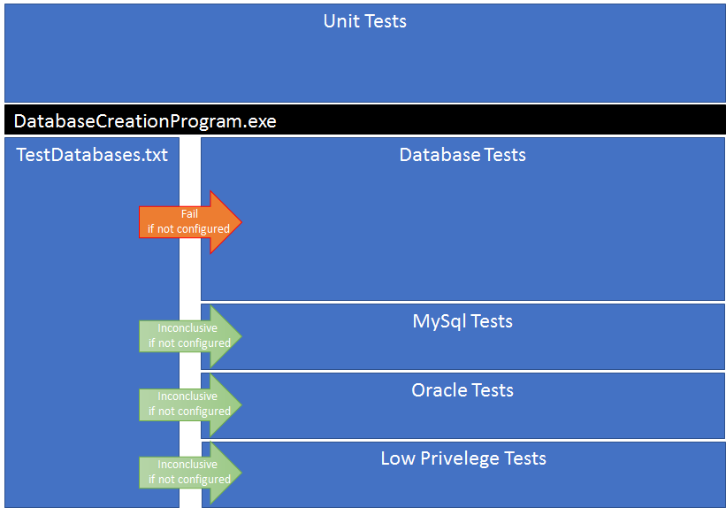

# RDMP Code Tests

## Background
Tests in RDMP are split between [Unit](#unit-tests), [User Interface](#user-interface-tests) and [Database](#database-tests) tests.

Many create tables/records in the test database or files on disk therefore [parallel test execution](https://github.com/nunit/docs/wiki/Parallelizable-Attribute) is not recommended.

 

## Unit Tests

Unit tests are tests which do not require a database or for any UI code to run.  These either have no base class or inherit from `UnitTests` (allows you to create RDMP platform objects e.g. `Catalogue`).

```csharp

public class CatalogueTests : UnitTests
{
    [Test]
    public void Test_GetObjects_Catalogue()
    {
        Catalogue catalogueWithId = new Catalogue(Repository, "bob");
        Catalogue[] catas = Repository.GetAllObjects<Catalogue>();

        Assert.IsTrue(catas.Length > 0);

        catalogueWithId.DeleteInDatabase();
    }
}

```
_Example Unit Test_

## User Interface Tests

User interface tests which confirm behaviours of RDMP client user interfaces e.g. `CatalogueUI`.  These tests create instances of Forms/Controls but do not actually show them (we do not use UI automation).

You can write new user interface tests by inheriting `UITests` and specifying a `UITimeoutAttribute` on the Test (this prevents messageboxes blocking the test indefinetly in failure conditions and ensures that an STA thread is used.)

```csharp
public class CatalogueUITests : UITests
{
    [Test, UITimeout(20000)]
    public void Test_CatalogueUI_NormalState()
    {
        //Get a new platform object
        var cata = WhenIHaveA<Catalogue>();

        //Get an instance of the UI
        var ui = AndLaunch<CatalogueUI>(cata);

        //when I type text
        ui._scintillaDescription.Text = "amagad zombies";

        //my class should get the typed text but it shouldn't be saved into the database yet
        Assert.AreEqual("amagad zombies", cata.Description);
        Assert.AreEqual(ChangeDescription.DatabaseCopyDifferent, cata.HasLocalChanges().Evaluation);

        //get the save button
        var saver = ui.GetObjectSaverButton();
                    
        //when I save
        saver.Save();

        //my class should have no changes (vs the database) and should have the proper description
        Assert.AreEqual(ChangeDescription.NoChanges, cata.HasLocalChanges().Evaluation);
        Assert.AreEqual("amagad zombies", cata.Description);

        //No errors of any type should have been displayed
        AssertNoErrors(ExpectedErrorType.Any);
    }
```
_Example User Interface Test_

## Database Tests

The RDMP client requires an Sql Server instance for storing platform metadata objects (`Catalogue`, `Project` etc).  its primary purpose is to query / manage SQL datasets (for linkage, extraction etc).  Database tests exist to test this functionality.

The easiest way to achieve this is to install the 'SQL Server Express LocalDB' package in Visual Studio:


If you are using LocalDB then your server will be called `(localdb)\MSSQLLocalDB`.  If you have manually installed the full version of SQL Server Express tehn it is likely to be `localhost\sqlexpress` or just `localhost`.  In both cases the user authentication will be done with your Windows account so no username or password is required.

Before running DatabaseTests you must create a set of RDMP platform databases for testing.  This can be done through the [RDMP command line tool](https://github.com/HicServices/RDMP/releases):

`rdmp.exe install localhost\sqlexpress TEST_ -D`

Or you can use the client application at startup:

 

If you need to change the server name or database prefix from the above example then update ".\Tests.Common\DatabaseTests.txt" to match.

If you have a testing environment with an Oracle and\or MySql server instance then you can enable running these tests too by entering the connection strings into `DatabaseTests.txt`.  If you do not define a connection string then these tests will be marked `Inconclusive` when run.

__WARNING__: DatabaseTests will delete the contents of the TEST_ databases before each test is run and some will create temporary databases/tables during runtime, therefore it is important that you do not use a production server for integration testing

## Writing Database Tests
You can write new database tests by inheriting from `DatabaseTests` or one of the Scenarios (e.g. `TestsRequiringAnExtractionConfiguration`).

```csharp
public class MyTests : DatabaseTests
{
	[Test]
	public void Test1()
	{
		var cata = new Catalogue(CatalogueRepository,"My Test Cata");
		Assert.IsTrue(cata.Exists());
	}
}
```
_Example Database Test_

If you want to run your test against multiple database types (Oracle / MySql etc) then you should use `TestCase` and call `GetCleanedServer` to obtain a cross platform object that represents the scratch database.

```csharp
public class MyTests : DatabaseTests
{
	[TestCase(DatabaseType.MicrosoftSQLServer)]
	[TestCase(DatabaseType.Oracle)]
	[TestCase(DatabaseType.MYSQLServer)]
	public void Test2(DatabaseType type)
	{
		var database = GetCleanedServer(type);
		
		Assert.IsTrue(database.Exists());
		Assert.IsEmpty(database.DiscoverTables(true));
		Assert.IsNotNull(database.GetRuntimeName());
	}
}
```

If you want to test a system running under a database user account with limited access rights you can use `DatabaseTests.SetupLowPrivilegeUserRightsFor`.  You will have to create the user account yourself and configure connect etc privileges.


```csharp
public class MyTests : DatabaseTests
{
	[TestCase(DatabaseType.MicrosoftSQLServer)]
	[TestCase(DatabaseType.Oracle)]
	[TestCase(DatabaseType.MYSQLServer)]
	public void TestReadDataLowPrivileges(DatabaseType type)
	{
		var database = GetCleanedServer(type);

		//create a table on the server
		var dt = new DataTable();
		dt.Columns.Add("MyCol");
		dt.Rows.Add("Hi");
		dt.PrimaryKey = new[] {dt.Columns[0]};

		var tbl = database.CreateTable("MyTable", dt);

		//at this point we are reading it with the credentials setup by GetCleanedServer
		Assert.AreEqual(1, tbl.GetRowCount());
		Assert.AreEqual(1, tbl.DiscoverColumns().Count());
		Assert.IsTrue(tbl.DiscoverColumn("MyCol").IsPrimaryKey);

		//create a reference to the table in RMDP
		TableInfo tableInfo;
		ColumnInfo[] columnInfos;
		Import(tbl, out tableInfo, out columnInfos);

		//setup credentials for the table in RDMP (this will be Inconclusive if you have not enabled it in TestDatabases.txt
		SetupLowPrivilegeUserRightsFor(tableInfo,TestLowPrivilegePermissions.Reader);

		//request access to the database using DataLoad context
		var newDatabase = DataAccessPortal.GetInstance().ExpectDatabase(tableInfo, DataAccessContext.DataLoad);

		//get new reference to the table
		var newTbl = newDatabase.ExpectTable(tableInfo.GetRuntimeName());

		//the credentials should be different
		Assert.AreNotEqual(tbl.Database.Server.ExplicitUsernameIfAny, newTbl.Database.Server.ExplicitUsernameIfAny);
		
		//try re-reading the data 
		Assert.AreEqual(1, newTbl.GetRowCount());
		Assert.AreEqual(1, newTbl.DiscoverColumns().Count());
		Assert.IsTrue(newTbl.DiscoverColumn("MyCol").IsPrimaryKey);

		//low priority user shouldn't be able to drop tables
		Assert.That(newTbl.Drop,Throws.Exception);

		//normal testing user should be able to
		tbl.Drop();
	}
}
```

[Catalogue]: ./Glossary.md#Catalogue

[Project]: ./Glossary.md#Project
