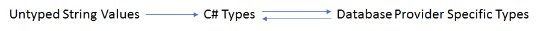

# Type Translation

## Table of contents
1. [Background](#background)
2. [Tests](#tests)

## Background
RDMP has a comprehensive Type translation layer between C# Types (e.g. `System.String`), Database Types (e.g. `varchar(10)`, `VARCHAR2(10)`) and raw untyped strings (e.g. `"10.2"`).



This functionality is vital for consistently achieving:
- [Loading untyped data](./DataTableUpload.md) (e.g. CSV)
- Moving data between database provider types (e.g. read all records from an Sql Server table and create a new table in MySql to store the results)
- Scripting table schema from one dbms and creating it in another
- Writing cross platform tests without having to worry about specific provider datatypes

This document describes how type decisions are made and how translations occur between provider specific types (e.g. `datetime2`) and C# `System.Type` and vice versa.


## Strings to C# Types
The decision of what C# `System.Type` to use for a given set of untyped (`System.String`) input values is made by by `DataTypeComputer`.  The decisions are made by consulting `IDecideTypesForStrings` classes.  In addition to recording the `System.Type`, the `DecimalSize` is recorded in order to allow creation of the appropriate scale/precision when creating SQL types (e.g. when translating to `decimal(3,2)`).  Finally all values impact the `DataTypeComputer.Length` which is the maximum length of strings seen so far incase the final `Type` determination is `System.String` (i.e. `varchar(x)`).

```csharp
DataTypeComputer t = new DataTypeComputer();
t.AdjustToCompensateForValue("12");

Assert.AreEqual(typeof(int),t.CurrentEstimate);
Assert.AreEqual(null, t.DecimalSize.NumbersAfterDecimalPlace);
Assert.AreEqual(2, t.DecimalSize.NumbersBeforeDecimalPlace);

t.AdjustToCompensateForValue("0.1");

Assert.AreEqual(typeof(decimal), t.CurrentEstimate);
Assert.AreEqual(1, t.DecimalSize.NumbersAfterDecimalPlace);
Assert.AreEqual(2, t.DecimalSize.NumbersBeforeDecimalPlace);

```

Each `IDecideTypesForStrings` has a `TypeCompatibilityGroup`.  This determines whether `Type` guesses are compatible with one another.  In the above example the estimation goes from `int` to `decimal` because both values seen can be represented by `decimal`. 

Below we can see what happens if we try to estimate a column of untyped data containing both integers and dates (the final estimate is left as `System.String`).

```csharp
DataTypeComputer t = new DataTypeComputer();
t.AdjustToCompensateForValue("12");

Assert.AreEqual(typeof(int), t.CurrentEstimate);
Assert.AreEqual(null, t.DecimalSize.NumbersAfterDecimalPlace);
Assert.AreEqual(2, t.DecimalSize.NumbersBeforeDecimalPlace);
Assert.AreEqual(2, t.Length);

t.AdjustToCompensateForValue("2001-01-01");

Assert.AreEqual(typeof(string), t.CurrentEstimate);
Assert.AreEqual(null, t.DecimalSize.NumbersAfterDecimalPlace);
Assert.AreEqual(10, t.Length);
```

## C# Types to Database Types
Each supported database provider has an implementation abstract base class `TypeTranslater`.  This is responsible for translating C# Types (with Length and `DecimalSize`) into the appropriate database provider type string.

```csharp
var cSharpType = new DatabaseTypeRequest(typeof (string), 10, null);

var ms = new MicrosoftSQLTypeTranslater();
var mysql = new MySqlTypeTranslater();
var oracle = new OracleTypeTranslater();

Assert.AreEqual("varchar(10)",ms.GetSQLDBTypeForCSharpType(cSharpType));
Assert.AreEqual("varchar(10)", mysql.GetSQLDBTypeForCSharpType(cSharpType));
Assert.AreEqual("varchar2(10)", oracle.GetSQLDBTypeForCSharpType(cSharpType));
```

It is also aware of the maximum size of various types:

```csharp
var cSharpType = new DatabaseTypeRequest(typeof(string), 10000000, null);

var ms = new MicrosoftSQLTypeTranslater();
var mysql = new MySqlTypeTranslater();
var oracle = new OracleTypeTranslater();

Assert.AreEqual("varchar(max)", ms.GetSQLDBTypeForCSharpType(cSharpType));
Assert.AreEqual("text", mysql.GetSQLDBTypeForCSharpType(cSharpType));
Assert.AreEqual("CLOB", oracle.GetSQLDBTypeForCSharpType(cSharpType));
```

## Database Types to C# Types

`TypeTranslater` is also responsible for converting back from DBMS data types to C# data types.

```csharp
var ms = new MicrosoftSQLTypeTranslater();
var mysql = new MySqlTypeTranslater();
var oracle = new OracleTypeTranslater();

Assert.AreEqual(typeof(string),ms.GetCSharpTypeForSQLDBType("varchar(max)"));
Assert.AreEqual(int.MaxValue,ms.GetLengthIfString("varchar(max)"));

Assert.AreEqual(int.MaxValue, mysql.GetLengthIfString("text"));
Assert.AreEqual(int.MaxValue, mysql.GetLengthIfString("text"));

Assert.AreEqual(int.MaxValue, oracle.GetLengthIfString("CLOB"));
Assert.AreEqual(int.MaxValue, oracle.GetLengthIfString("CLOB"));
```

## Tests
See `TypeTranslaterTests` and `DatatypeComputerTests`
