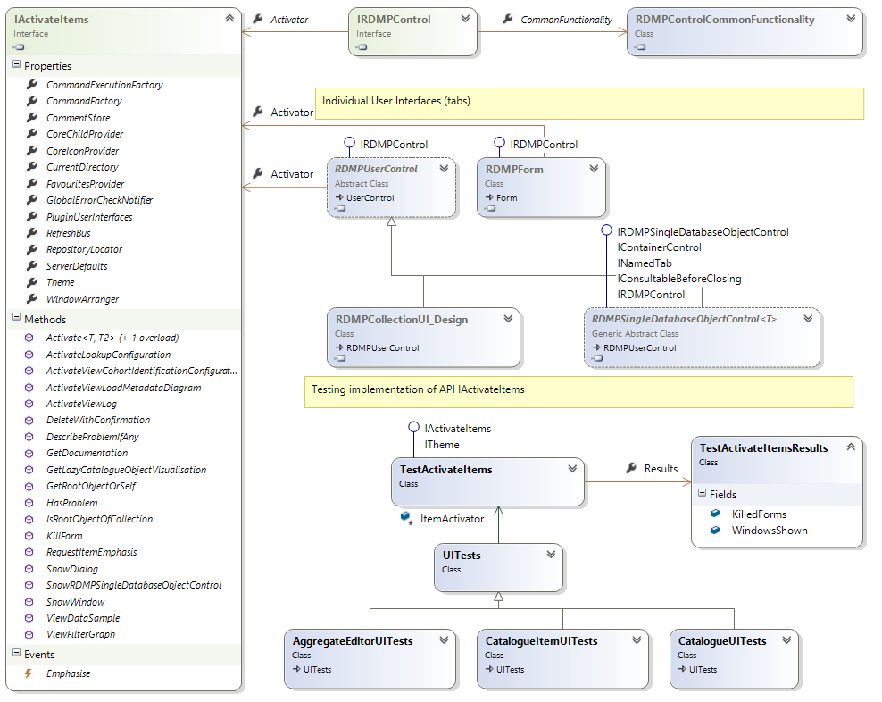
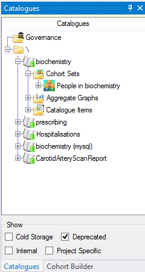
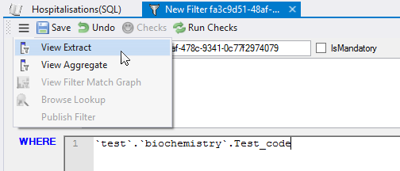
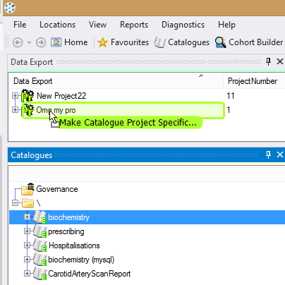
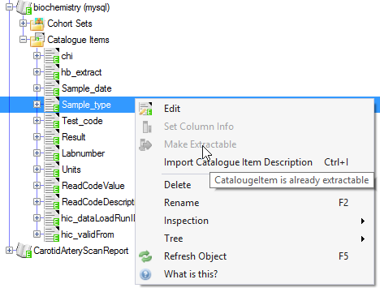
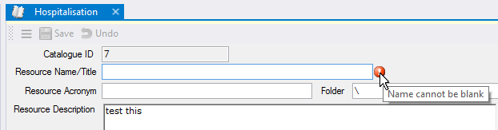
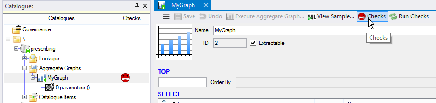

# User Interface Overview

## Background

RDMP is a large application with many complicated user interfaces.  In order to manage these a strict architecture has been built.  This architecture is built around a single base class `IRDMPControl` for all top level controls.  This interface provides access to the UI API `IActivateItems`.  Unit testing of UIs is supported via `TestActivateItems`.
 

## Collections
<p align="center">
  
</p>

`RDMPCollectionUI` is responsible for hosting tree views depicting all objects associated with a given area of the program (Extraction,Cohort Building, Loading etc).  There can only be one instance of any given `RDMPCollectionUI` at once (like the Solution Explorer in Visual Studio).

All the logic for how these controls operate is defined in `RDMPCollectionCommonFunctionality`.  The hierarchy of objects is determined up front by `ICoreChildProvider`.  The hierarchy is updated whenever any [Publish](#publishing) occurs.

---

## Single Object Control Tabs

Where possible RDMP associates any top level tab (that isn't a [collection](#collections)) with a single object.  This is done by subclassing `RDMPSingleDatabaseObjectControl<T>` with the `DatabaseEntity` class being managed.  The flow of control for these tabs is:

1. Blank constructor invoked
1. Control shown on Form
1. SetDatabaseObject entered in derived class
   1. `base.SetDatabaseObject` invoked by derived class
   1. `SetBindings` called (virtual)
1. SetDatabaseObject exited

Whenever a Publish event occurs `SetDatabaseObject` is invoked again with the latest version of the hosted object.  If the hosted object is deleted then the tab is automatically closed.

You can instigate this process by calling `IActivateItems.Activate<T, T2>(T2 databaseObject)`  Where `T` is the object that should be shown in the UI control of Type `T2`

Only one instance of a given UI Type can be open at once per databaseObject (i.e. you cannot have two `CatalogueUI` tabs showing the same `Catalogue`).  If you try to do this the `IActivateItems` will just bring the existing instance to the front.

Tabs are automatically persisted when exiting the program by recording the Type of the UI and the ID of the object being hosted.

### Task Bar

 
*Example Single Object Control Tab*

You can add buttons and menu items to the top task bar in `SetDatabaseObject` using:

```csharp

//Adds command to the dropdown menu
CommonFunctionality.AddToMenu(new ExecuteCommandViewFilterMatchData(Activator, databaseObject, ViewType.TOP_100));
CommonFunctionality.AddToMenu(new ExecuteCommandViewFilterMatchData(Activator, databaseObject, ViewType.Aggregate));

//Adds the command to the top bar
CommonFunctionality.Add(new ExecuteCommandViewFilterMatchData(Activator, databaseObject, ViewType.TOP_100));
CommonFunctionality.Add(new ExecuteCommandViewFilterMatchData(Activator, databaseObject, ViewType.Aggregate));

//Adds checks for the current object
CommonFunctionality.AddChecks(databaseObject);

```

If your control supports modifying the Properties of the hosted object you should declare that you implement `ISaveableUI` (methods are already declared by base class).  This will result in the save/undo control being added to the task bar.

Since `SetDatabaseObject` is called when relevant changes are [Published](#publishing), the task bar is also repopulated.  This is intended since it gives an opportunity for [commands](#commands) to be recreated reflecting the new system state (e.g. `IsImpossible` might change).

## Other Tabs
Sometimes it is not possible to tie a UI control to a single object (e.g. `ViewSQLAndResultsWithDataGridUI`).  This may be because the UI reflects a collection of objects combined or a choice the user made when launching the control.  In this case the UI should implement `IObjectCollectionControl` and declare an `IPersistableObjectCollection` which contains all the objects and settings needed to persist the UI.

It is possible to show adhoc untracked UI controls as tabs via `IActivateItems.ShowWindow` but this is discouraged.

## Publishing
The `RefreshBus` is responsible for updating all UI components with the latest state of objects.  This is instigated whenever `RefreshBus.Publish` is called by a UI.  The sequence of events is:

1. `ICoreChildProvider` updated (fetches all new objects from the repository)
2. BeforePublish event called
3. All `IRefreshBusSubscriber` are notified

Typical behaviours exhibited by subscribers include closing (if the object has been deleted) or updating the displayed contents based on the new state of the object.

Subscribers should never attempt a new Publish while responding to a Publish callback (this will trigger a `SubscriptionException`).

Since the Equality comparer of `DatabaseEntity` considers only the `ID` and `Repository` newly published objects do not break Dictionaries / HashSets etc.  This is very important since [most UI tabs are tied to a specific single object](#single-object-control-tabs).


## Double Clicking

Double clicking an objects in a Tree Views should result in activating it (if possible).  This is dealt with through the `RDMPCommandExecutionProposal<T>` class (which also deals with [drop operations](#drag-and-drop)).  There should be only one implementation per `Type`.  If a `Type` doesn't have a proposal then it doesn't support activation.

The following conventions are enforced:

1. The command must be called `ProposeExecutionWhenTargetIsX` where X is the Type of the object that supports activation
2. The command must be in the namespace `CommandExecution.Proposals` (it can be in any project)

A typical proposal looks like:
```csharp

class ProposeExecutionWhenTargetIsProject:RDMPCommandExecutionProposal<Project>
{
	public ProposeExecutionWhenTargetIsProject(IActivateItems itemActivator) : base(itemActivator)
	{
	}

	public override bool CanActivate(Project target)
	{
		//All Projects can be activated
		return true;
	}

	public override void Activate(Project target)
	{
		//When activated we show the ProjectUI 
		ItemActivator.Activate<ProjectUI.ProjectUI, Project>(target);
	}

	public override ICommandExecution ProposeExecution(ICombineToMakeCommand cmd, Project project, InsertOption insertOption = InsertOption.Default)
	{
		//return null if you don't support objects being dropped on your object
		return null;
	}
}

```

## Drag and Drop

For full docs on drag/drop see [Double Click And Drag Drop](./DoubleClickAndDragDrop.md)

Drag and drop in tree views is handled through the `RDMPCommandExecutionProposal<T>` class (which also deals with [double clicking](#double-clicking)).  All dragged objects are encapsulated in an `ICombineToMakeCommand` which is generated when a drag operation begins in the program.  The sequence is:

1. Drag operation starts
1. ICombineToMakeCommand created
1. ICombineToMakeCommand loaded with relevant facts about object being dragged
1. User drags object around and hovers over various other objects
1. Each object hovered over has its `RDMPCommandExecutionProposal<T>.ProposeExecution` consulted for drop legality
1. User drops object
1. If the ``RDMPCommandExecutionProposal<T>.ProposeExecution` returned a command that was not `IsImpossible` then command is executed

 

This advantages of this are as follows:

1. Centralises all drop logic for a class in one place
1. Front loads expensive queries at the start of the drag operation (when populating `ICombineToMakeCommand`)
1. Reuses `ICommandExecution` atomic commands which already exist for encapsulating atomic operations (in menus, HomeUI etc)
1. Provides feedback to the user about the operation they are about to perform
1. Allows unit testing of drag and drop conditions


Here is an example drop implementation for `Project`

```csharp
public override ICommandExecution ProposeExecution(ICombineToMakeCommand cmd, Project project, InsertOption insertOption = InsertOption.Default)
{
	//if user is dropping a cohort builder query
	var cicCommand = cmd as CohortIdentificationConfigurationCommand;
	if(cicCommand != null)
		return new ExecuteCommandAssociateCohortIdentificationConfigurationWithProject(ItemActivator).SetTarget(cicCommand.CohortIdentificationConfiguration).SetTarget(project);

    //if user is dropping a Catalogue they probably want to make it 
	var cataCommand = cmd as CatalogueCommand;
	if (cataCommand != null)
		return new ExecuteCommandMakeCatalogueProjectSpecific(ItemActivator).SetTarget(cataCommand.Catalogue).SetTarget(project);

	//if a file is being dropped (e.g. a csv file)
	var file = cmd as FileCollectionCommand;

	//Import the file as a new Catalogue and associate it with the Project
	if(file != null)
		return new ExecuteCommandCreateNewCatalogueByImportingFile(ItemActivator,file).SetTarget(project);

	//if the object being dragged is something else then no operation is possible
	return null;
}
```

Adding support for dragging a new object (not currently draggable) involves creating a new `ICombineToMakeCommand` and implementing its construction logic in `RDMPCombineableFactory`

## Menus

For full docs on menu see [Creating a new Right Click Menu](./CreatingANewRightClickMenu.md)

Right click menus for objects are created by subclassing `RDMPContextMenuStrip`.  Once a menu has been created it will be automatically shown when right clicking.  Menus must be in the `Menus` namespace of a project and should be named XMenu where X is the object for whom the menu is shown e.g. `CatalogueMenu`.

Build your menu by adding `IAtomicCommand` instances, for example:

```csharp
[System.ComponentModel.DesignerCategory("")]
class CatalogueItemMenu : RDMPContextMenuStrip
{
	public CatalogueItemMenu(RDMPContextMenuStripArgs args, CatalogueItem catalogueItem): base(args, catalogueItem)
	{
		Add(new ExecuteCommandLinkCatalogueItemToColumnInfo(_activator, catalogueItem));
		Add(new ExecuteCommandMakeCatalogueItemExtractable(_activator, catalogueItem));
		Add(new ExecuteCommandImportCatalogueItemDescription(_activator, catalogueItem), Keys.Control | Keys.I);
	}
}
```

 

Where multiple objects have very similar/identical menus then it is permissible (though still not recommended) to include them in the same class via constructor overloading.  It is the constructor signature which defines what menu is shown for a given object(if any) not the class name.  For example:

```csharp
    [System.ComponentModel.DesignerCategory("")]
    class CohortIdentificationConfigurationMenu :RDMPContextMenuStrip
    {
		//constructor for cics
        public CohortIdentificationConfigurationMenu(RDMPContextMenuStripArgs args, CohortIdentificationConfiguration cic): base(args, cic)
        {
            //Build menu
        }

		//constructor for associated cics
        public CohortIdentificationConfigurationMenu(RDMPContextMenuStripArgs args, ProjectCohortIdentificationConfigurationAssociation association) 
				//invoke other constructor with the underlying cic
				: this(args,association.CohortIdentificationConfiguration)
        {
            //Build more menu
        }
    }
```

## Commands
Where possible RDMP likes to encapsulate all atomic operations that the user can perform in an `IAtomicCommand` implementation e.g. `ExecuteCommandCreateNewFilter`.  You should inherit from `BasicUICommandExecution` and override the required methods.

`IAtomicCommand` objects can be displayed in several ways and are the preferred way of offering options to the user.

If (based on constructor parameters) a command is found to be impossible you should call `SetImpossible` with a description of why.  This will be presented to the user in an appropriate way (e.g. grey out a menu item and add a tool tip).

## Tests

Unit tests for user interface classes can be written by subclassing `UITests`.  Tests run without ever showing UI components but do execute within an STA Thread.  The sequence for UI tests is as follows:

1. Add the attribute `UITimeout` to your test (this ensures an STA thread and prevents tests hanging due to modal dialogs)
1. Create your object(s) using `WhenIHaveA<X>`
1. 'Launch' your UI by calling `AndLaunch<XUI>`
1. Perform operations
1. Check results using `ItemActivator.Results`
 
For example the following test checks that only date columns are advertised for axis dimension selection in `AggregateEditorUI`.
 
```csharp
[Test, UITimeout(5000)]
public void Test_AggregateEditorUI_AxisOnlyShowsDateDimensions()
{
	ExtractionInformation dateEi;
	ExtractionInformation otherEi;
	var config = WhenIHaveA<AggregateConfiguration>(out dateEi,out otherEi);

	var dimDate = new AggregateDimension(Repository, dateEi, config);
	var dimOther = new AggregateDimension(Repository, otherEi, config);
	
	var ui = AndLaunch<AggregateEditorUI>(config);

	//only date should be an option for axis dimension
	Assert.AreEqual(1, ui.ddAxisDimension.Items.Count);
	Assert.AreEqual(dimDate,ui.ddAxisDimension.Items[0]);

	//dates are not valid for pivots
	Assert.AreEqual(1, ui.ddPivotDimension.Items.Count);
	Assert.AreEqual(dimOther, ui.ddPivotDimension.Items[0]);
}
```

A limitation of this testing approach is that it requires private fields (e.g. `ddAxisDimension`) to be accessible to the test assembly.  Fields (in UI code only) that need to be tested in this way should be made internal (and the testing assembly marked as `InternalsVisibleTo`).

## Error Programming

When your UI has an object in an illegal state or causing a crash/error message then follow the following process:

1. If the condition is associated with a specific control on the UI (e.g. a `TextBox`)
   1. Add an `ErrorProvider` to the UI control
   1. Reset/Clear the `ErrorProvider` in the `SetDatabaseObject` method so when the user fixes and saves it clears the error
        
1. If the condition can be detected at object level
   1. Make the object `ICheckable` (if it isn't already)
   1. Add check for condition to the objects `ICheckable.Check` method
   1. Ensure UI has a call to `CommonFunctionality.AddChecks`
   1. Ensure UI still loads and exposes the check failure without crashing   
        
1. If the condition cannot be detected at object level and is only surfaced in UI logic
   1. Add a call to `CommonFunctionality`.`Fatal`
1. If UI no longer makes sense in the state and the UI has no way to salvage the object
   1. Add a call to `IActivateItems.KillForm` and return out of any executing methods

 
   
## UI Checklist

- [ ] Does UI have a `<summary>` tag that makes sense to the user when they hit F1
- [ ] Do all subcomponents that are not immediately obvious have a Help (See `CommonFunctionality.AddHelp`)
- [ ] Is there a Unit test in `Rdmp.UI.Tests` namespace
  


[Catalogue]: ./Glossary.md#Catalogue

[Project]: ./Glossary.md#Project
