# Background

## What is RDMP?

RDMP is a tool for the curation of research datasets.  This includes many typical ETL tasks but also tools for management of the research lifecycle.  The software focuses on ensuring thorough documentation of datasets, reliable loading of often poorly structured/volatile data, cohort linkage and reproducibility of project extracts.

## Why is research data curation important?
Data management and data curation of long-term study and research databases are time consuming and complex activities that demand the attention of experts with very specific skills. Some of the most costly and complex data management activities emerge from consideration of two common scenarios. The first considers a single cohort used in a longitudinal study accruing data in distinct phases where the new data must be reconciled and merged with the existing data sets. The second scenario occurs when distinct cohorts from different studies of the same disease are merged to create greater scale in the research data. Again the data must be merged and reconciled in order to create an aggregate data set that is valid in its totality.

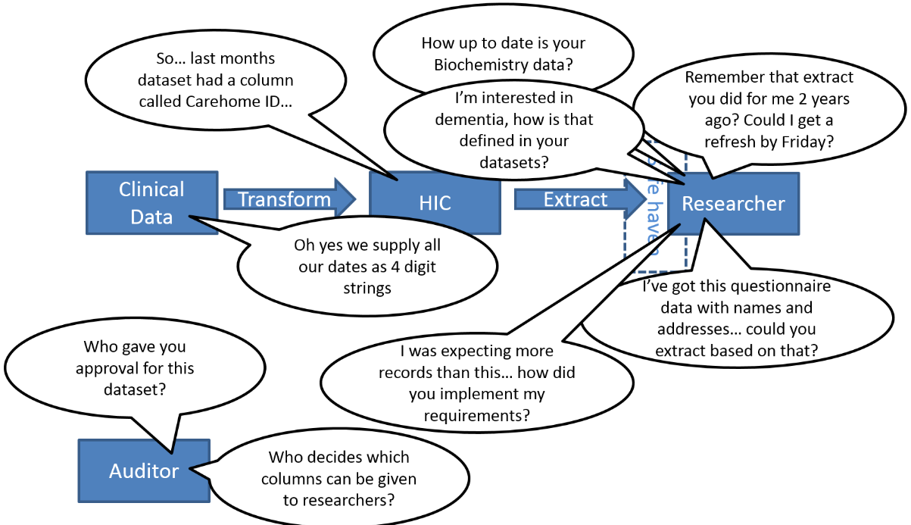

Existing data management approaches are focused on the initial generation and preparation of project research data and on preservation techniques that promote reuse of the data at the end of individual research projects. These approaches do not consider longer term studies and research programmes and fail to account for the key data merge, transformation and enrichment processes that are applied over life-time study lengths and that shape the data to support analysis and results. Failure to capture the project level transformation processes represents a major loss for long lived research data sets, as data improvements identified by individual studies and cohorts are not fed back into larger aggregated data sets to extend the data and improve the data quality. 

Continuing dissatisfaction within the academic community with the lack of transparency in research data management and the inability to reproduce study results and understand the provenance of study data calls for further revision and extension of the research data management techniques. This software aims to resolve the major data management issues associated with long term study data management through a distinct life cycle for research data merge management. It focuses on transformation processes used within research projects brings transparency and reproducibility benefits through process mining. It also accommodates variation in the data and allowing multiple simultaneous versions and potentially conflicting views to exist through the application of competing transformation processes.

# Getting Started

## Installing RDMP Client Software
In a normal RDMP deployment, users access a single shared Metadata database. 

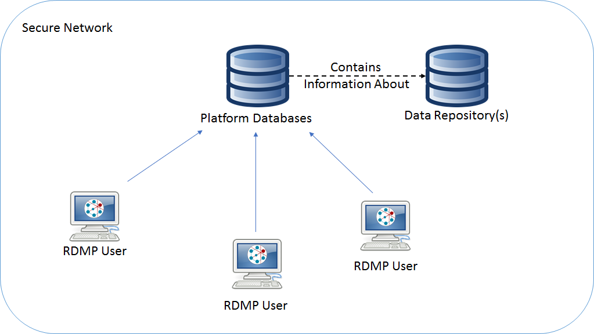

You can install the client software via the [installer link on the Github site](https://github.com/HicServices/RDMP#install ).  Once installed the software will guide you through the process of setting up platform databases / connecting to existing platform databases (see [Platform Database Setup](#platform-database-setup)).

It is possible to run RDMP as a standalone tool without an Sql Server instance using a [File System Backend](./YamlRepository.md) but this approach is recommended only for single user or standalone systems where RDMP performs a specific activity in isolation (e.g. data load, cohort creation etc).

## System Requirements
You will need an Sql Server instance (unless using a [file system backend](./YamlRepository.md)).  If you do not already have one, you can use the Express edition for free which is available from microsoft.com (https://www.microsoft.com/en-us/sql-server/sql-server-editions-express ).  Alternatively you can use [LocalDb](https://learn.microsoft.com/en-us/sql/database-engine/configure-windows/sql-server-express-localdb?view=sql-server-ver16) which is a Sql Server development tool installable with Visual Studio that allows for instances to be started when needed and shutdown automatically.

You will also need to have your actual dataset data in a relational database.  RDMP supports accessing research data repositories stored in MySql, Sql Server and Oracle databases but stores it�s own metadata (platform databases) in Sql Server only.

If your dataset data is currently in flat files then RDMP can load them into a relational database for you via the data load engine.

## Platform Database Setup

The RDMP uses SQL Server databases* to store metadata (dataset/column descriptions, validation rules, validation results, data load configurations etc) as well as to store logging data, caching repository data etc.  These �platform databases� are separate from your �data repository� which is the location that you store your live research data.

The first time you start RDMP (ResearchDataManagementPlatform.exe) you will be prompted to create the metadata databases that allow RDMP to function.  The simplest approach is to create them all on a single server, to do this enter your Sql Server name and a prefix for the databases.

Choose `Set Platform Databases...`

If you are a new user at a site where there is already a platform database you can connect to the existing instance.  Otherwise choose 'I want to create new Platform Databases'.

Enter the connection details of your server and any keywords that are required to access (custom ports, certificate validation options etc):

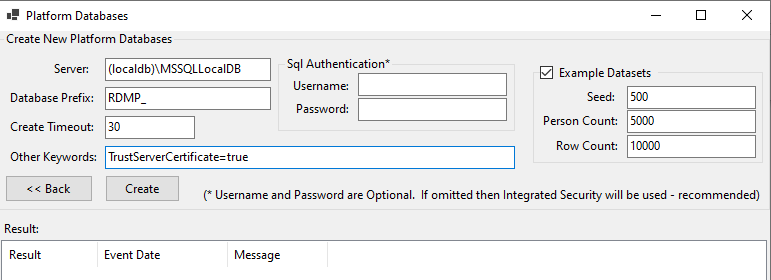

> **[Command Line]:** This can be done from the CLI using:
> ```
> ./rdmp install "(localdb)\MSSQLLocalDB" RDMP_ -e
> ```

This creates 4 databases which are the minimum set of platform databases required for RDMP to function.  The databses fulfil the following roles.

|Database|Role|
|--|---|
| Catalogue| Stores all descriptive, technical, validation, extraction information, attachments etc about your datasets (both externally accessible and internal).  Also stores Cohort Builder and data load configurations. |
| DataExport| Stores all project extraction configurations allowing for long term versioning and reproducibility into a variety destination formats (CSV, extract to database etc).  Also stores which final cohort lists were used with which extraction projects (Actual identifier lists are not stored in this database) |
| Data Quality Engine (DQE)| Stores a longitudinal record of the results of Data Quality Engine runs on your datasets.  This includes how many rows passed validation rules, how many rows there are per month etc. |
|Logging| Stores a hierarchical audit of all flows of data from one place to another.  This includes data being loaded, data being extracted and even internal processes like DQE executions. |

There are a couple of other database types which can be created as and when you need them.  These include:

|Database|Role|
|---|---|
| [Query Caching](./../../Rdmp.Core/CohortCreation/Readme.md)| Improves the performance of complex cohort identification configurations and anonymisation.  Also allows cross server and plugin Cohort Builder elements (e.g. to [REST APIs](./FAQ.md#apis))|
|Anonymisation|Provides a way of performing identifier dropping / substitution on data load for when you want an entirely anonymous data repository|
|[Plugin Databases](./FAQ.md#plugins)| RDMP supports plugins which can in some cases have their own database(s)|

_\* Unless using [file system backend](./YamlRepository.md)_

## Example Data
Example data can be setup on install by ticking the 'Example Datasets' checkbox during platform database setup.

New example data can be generated through the `Diagnostics=>Generate Test  Data` menu. Or with the [BadMedicine](https://github.com/HicServices/BadMedicine) command line tool. 

## Importing a flat file as a new dataset
If you have some CSV files (or Excel/Fixed Width) that you want to load into your database, you can do so with the RDMP bulk import tool.

Alternatively if you already have your data in a database then you can simply [tell RDMP where it is](#import-existing-table).

There are many problems that can occur in the daily handling of research data by data analysts.  It can be helpful to discover how RDMP handles various problems and what problems it cannot handle (and how it communicates this to you as a user).  Files you receive may have an array of issues such as missing/extra separators; primary key duplication; missing/extra columns etc.  It is a good idea to take your time at this stage to explore these issues and see how they manifest in RDMP.

From the Home screen under Catalogue select `New...=>Catalogue From File...`

After entering the target database make sure to click `Confirm Database` then choose a [Pipeline], for now any of the default CSV pipelines should work.

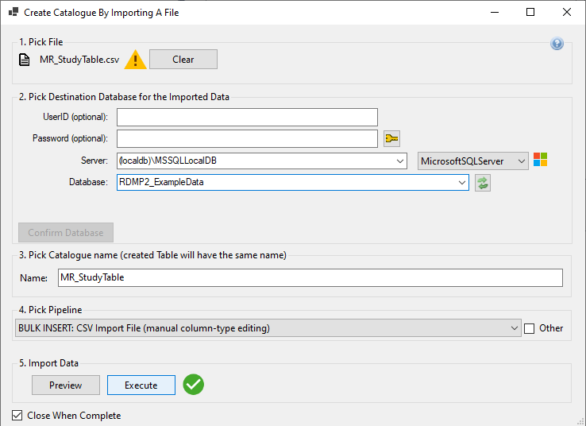

RDMP will automatically detect column datatypes as it loads the data.  An initial batch of data is inspected to determine initial datatype but if larger/longer data is encountered later this is updated and an `ALTER COLUMN` command sent to the DBMS.  This streaming approach allows RDMP to load very large files (multiple Gigabytes) without running out of memory.

If the import fails you can click the error icon to see error including the stack trace.

Using the 'manual column-type' [Pipeline] will give you a chance to change the column types created (calculated by RDMP):

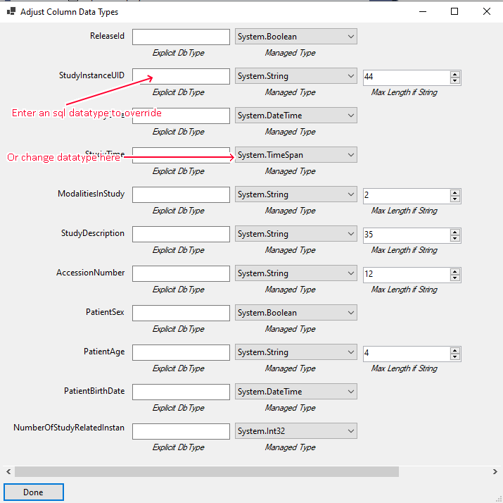

You should now proceede to [Configure Extractability] for the Catalogue

> **[Command Line]:** This can be done from the CLI using:
> ```
> ./rdmp CreateNewCatalogueByImportingFile "./Biochemistry.csv" "chi" "DatabaseType:MicrosoftSQLServer:Name:RDMP_ExampleData:Server=(localdb)\MSSQLLocalDB;Integrated Security=true" "Pipeline:*Bulk INSERT*CSV*automated*" null
> ```

## Import Existing Table

If your data is already in a relational database (MySql, Sql Server etc) then you can import it into RDMP.  This will create a metadata object in RDMP storing the location of the data but will not move any data.

From the Home Screen select `New...->Catalogue From Database...`

Enter your servername (and optionally the username/password if using sql authentication). Choose the database and table you want to import.  Importing views (any [DBMS]) and table valued functions (Sql Server only) as [Catalogue] is fully supported.

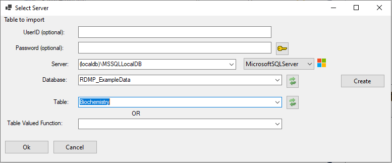

After importing you wil be prompted to [configure extractability](#configure-extractability)

> **[Command Line]:** This can be done from the CLI using:
> ```
> ./rdmp CreateNewCatalogueByImportingExistingDataTable "Table:Biochemistry:DatabaseType:MicrosoftSQLServer:Name:RDMP_ExampleData:Server=(localdb)\MSSQLLocalDB;Integrated Security=true" null 
> ```

If you have many tables in the same database you can bulk import them from the windows client:

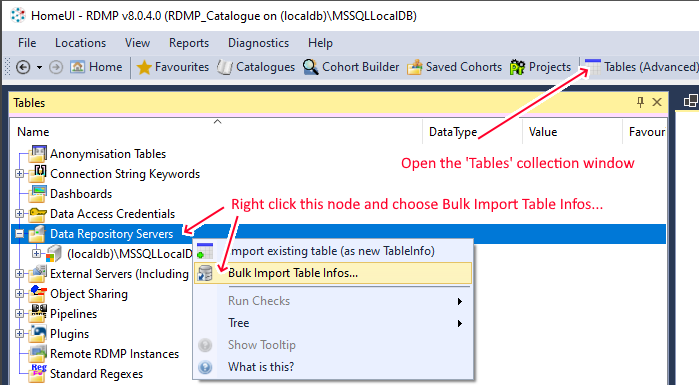

## Configure Extractability

Once a new [Catalogue] has been imported you will be presented with a dialog that allows you to make a decisions about which columns should be available to researchers in project extracts (extractable) and which should be kept private.  You will also be asked to select which column(s) are the linkage identifier that can be used to link between datasets (e.g. chi).

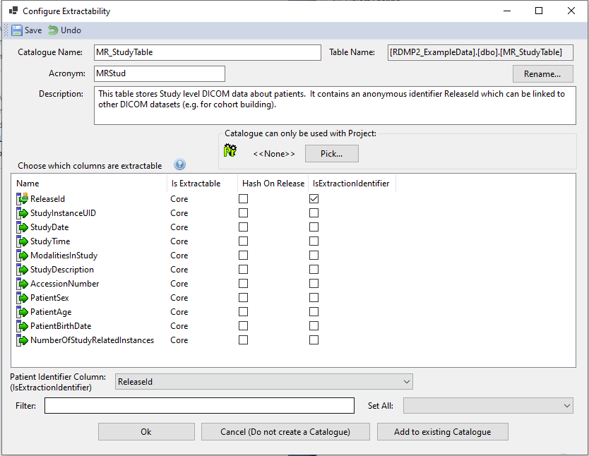

> **[Command Line]:** You can configure extractability from the CLI for example:
> ```
> ./rdmp ChangeExtractability Catalogue:Biochemistry true
> ./rdmp Delete ExtractionInformation:patient_triage_score
> ```

# Data Quality
There are two summarisation components to RDMP.  The first is the [DQE Data Quality Engine](./Validation.md).  This allows you to create row level validation rules for the columns in your datasets (If column A is populated then column B should also have a value in it, column C must match Regex Z etc).  The results of DQE executions are stored longitudinaly in the DQE database, this allows you to pipoint when your data became corrupt or inspect the differences in quality before and after a data load at any time.

The second summarisation component are [Aggregate Graphs](./Graphs.md).  These are real time charts which provide a live view of the data in your repository.  Aggregate graphs can be reused during cohort identification and data extract building for testing filter configurations.  For example you could build a graph showing  �All drugs prescribed over time� and reuse it in a cohort identification set �People prescribed painkillers� to confirm that you have configured your query filters correctly.

Graphs can be marked Extractable which allows you to run them on [ExtractionConfigurations].  This provides an overview of the subset of data provided to a project in their extract.

# Dashboards

RDMP Allows you to build modular dashboards from a range of available components that let you monitor the healthiness of your datasets, the extent of your metadata cover etc.  This API is also tied into the [plugins system](./PluginWriting.md) and is intended to be expanded upon with custom components.  

There are 3 components supplied out of the box.  These are

|Component|Code|Role|
|--|--|---|
|GoodBadCataloguePieChart|[Source](../../Rdmp.UI/PieCharts/GoodBadCataloguePieChart.cs) | Provides an overview of metadata completeness (how many columns have descriptions) |
|DatasetRaceway|[Source](../../Rdmp.UI/Raceway/DatasetRaceway.cs) | Provides a vertical chronological view of data quality across all your datasets |
|DataLoadsGraph|[Source](../Rdmp.UI/Overview/DataLoadsGraph.cs)| Shows the last recorded state of data loads (passing/failing)|


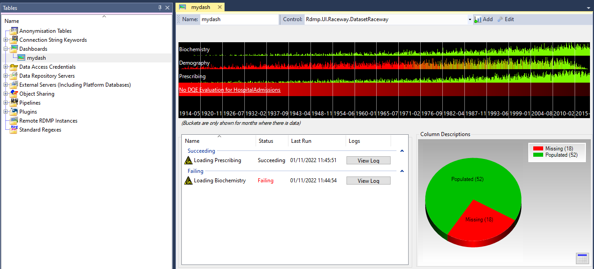
            

# Sql Code Management

One difficulty facing any long running data management agency is how to preserve and document the code files/tools used for data loading, linkage and extraction.  RDMP avoids the need for lengthy script files by dividing code into conceptual blocks.  Once created, these blocks are stored as reusable documented components in the Catalogue database.  When an analyst needs to use a given set of concepts they can assemble a query using drag and drop without having to worry about the underlying code implementation.

The core blocks that are curated by RDMP are:

|Component| Role|
|--|--|
| [Filter] | Reduce the number of records matched using a boolean query.  Each filter results in a  single line of `WHERE` sql.|
| [FilterContainer]| Allows for combining of multiple Filters.  Each container results in brackets, indentation and either the `AND` or `OR` sql keywords|
| [ExtractionInformation]| Defines governance around an extractable column and whether there is any transform (UPPER etc).  Each of these results in a single line of `SELECT` sql |

There are many macro components (e.g [Catalogue], [AggregateConfiguration], [ExtractionConfiguration]) that are composed of these sub blocks but these are covered elsewhere.  It is the curation of logic as such small, documented, reusable atomic blocks which makes RDMP unique.

## Filters

Extraction Filters are lines of WHERE SQL which can be used as part of cohort creation, data summarisation and project extraction.  Once created and documented a filter can be reused in any context simply by adding a reference to it.  In this example we will create a ‘Diabetic drugs' filter on the prescribing dataset.

You can create a new filter by using the right click context menu on any [ExtractionInformation]:

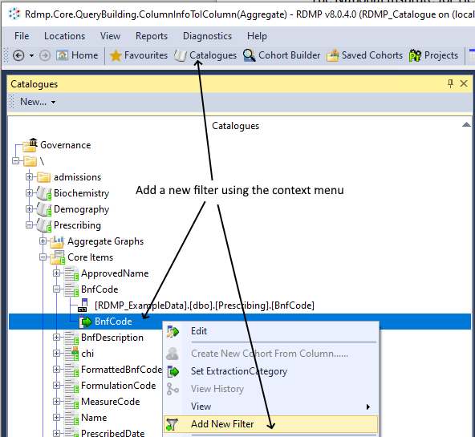

> **[Command Line]:** This can be done from the CLI using:
> ```
> ./rdmp CreateNewFilter ExtractionInformation:FormattedBnfCode null "Diabetic Drugs" "LEFT ( [FormattedBnfCode] , 3) = '6.1'"
> ```

You can test that an [ExtractionFilter] is working correctly by viewing what data it matches

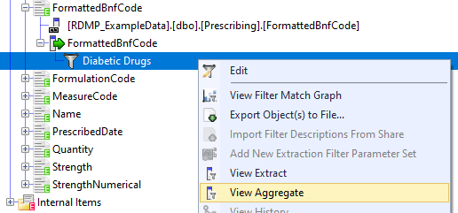

> **[Command Line]:** This can be done from the CLI using:
> ```
> ./rdmp ViewFilterMatchData "ExtractionFilter:Diabetic Drugs" Aggregate
> ```

### Parameters

When updating a filters WHERE sql you can enter a parameter (e.g. @bnfCode).  When saved this will create a new parameter for the filter.  By default this will have the datatype `varchar(50)` and a value of `'todo'`.  Enter a placeholder value and a Comment to describe the role that the parameter plays in the filter.

When the filter is deployed in an [ExtractionConfiguration] or [CohortIdentificationConfiguration] the analyst will be able to specify a different parameter each time.  It is even possible to deploy multiple copies of the same filter with the only difference being the value of the parameter (e.g. inside a [FilterContainer]).

## Extraction Transforms

Sometimes you need to be able to provide a given column in more than one format. Or you may want to hold it in one format and release it in another.  The most common use case is sensitive or identifiable data.  RDMP allows you to write SQL code to change how a given column is extracted (or create multiple versions) and assign it an extraction category (Core, Supplemental, Special Approval etc).

For example you may call a scalar function on the underlying column (e.g. `UPPER` or `dbo.MakeAnonymous(mycol)`).  These are refered to as 'Extraction Transforms' because they transform the data before it is provided in a research extract.

In mature agencies such transforms are often already modelled in views and/or table valued functions.  If this is the case then these should simply be imported directly into RDMP as new [Catalogues] (RDMP supports both views and table valued functions).

### Creating an Extraction Transform

When a column is marked extractable in RDMP, an [ExtractionInformation] is created.  This defines what SQL is executed in the `SELECT` block of any SQL query built including that column (e.g. in an [ExtractionConfiguration]).  This SQL defaults to the fully qualified column name of the underlying column (e.g. `[RDMP_ExampleData].[dbo].[Prescribing].[FormattedBnfCode]`).    This means no transformation takes place.

You can update the SQL by opening it.  For example you could update it as follows:

```sql
UPPER( [RDMP_ExampleData].[dbo].[Prescribing].[FormattedBnfCode]) as FormattedBnfCode
```

Make sure that you always provide the column alias when defining a transform (e.g. `as FormattedBnfCode`)

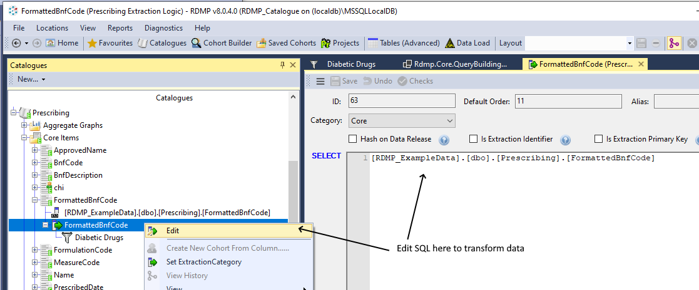

> **[Command Line]:** This can be done from the CLI using:
> ```
> ./rdmp Set "ExtractionInformation:FormattedBnfCode" SelectSql "UPPER( [RDMP_ExampleData].[dbo].[Prescribing].[FormattedBnfCode]) AS FormattedBnfCode" 
> ```

# Data Load Engine

Many datasets are poorly formed, change structure over time and/or require significant transform/cleaning before they are useful for statistical analysis.

Often the technical implementation of each datasets ETL is known only to the data analysts who built the original data load (and who might not even work at the agency any more) or the ETL may be built into bespoke legacy applications.  
The RDMP data load engine was developed by the Health Informatics Centre at a time when it was struggling to cope with reliable data loading of a high volume of clinical datasets using a mixture of commercial packages such as SSIS, bespoke dataset specific applications and undocumented SQL stored procedures.  The design core requirements for the Data Load Engine were:

- Eliminate the possibility of duplication by loading the same source rows multiple times
  -DLE requires primary keys that come from the source data provider
- Prevent failed loads from impacting the live dataset (e.g. crashing half way through a load)
  - All data is loaded first into an unstructured unconstrained RAW environment
  - Then loaded into mirror area called STAGING which matches the LIVE environment
  - Finally, the load is committed as a MERGE from STAGING to LIVE
  - Any failure at any step results in zero affected changes to the LIVE dataset
- Centralise load logic into one place that is accessible to every data analyst
- Handle strange file types and bespoke/proprietary file layouts
  - Plugin architecture allows agency specific requirements 
- Useable by data analysts who familiar only with SQL
- Ensure reusability of components where possible (e.g. where previously each load application would use a different FTP library and store credentials in different places or be hard coded or be a manual task!) 
- Be automatable through a single point of automation

It is important to note that these features are designed for the robust loading of routine data (supplied on a regular basis).  For one off loads use the [File Import](#importing-a-flat-file-as-a-new-dataset) feature.

RDMP is primarily a data management tool and therefore does not seek to replace existing ETL tools that you might use for complex data transforms.  It's data load engine is optimised for rapidly and safely loading and versioning data tables in as close a schema to the original source as possible (e.g. if a dataset is produced by a clinical scanner and comes out in with 30 headers then the data should ideally be held in your repository in the same format).  This not only simplifies data load but means there is no bias / interpretation introduced at the data management layer, researchers receive the data exactly the same way you receive it.  The only time extensive transformation is required during ETL is when the data includes duplication / errors that make the data otherwise unloadable.

## RAW Bubble, STAGING Bubble, LIVE Model

Core to the data load process implemented in RMDP is the migration of the data you are trying to load through increasingly structured states (RAW=>STAGING=>LIVE).


The purpose of the RAW/STAGING/LIVE Model is:
- Isolating failed loads from affecting live data
- Divide data load problems into either loading (RAW) or database constraint /anonymization issues (STAGING)
- Allow ALTER / UPDATE logic e.g. to merge columns etc to be done in a safe environment (RAW) with a language the user is familiar with (SQL).
- Freezing failed data in the state in which it failed so analysts can evaluate it

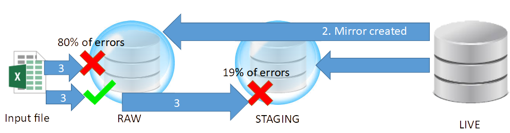

There are many reasons why a dataset load might fail.  Some of the most common scenarios encountered by HIC include:
1. Data supplier changes the name of a column(s)
    - Is there a semantic change to the data that should be documented?
    - Is the contents of the column still rational with previously loaded data?
2. A column starts containing null values where previously it was fully populated
    - Is the column still conceptually the same as before? 
    - Is it that the provider has started coding 0 values as null?
    - Is it valid that the column contains nulls and the LIVE schema should be updated?
3. Data supplier has primary key duplication within a load file
    - Is it the analyst/dataset which has the wrong primary keys?
    - Is it possible to resolve by merging missing data into a composite record?
    - Is it possible to identify one record which is clearly wrong / out of date?

Of the above cases, the first would break on loading to RAW and require adjustments to the load configuration (which would then work on all subsequent loads).   This is because even though RAW does not have constraints (primary key etc) it follows the same column naming and datatypes as LIVE.  Cases 2 and 3 would fail when trying to move from the unconstrained RAW to the constrained STAGING bubbles.  In both cases after the load crashes the RAW database would be left accessible so the analyst could run SQL queries against it to explore the problem data directly (without having to resort to peering at the source file).

## Error Messages

The DLE tries to give as much information about problems as possible.  Every message generated by the system (either during pre-load checking or loading data) is auditted to the logging server as well as displayed in an interactive data load user interface.  It is intended that the data loader user interface be used to debug failing loads and build new loads but that once a load is stable it be setup as an automated run via the [RDMP CLI].

Commonly encountered errors (missing columns, extra columns, data too wide etc) will always provide context that can be used to help resolve the problem.  For example

```
BulkInsert failed on data row 155, the complaint was about source column <<ApprovedName>> which had value <<SODIUM LAURYL ETHER SULFATE WITH SODIUM LAURYL ETHER SULPHOSUCCINATE>> destination data type was <<varchar(56)>>
Received an invalid column length from the bcp client for colid 9(Source Column <<ApprovedName>> Dest Column <<ApprovedName>> which has MaxLength of 56).
```

Since error messages may contain identifiable data, it is important to secure the logging database with the same rigour as your live data repository.

## Archive Tables

All tables loaded by the DLE must have a primary key.  This prevents duplication and allows for 'UPSERT' of new batches such that only new/different records are loaded.

In order to keep a backup of replaced data the DLE creates an `_Archive` table for each table in a load.  This provides a longitudinal history of each row (by primary key).  It is done to provide traceability and reproducability of data extracts as well as to investigate changes in data quality etc.  This process is transparent to the analyst building the load and requires only that appropriate primary keys exist in the source data and are enforced in the repository data table.


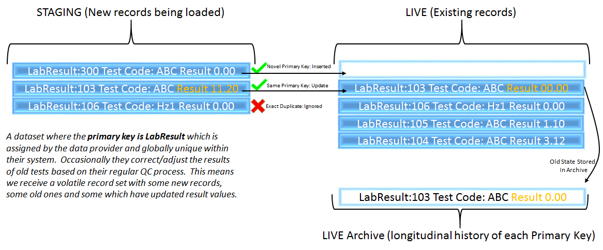

The technical implementation for this process is to issue an INSERT INTO sql command for all unique primary keys and then a MERGE sql command for the remainder.  The versioning of old records is achieved using an SQL Trigger which is applied on UPDATE and inserts the record into the archive table.  This process uses a transaction.  

[Implementations of the archive trigger](../../Rdmp.Core/DataLoad/Triggers/Implementations/TriggerImplementerFactory.cs) exist for all [DBMS] supported by RDMP.


INSERT and MERGE are both very fast operations which scale to very large volumes of data (Gigabytes of records).  The archiving trigger however does not scale linearly with dataset size.  Rather it scales against the volume of records which change in a load.  If data loads are highly volatile (rather than incremental updates) then it may be prudent to disable this feature:

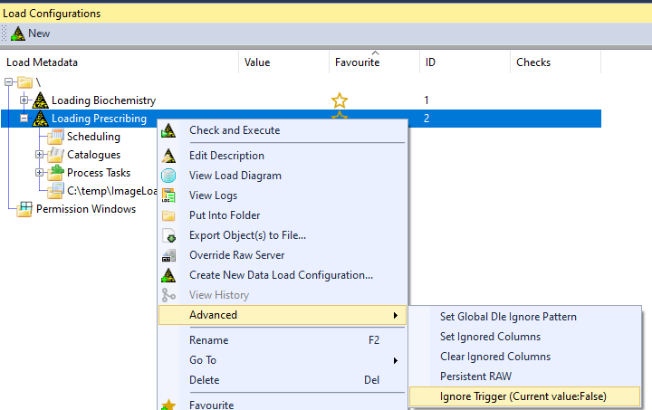

> **[Command Line]:** This can be done from the CLI using:
> ```
> ./rdmp Set "LoadMetadata:*Prescribing*" IgnoreTrigger true 
> ```

*Note that disabling the trigger will not delete any existing trigger that is already in place*.  This can be manually dropped using SQL appropriate to your [DBMS] e.g.:

```csharp
drop trigger Prescribing_OnUpdate;
```


[Command line]: ./RdmpCommandLine.md
[RDMP CLI]: ./RdmpCommandLine.md
[Pipeline]: ./Glossary.md#Pipeline
[ExtractionConfigurations]: ./Glossary.md#ExtractionConfiguration
[Catalogue]: ./Glossary.md#Catalogue
[Catalogues]: ./Glossary.md#Catalogue
[DBMS]: ./Glossary.md#DBMS
[ExtractionInformation]: ./Glossary.md#ExtractionInformation
[AggregateConfiguration]: ./Glossary.md#AggregateConfiguration
[Filter]: ./Glossary.md#ExtractionFilter
[ExtractionFilter]: ./Glossary.md#ExtractionFilter
[FilterContainer]: ./Glossary.md#FilterContainer

