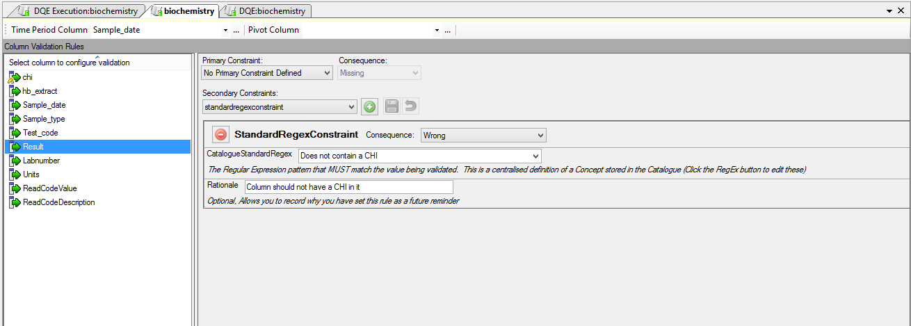
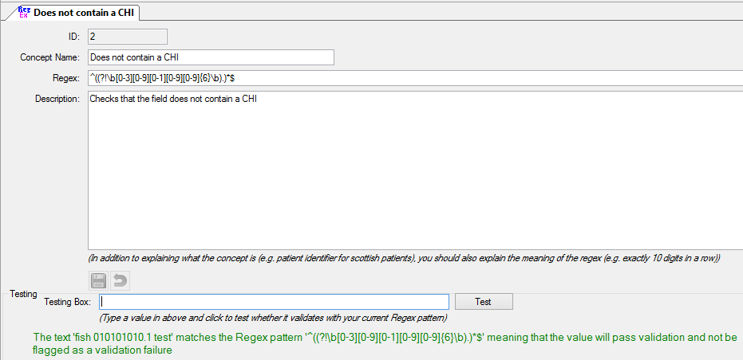
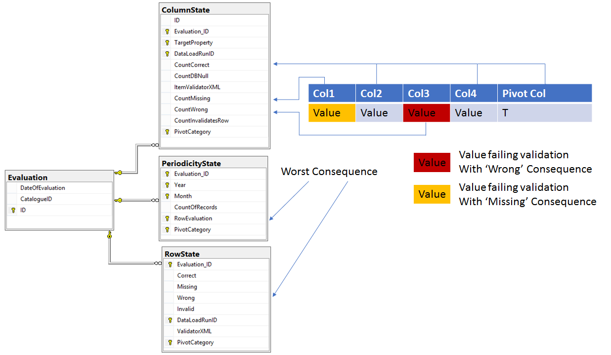
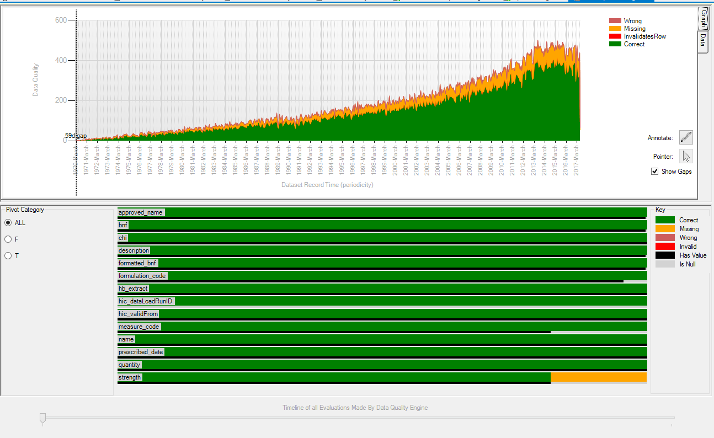
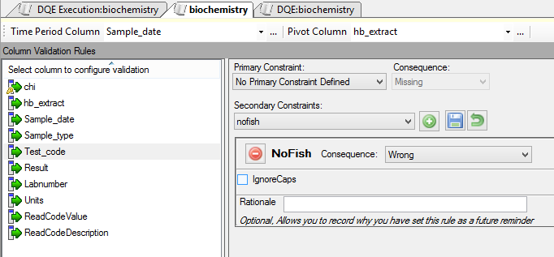

# Validation

## Table of contents
1. [Background](#background)
2. [Configuring Validation](#configuring-validation)
2. [Results Database](#results-database)
2. [Visualisation](#visualisation)
2. [Plugin Constraints](#plugin-constraints)

## Background
The RDMP Data Quality Engine (DQE) performs row level validation based on rules you set up on each column.  Validation is only run on extractable columns.  Results are persisted in a DQE results database designed to scale to very large datasets.

## Configuring Validation
Launch the 'Data Quality Engine' from the Home Screen and choose 'Change Validation Rules'.  Then pick a column for:

1. Time Period (Required)
2. Pivot (Optional)
3. Validation Rules

The 'Time Period Column' should be a heavily populated column which is representative of the point in time for the record (e.g. Date Prescribed).  Records with a null value in the 'Time Period Column' will still be validated but will only have results in RowState and ColumnState (not PeriodicityState).

The 'Pivot Column' is an optional way of dividing up your dataset when recording results.  This should be a helpful way of narrowing down the source of failing/missing data (e.g. healthboard / data source).

Validation Rules are configured on a per column basis.  Each column can have one Primary Constraint and any number of Secondary Constraints.  Each constraint has a Severity (Consequence).  Only the worst Consequence is recorded for a given column (if two validation rules fail then the worst Consequence is recorded).



Regular Expressions are very powerful for string validation.  In order to avoid replication of a given concept in multiple columns/datasets you can centralise the definition in a `StandardRegex`.  After this you can reference the regex anywhere in RDMP (e.g. with a StandardRegexConstraint).




If your data is loaded through the DLE then you should have `hic_dataLoadRunID` column.  If you make this column extractable (even with category Internal) then your results will be sliced by load ID too.  This will allow you to corrolate invalid data with loads.

## Results Database

Validation rules are applied by batch pulling all records from the source dataset table.  Each row is validated in isolation.  Results are compiled in memory then sent to the DQE results database in a transaction.  The DQE results database schema is designed to scale independently of the number of rows / rows failing validation.  To this end validation is recorded:

- By Column (Number of cells failing validation in this column)
- By Row (Number of rows failing validation)
- By Date (Number of rows failing validation per month)

Each of these is also subdivided by Pivot Value and Data Load Run ID (except By Date).



This schema scales well and allows you to persist DQE results for a large number of datasets and maintain a rewindable history for determining when a problem first manifested.

```
Example Dataset:
20,000,000 rows
20 columns
10 unique pivot values in pivot column
120 unique months of data (10 years)
60 unique data loads (one load every 2 months)

Number of records in ColumnState
10 (pivot values) x 20 (columns) x 60 (data loads) = 12,000 rows

Number of records in RowState
10 (pivot values) x 60 (data loads) = 600 rows

Number of records in PeriodicityState 
10 (pivot values) x 120 (months) x 4 (correct + the 3 failure severities) = 4,800 rows
```

## Visualisation

RDMP features a viewer which renders the By Date and By Column tables as graphs.  You can switch which Pivot Value you are looking at with the radio buttons and change which Evaluation (DQE run) you are viewing using the slider.  This allows you to look back in time at the dataset data quality in the past.




## Plugin Constraints
You can write new validation rules by inheriting from `HIC.Common.Validation.Constraints.Secondary.PluginSecondaryConstraint`.  Implement the Validate method returning null if validation passed or a `ValidationFailure` if it didn't.  Public properties will be rendered as CheckBoxes, TextBoxes etc.

```csharp
public class NoFishConstraint : PluginSecondaryConstraint
{
	//Will be exposed in user interface
	public bool IgnoreCaps { get; set; }

	public override void RenameColumn(string originalName, string newName){ }

	public override string GetHumanReadableDescriptionOfValidation()
	{
		return "Ensures the word Fish doesn't appear in the column";
	}

	public override ValidationFailure Validate(object value, object[] otherColumns, string[] otherColumnNames)
	{
		var s = value as string;
		if(s != null)
		{
			if(IgnoreCaps)
			{
				if (s.ToLowerInvariant().Contains("fish"))
					return new ValidationFailure("Value was Fish!", this);
			}
			else
			{
				if (s.Contains("Fish"))
					return new ValidationFailure("Value was Fish!",this);
			}
		}
		
		//validation passed
		return null;
	}
}

```

When uploaded as a plugin the above example would appear as:


