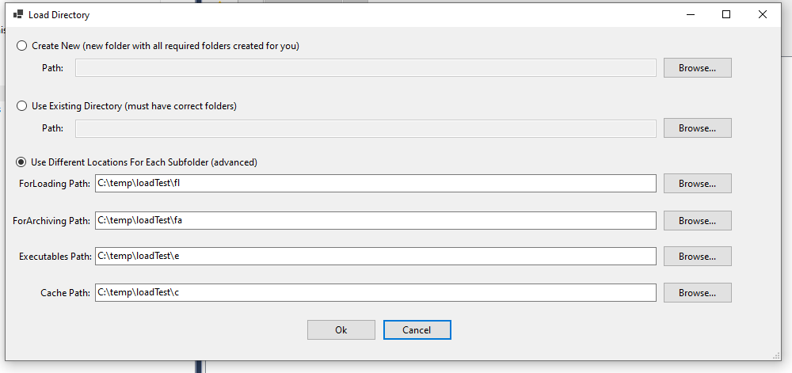

# Load Metadata
The Load Metadata stores a reference to the directory you want your data load pipeline to use.
This directory will be populated with a number of folders
```
- MyFolder	
|_ Data
|  |_ Cache
|  |_ ForArchiving
|  |_ ForLoading
|_ Executables
```
The ForLoading Directory is used as a holding pen for data that you are trying to load into the system

The ForArchiving Directory is used to store a compressed varion of the data involved in the data load for archiving purposes

The Executables directory is provided for storing executable files and/or sql scripts that you might want to run during the load.

The Cache folder is used for the RDMP caching engine (long running fetching tasks e.g. pulling images from a PACS server or reports from a webservice).


## Using Different Locations for each Load Metadata Directory
N.B. This is an advanced feature and should be used with caution.




Some users may with to store their archives, for example, in a nother location or disk.
RDMP allows this by having the user specify the directory they wish each type of data to be written to.

This functionality will write files directly into this folder, not into a "Data" subfolder.
It is not recommended to set each folder option to the same location as RDMP will clean up the "ForLoading" directory and delete all files, including the archive, during this step.


