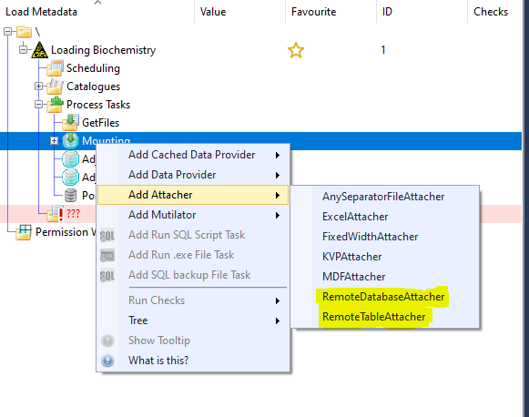

# Remote Attachers
The Data Load Engine within RDMP supports 2 methods for retrieving data from remote databases.

The Remote Table Attacher facilitates pulling data from a specific table on a remote database.
The Remote Database Attacher also facilitates pulling data from a remote database, but allows for more freedom when specifying what data is returned.

## How to setup a Remote Attacher
RDMP's remote attachers require some external database to pull from.
You can set this up via the "Create New External Database" function in the External Servers section of the Tables tab.

Once you have your external database configured, you can add a Remote Attacher (Table or Database) to your Data Load.

Attachers can only be added to the Mounting stage of a data load.

Each Attacher's configuration options are detailed below.

##  Configuring the Remote Table Attacher
The Remote Table Attacher has a number of configuration options, the required fields are:
* Remote Server Reference - Alternatively, you can manually add the remote server details
* Remote Table Name - The Table you wish to load from
* RAW Table Name - The RAW table you wish to load the data into

The full configuration options are

| Option Name                                  | Description                                                                                                                                                                                                                                                                                                                                                 |
|----------------------------------------------|-------------------------------------------------------------------------------------------------------------------------------------------------------------------------------------------------------------------------------------------------------------------------------------------------------------------------------------------------------------|
| Remote Server Reference*                     | A Dropdown of defined external databases to select from                                                                                                                                                                                                                                                                                                     |
| Remote Server                                | Alternative to the Remote Server Reference. A DataSource connection string for a remote server                                                                                                                                                                                                                                                              |
| Remote Database Name                         | The Database name on the remote server. Not required if specified by your external database                                                                                                                                                                                                                                                                 |
| Remote Table Name*                           | The table name on the remote server                                                                                                                                                                                                                                                                                                                         |
| Remote Select SQL                            | Optionally provide custom SQL to query the remote table, otherwise a simple select will be used                                                                                                                                                                                                                                                             |
| RAW Table Name*                              | The Table in RAW that you wish to populate with the fetched data                                                                                                                                                                                                                                                                                            |
| RAW Table To Load                            | Overrides RAW Table Name with a specific named table                                                                                                                                                                                                                                                                                                        |
| Progress                                     | Used for Load Scheduling                                                                                                                                                                                                                                                                                                                                    |
| Progress Update Strategy                     | Select the Progress update strategy                                                                                                                                                                                                                                                                                                                         |
| Timeout                                      | The timeout to use for connecting to the remote database                                                                                                                                                                                                                                                                                                    |
| Load Not Required If No Rows Read            | If no data is read, then the load will stop if this option is checked                                                                                                                                                                                                                                                                                       |
| Remote Table Access Credentials              | Optional Remote Table Access Credentials - create these in the Tables tab of RDMP                                                                                                                                                                                                                                                                           |
| Database Type                                | Which type of database you will be connecting to                                                                                                                                                                                                                                                                                                            |
| Historical Fetch Duration                    | A Filter to select how far back in history to pull from.  'Since Last Use' will pull data since the last successful run of this data load 'Delta Reading' allows you to move forward in time a specified number of days from a specific date. This specified date will move forwards each time the load is run by the number of days specified to look forward.  |
| Remote Table Date Column                     | The Date column of the remote table to base the Historical Fetch Duration on                                                                                                                                                                                                                                                                                |
| Custom Fetch Duration Start Date             | If using the custom fetch duration, this is the start date                                                                                                                                                                                                                                                                                                  |
| Custom Fetch Duration End Date               | If using the custom fetch duration, this is the end date                                                                                                                                                                                                                                                                                                    |
| Delta Reading Date In Time                    | If using the Delta Reading fetch, this is the earliest date you will pull data from                                                                                                                                                                                                                                                                          |
| Delta Reading Look Back Days                  | If using the Delta Reading fetch duration, this is how many days backwards in time you wish to look each time. You may wish to use this option if data on the remote server is populated in batches, rather than real time.                                                                                                                                  |
| Delta Reading Look Forward Days               | If using the Delta Reading fetch duration, this is how many days forward in time you wish to look each time                                                                                                                                                                                                                                                  |
| Set Delta Reading To Last Seen Date Post Load | Optional overwrite to the Delta Reading fetch option. Will use the most recently seen date in the fetched data rather than the adding the forward look days amount onto the stored minimum date                                                                                                                                                              |
| Culture                                      | Optionally specify a custom date format                                                                                                                                                                                                                                                                                                                     |
| Explicit Date Time Format                    | Optionally specify a specific datetime format    
| Selected Columns                             | Optionally select which columns you wish to pull from the remote server (defaults to "*" )
| RawTableDateColumn                           | Optionally give the date column in RAW a different name than in the select statement for delta loads. This may be due to awkward joins in a custom select query 

## Configuring the Remote Database Attacher
The Remote Database Attacher has a number of configuration options the required fields are:
* Remote Source - A predefined external data base

| Option Name                                  | Description                                                                                                                                                                                                                                                                                                                                                 |
|----------------------------------------------|-------------------------------------------------------------------------------------------------------------------------------------------------------------------------------------------------------------------------------------------------------------------------------------------------------------------------------------------------------------|
| Remote Source*                               | A Dropdown of defined external databases to select from                                                                                                                                                                                                                                                                                                     |
| Timeout                                      | The timeout to use for connecting to the remote database                                                                                                                                                                                                                                                                                                    |
| Ignore Missing Tables                        | Skip Tables that do not appear in the default RAW columns                                                                                                                                                                                                                                                                                                   |
| Historical Fetch Duration                    | A Filter to select how far back in history to pull from.  Since Last Use will pull data since the last successful run of this data load Delta Reading allows you to move forward in time a specified number of days from a specific date. This specified date will move forwards each time the load is run by the number of days specified to look forward.  |
| Remote Table Date Column                     | The Date column of the remote table to base the Historical Fetch Duration on                                                                                                                                                                                                                                                                                |
| Custom Fetch Duration Start Date             | If using the custom fetch duration, this is the start date                                                                                                                                                                                                                                                                                                  |
| Custom Fetch Duration End Date               | If using the custom fetch duration, this is the end date                                                                                                                                                                                                                                                                                                    |
| Delta Reading Date In Time                    | If using the Delta Reading fetch, this is the earliest date you will pull data from                                                                                                                                                                                                                                                                          |
| Delta Reading Look Back Days                  | If using the Delta Reading fetch duration, this is how many days backwards in time you wish to look each time. You may wish to use this option if data on the remote server is populated in batches, rather than real time.                                                                                                                                  |
| Delta Reading Look Forward Days               | If using the Delta Reading fetch duration, this is how many days forward in time you wish to look each time                                                                                                                                                                                                                                                  |
| Set Delta Reading To Last Seen Date Post Load | Optional overwrite to the Delta Reading fetch option. Will use the most recently seen date in the fetched data rather than the adding the forward look days amount onto the stored minimum date                                                                                                                                                              |
| Culture                                      | Optionally specify a custom date format                                                                                                                                                                                                                                                                                                                     |
| Explicit Date Time Format                    | Optionally specify a specific datetime format   
| Selected Columns                             | Optionally select which columns you wish to pull from the remote server (defaults to "*" )

## Using Historical Loading with custom SQL
By default, historical fetch configuration will be ignored in custome select SQL.
To enable the use of hostorical fetching, include the string "$RDMPDefinedWhereClause" in the where clause of your query
e.e. "Select * from Biochemistry Where $RDMPDefinedWhereClause"
