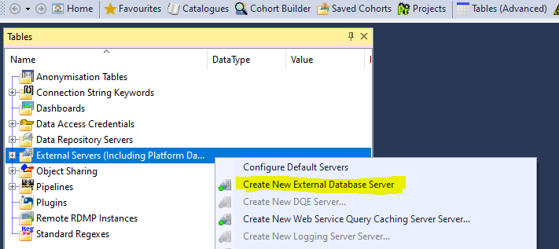

# Remote Attachers
The Data load enging within RDMP supports 2 methods for retreiving data from remote databases.

The Remote Table Attacher facilitates pulling data from a specific table on a remote database.
The Remote Database Attacher also faciliates pulling data from a remote database, but allows for more freedom when specifying what data is returned.

## How to setup a Remote Attacher
RDMP's remote attachers require some external database to pull from.
You can set this up via the "Create New External Database" function in the External Servers section of the Tables tab.

Once you have your external database configured, you can add a Remote Attacher (Table or Database) to your Data Load.

Attachers can only be added to the Mounting stage of a data load.

Each Attachers configuration options are detailed below.

##  Configuring the Remote Table Attacher
The Remote Table Attacher has a number of configuration options, the required fields are:
* Remote Server Reference - Alternatively, you can manually add the remote server details
* Remote Table Name - The Table you wish to load from
* RAW Table Name - The RAW table you wish to load the data into

The full configuration options are

| Option Name                                  | Description |
|----------------------------------------------|-------------|
| Remote Server Reference                      |             |
| Remote Server                                |             |
| Remote Database Name                         |             |
| Remote Table Name                            |             |
| Remote Select SQL                            |             |
| RAW Table Name                               |             |
| RAW Table To Load                            |             |
| Progress                                     |             |
| Progress Update Strategy                     |             |
| Timeout                                      |             |
| Load Not Required If No Rows Read            |             |
| Remote Table Access Credentials              |             |
| Database Type                                |             |
| Histroical Fetch Duration                    |             |
| Remote Table Date Column                     |             |
| Custom Fetch Duration Start Date             |             |
| Custom Fetch Duration End Date               |             |
| Forward Scan Date In Time                    |             |
| Forward Scan Look Back Days                  |             |
| Forward Scan Look Forward Days               |             |
| Set Forward Scan To Last Seen Date Post Load |             |
| Culture                                      |             |
| Explicit Date Time Format                    |             |