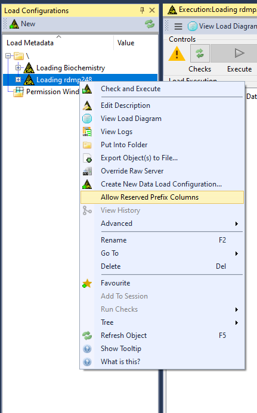

# Reserved Column Prefixes
By default RDMP uses the prefix "hic_" for internally important columns.
We advise that you typically don't use the prefix in your table schemas.

## Data Loads
By default, RDMP will not import a column stating with "hic" in the RAW stage of a data load.
If you want to bypass this for whatever reason, you can allow this type of column on a Dataload by Dataload basis.

Via the CLI:
```
./rdmp.exe ToggleAllowReservedPrefixForLoadMetadata LoadMedata:<id>
```


Via the UI:
Right Click on a Data Load.

There will be a menu option that says "Allow Reserved Prefix Columns" or "Drop Reserved Prefix Columns" depending on the current configuration.




Selecting "Allow..." will enable "hic_" prefixed columns to be imported during a data load.

Selecting "Drop..." will prevent "hic_" prefixed columns from being imported during a data load
