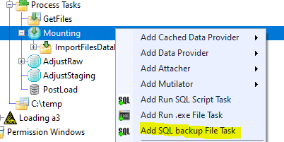

# SQL .bak files
RDMP data loads can make use of .bak files to load data into catalogues.

## How to use a .bak file
When creating a data load, selecting the mounting section will give the option "Add SQL backup File Task"

This will prompt you to select a .bak file from the file system.
If you are using the 'GetFiles' stage to fetch the .bak file from a remote server, you will have to perform this load in stages.
This is to reduce the risk of loading unintended .bak files into the system.
The database will be mounted and can now be interacted with like a standard database.
