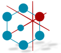

# Research Data Management Platform

[](https://github.com/HicServices/RDMP/actions?query=workflow%3ABuild) [](https://lgtm.com/projects/g/HicServices/RDMP/alerts/) [](https://buildstats.info/nuget/HIC.RDMP.Plugin) [](https://coveralls.io/github/HicServices/RDMP?branch=develop)

- [Demo Video](https://www.youtube.com/watch?v=Fgi9-Sdup-Y)
- [Releases](https://github.com/HicServices/RDMP/releases)
- [FAQ](Documentation/CodeTutorials/FAQ.md)
- [User Manual](https://github.com/HicServices/RDMP/raw/master/Documentation/UserManual.docx)
- [Glossary](./Documentation/CodeTutorials/Glossary.md)
- [Changelog](./CHANGELOG.md)
- [Libraries](./Documentation/CodeTutorials/Packages.md)

RDMP is a free, open source software application for cohort building, loading, linking, anonymisation and extraction of datasets stored in relational databases (Sql Server, MySql, Postgres and Oracle). It was designed from the bottom up to support with data provenance, preserving domain knowledge and configuration management workflows.

RDMP does not require your data be moved or transformed prior to processing and is integrates into existing SQL based extraction practices.


## Install

Signed release binaries for the RDMP client and Command Line Interface (CLI) are in the available in the [GitHub releases section](https://github.com/HicServices/RDMP/releases).

## Build


### Building on Windows

You can build RDMP from the command line using `dotnet build` or through an IDE e.g. Visual Studio or Visual Studio Code (Requires [dotnet5 SDK](https://dotnet.microsoft.com/download/dotnet/5.0)).

The windows client:

```
dotnet build
cd Application\ResearchDataManagementPlatform\bin\Debug\net5.0-windows\win-x64
./ResearchDataManagementPlatform.exe
```

The console client:

```
dotnet build
cd Tools\rdmp\bin\Debug\net5.0\
./rdmp.exe --help
```

### Building on Linux

Only the console client can be built/run in linux

```
cd ./Tools\rdmp\
dotnet build
cd ./bin/Debug/net5.0/
./rdmp --help
```

### Tests

To run tests you will need an instance of Sql Server.  These instructions use localdb which is included in [visual studio](https://docs.microsoft.com/en-us/sql/database-engine/configure-windows/sql-server-express-localdb?view=sql-server-ver15).

If using a docker container or alternate sql server instance then substitute your host name in place of `(localdb)\MSSQLLocalDB`

```
dotnet build
./Tools/rdmp/bin/Debug/net5.0/rdmp.exe install "(localdb)\MSSQLLocalDB" TEST_ -d

echo "ServerName: (localdb)\MSSQLLocalDB" > ./Tests.Common/TestDatabases.txt
echo "Prefix: TEST_" >> ./Tests.Common/TestDatabases.txt

dotnet build

dotnet test ./scripts/run-all-tests.proj -c Release -p:BuildInParallel=false
```

For a more indepth guide to CI testing see [How to set up your test environment in Tests.md](Documentation/CodeTutorials/Tests.md).

## Contributing

We welcome all contributions including:

- [Issues and bug reports](https://github.com/HicServices/RDMP/issues)
- Code Reviews
- [Translations](./Documentation/CodeTutorials/Localization.md)
- Documentation
- [Code Contributions](./Documentation/CodeTutorials/Coding.md)

[DBMS]: ./Documentation/CodeTutorials/Glossary.md#DBMS
