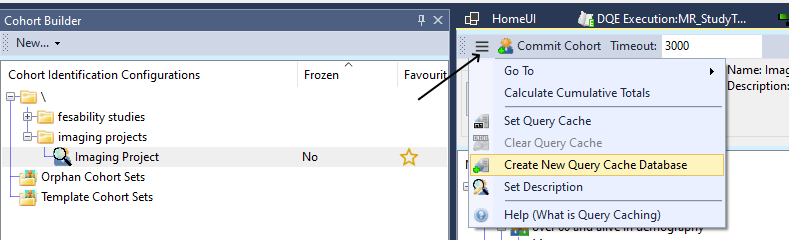
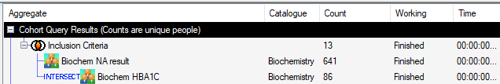
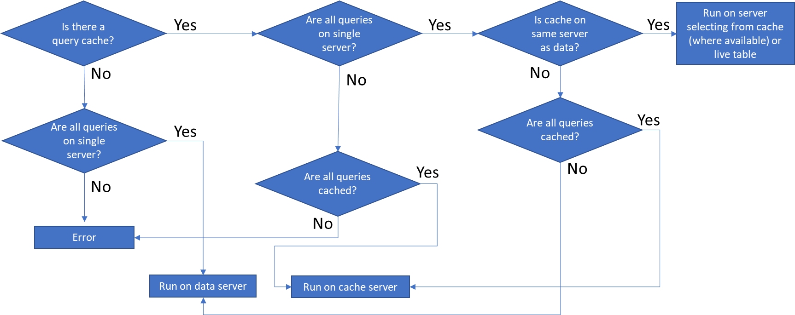
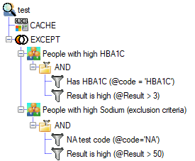
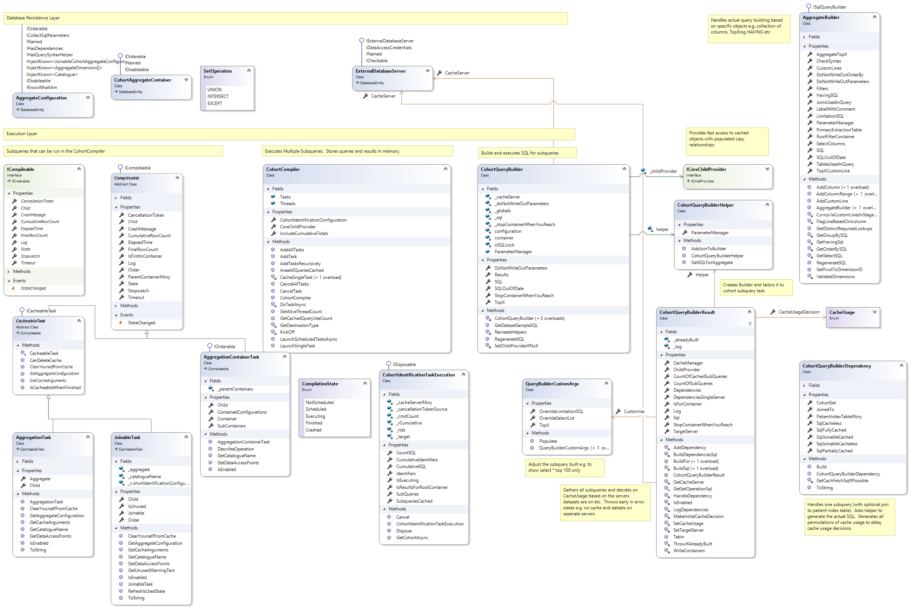

# Cohort Creation

## Contents

- [Introduction](#introduction)
- [Query Caching](#query-caching)
  - [Background](#background)
  - [Creating a Cache](#creating-a-cache)
  - [Hit/Miss](#cache-hitmiss)
  - [Code](#code)
- [Parameters and Renaming](#parameters-and-renaming)

## Introduction

A Cohort is a collection of unique person identifiers which can be linked against datasets during an extraction.  This namespace covers the creation of queries that identify lists of patients (based on inclusion / exclusion criteria).

See [CohortComitting](../CohortCommitting/CohortCommitting.md) for committing (saving) a final list of patients (or for generating cohorts directly from a file etc).

Cohorts are always created by performing set operations and/or joins on distinct patients (determined by the selected [IsExtractionIdentifier] column in the dataset(s))

## Query Caching

### Background

A complicated cohort can easily include 10 or more criteria (prescribed drug X; never prescribed drug y etc).  Each criteria can involve querying a large number of records and can take some time.  The traditional approach to this problem is to use temporary tables (e.g. `tempdb`) or a scratch area (e.g. MyWorkingDb) to create tables that store results for subsections of the overall query.  RDMP automates this practice through its query caching subsystem.

The RDMP query cache also gets around [DBMS] limitations e.g. MySql not supporting Set operations ([UNION] / [INTERSECT] / [EXCEPT]) and enables cross server (and [DBMS]) query generation.

### Creating a Cache

To create a query cache open any [CohortIdentificationConfiguration] and open the top toolbar menu:



After creating the server you should see that the [CohortIdentificationConfiguration] is automatically set to use it.  You should also find that it has been set as the Default caching server and new CohortIdentificationConfigurations you create will automatically use it.

If you have other old [CohortIdentificationConfiguration] that do not yet use the cache you can set them to use caching from the same menu.

### Cache Hit/Miss

Consider the following cohort

- [INTERSECT] 
  - People in Biochemistry with an HBA1C
  - People in Biochemistry with an NA



If we have no cache then the following SQL would be executed:

```sql
SELECT
distinct
[TEST_ExampleData].[dbo].[Biochemistry].[chi]
FROM 
[TEST_ExampleData]..[Biochemistry]
WHERE
(
/*TestCode is NA*/
[TEST_ExampleData].[dbo].[Biochemistry].[TestCode] = 'NA'
)

INTERSECT

SELECT
distinct
[TEST_ExampleData].[dbo].[Biochemistry].[chi]
FROM 
[TEST_ExampleData]..[Biochemistry]
WHERE
(
/*TestCode is HBA1c*/
[TEST_ExampleData].[dbo].[Biochemistry].[TestCode] like '%HBA%'
)
```

A caching database can be used to store the results of each subcomponent.  The final list of identifiers is stored in an indexed table in the caching database along with the SQL used to fetch the results.  This indexed tables can be used by RDMP to run the final container (the [INTERSECT]).

Caching provides the following benefits:

- Parallel processing of subsets
- Faster execution of set containers
- Allows combining sets built on different servers / [DBMS] (e.g. [INTERSECT] an Oracle dataset with an Sql Server dataset)
- Use set operations ([UNION] / [INTERSECT] / [EXCEPT]) on a [DBMS] that doesn't support it (MySql)

The following flow chart describes the process RDMP uses to build a SET container (and determine where to execute the query):



_* If you are using credentials to access a table (e.g. username and password rather than integrated security) then differing credentials is treated as different servers (since a connection cannot be opened to both objects)_

When run from the cache the above query would be:

```sql
(
/*Cached:cic_10_Biochem NA result*/
select * from [RDMP_QCache]..[IndexedExtractionIdentifierList_AggregateConfiguration68]

INTERSECT

/*Cached:cic_10_Biochem HBA1C*/
select * from [RDMP_QCache]..[IndexedExtractionIdentifierList_AggregateConfiguration67]

)
```

Caching happens automatically after executing an uncached query.  If you make a change to a cohort the corresponding cache entry is automatically cleared (and the table dropped).

When using the execute all button, execution will start with each subquery in order to maximise cache usage.  This is especially important when cumulative totals is enabled (which results in more component combinations being executed at once).

### Code

The cache usage flow chart is implemented by the `CohortQueryBuilderResult` class.  The following states can be determined:

|State|Description|
|-|-|
|MustUse| The cache must be used and all Dependencies must be cached.  This happens if dependencies are on different servers / credentials.  Or the query being built involves SET operations which are not supported by the [DBMS] of the dependencies (e.g. MySql [UNION] / [INTERSECT] etc).|
|Opportunistic|All dependencies are on the same server as the cache.  Therefore we can mix and match where we fetch tables from (live table or cache) depending on whether the cache contains an entry for it or not. |
|AllOrNothing|All dependencies are on the same server but the cache is on a different server.  Therefore we can either run a fully cached set of queries or we cannot run any cached queries|

The following classes play a role in building and executing cohort building queries

|Class|Role|
|-|-|
|CohortCompiler| Runs multiple set containers / cohort subcomponents at once and stores states|
|ICompileable| A subcomponent that could be executed (or encountered an error while building) | 
|CohortIdentificationTaskExecution | The current state of an `ICompileable` including result / crashed etc |
|CohortQueryBuilder | Manages configuration/tailoring of cohort sets e.g. run as normal or run TOP x only etc |
|CohortQueryBuilderResults | Identifies all subcomponents in the container / cohort and makes decisions about cache usage |
|CohortQueryBuilderDependency| Stores the uncached and cached (if available) SQL for the subcomponent|
|CohortQueryBuilderHelper| Builds the uncached SQL for each atomic subcomponent (uses an `AggregateBuilder` to do most of the work)|

## Parameters and Renaming

Consider the following cohort identification configuration.  We have an inclusion criteria (based on HBA1C) and an exclusion criteria (based on NA - sodium).  Both filters use parameters `@code` and `@Result` but with different values.



In the ideal situation we can use the cache to avoid the colliding parameters by running each subquery separately and then running the container ([EXCEPT]) from the cache:

```sql
/*Cached:cic_15_People with high HBA1C*/
select * from [CACHE]..[IndexedExtractionIdentifierList_AggregateConfiguration75]

EXCEPT

/*Cached:cic_15_People with high Sodium (exclusion criteria)*/
select * from [CACHE]..[IndexedExtractionIdentifierList_AggregateConfiguration76]
```

However if no query cache is configured or there are patient index tables preventing cache use then we may have to run the full SQL:

```sql
DECLARE @code AS varchar(50);
SET @code='HBA1C';
DECLARE @Result AS float
SET @Result=3;
DECLARE @code_2 AS varchar(50)
SET @code_2='NA';
DECLARE @Result_2 AS float
SET @Result_2=50;

(
/*cic_15_People with high HBA1C*/
SELECT
distinct
[TEST_ExampleData].[dbo].[Biochemistry].[chi]
FROM 
[TEST_ExampleData]..[Biochemistry]
WHERE
(
/*Has HBA1C (@code = 'HBA1C')*/
[TEST_ExampleData].[dbo].[Biochemistry].[TestCode] = @code
AND
/*Result is high (@Result > 3)*/
[TEST_ExampleData].[dbo].[Biochemistry].[Result] > @Result
)
EXCEPT

/*cic_15_People with high Sodium (exclusion criteria)*/
SELECT
distinct
[TEST_ExampleData].[dbo].[Biochemistry].[chi]
FROM 
[TEST_ExampleData]..[Biochemistry]
WHERE
(
/*NA test code (@code_2='NA')*/
[TEST_ExampleData].[dbo].[Biochemistry].[TestCode] = @code_2
AND
/*Result is high (@Result_2 > 50)*/
[TEST_ExampleData].[dbo].[Biochemistry].[Result] > @Result_2
)
)
```

Notice that the parameter has been renamed `@Result_2` and `@code_2` in the compiled SQL.  This is a runtime decision and does not affect the persisted configuration. 

## Class Diagram




[DBMS]: ../../Documentation/CodeTutorials/Glossary.md#DBMS
[UNION]: ../../Documentation/CodeTutorials/Glossary.md#UNION
[INTERSECT]: ../../Documentation/CodeTutorials/Glossary.md#INTERSECT
[EXCEPT]: ../../Documentation/CodeTutorials/Glossary.md#EXCEPT
[IsExtractionIdentifier]: ../../Documentation/CodeTutorials/Glossary.md#IsExtractionIdentifier
[CohortIdentificationConfiguration]: ../../Documentation/CodeTutorials/Glossary.md#CohortIdentificationConfiguration